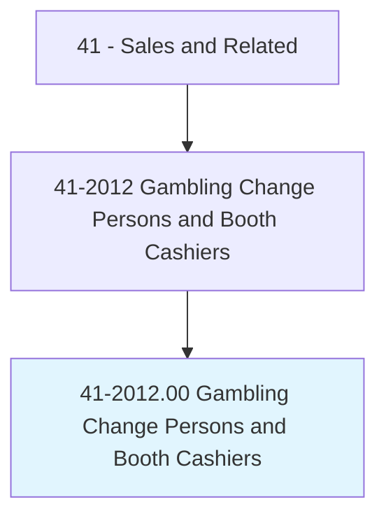
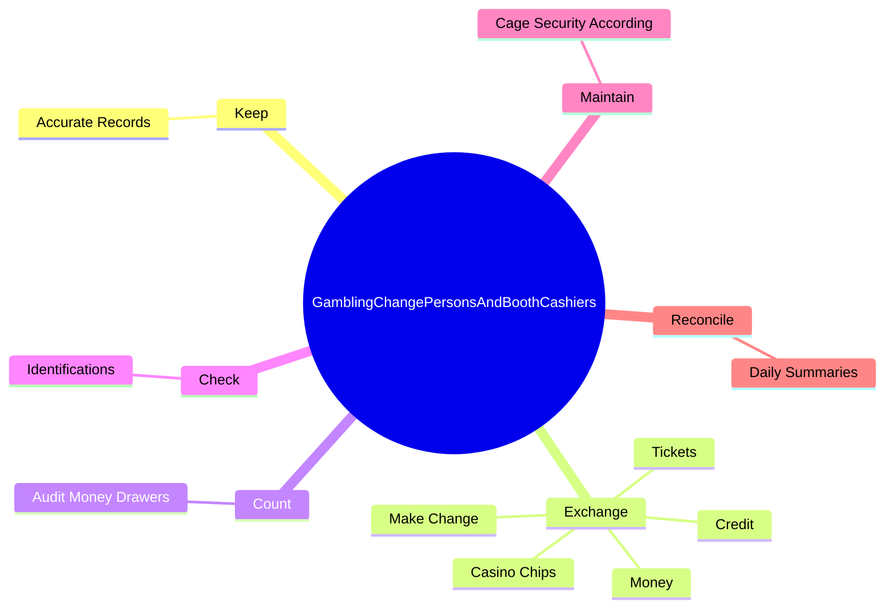
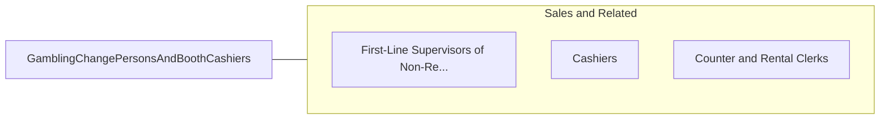

# Gambling Change Persons and Booth Cashiers

> Exchange coins, tokens, and chips for patrons' money. May issue payoffs and obtain customer's signature on receipt. May operate a booth in the slot machine area and furnish change persons with money bank at the start of the shift, or count and audit money in drawers.

## Overview

Gambling Change Persons and Booth Cashiers is an occupation within the Sales and Related category. Exchange coins, tokens, and chips for patrons' money. May issue payoffs and obtain customer's signature on receipt.

## Classification Hierarchy

## Key Statistics

| Metric | Value |
|--------|-------|
| SOC Code | 41-2012.00 |
| Category | [Sales and Related](/occupations/Sales/index) |
| Task Count | 31 |
| Source | O*NET |

## Core Tasks

### keep.AccurateRecords

Gambling Change Persons and Booth Cashiers keep accurate records as part of their core responsibilities.

**Actions:**
- `keep.AccurateRecords.of.MonetaryExchanges`
- `keep.AccurateRecords.of.AuthorizationForms`
- `keep.AccurateRecords.of.TransactionReconciliations`

### exchange.Money

Gambling Change Persons and Booth Cashiers exchange money as part of their core responsibilities.

**Actions:**
- `exchange.Money.for.Customers`
- `exchange.Credit.for.Customers`
- `exchange.Tickets.for.Customers`
- `exchange.CasinoChips.for.Customers`

### count.AuditMoneyDrawers

Gambling Change Persons and Booth Cashiers count audit money drawers as part of their core responsibilities.

**Actions:**
- `count.AuditMoneyDrawers`

## Skills & Competencies

### Technical Skills
- **Sales Techniques** - Advanced
- **Customer Relations** - Advanced
- **Product Knowledge** - Advanced

### Soft Skills
- **Communication** - Essential
- **Problem Solving** - Essential
- **Critical Thinking** - Important
- **Teamwork** - Important
- **Adaptability** - Important

## Related Occupations

## Industries

This occupation is found across multiple industries. See [Industries](/industries) for sector-specific employment data.

## Career Progression

---

*Source: O*NET 41-2012.00 - ONETOccupation*
