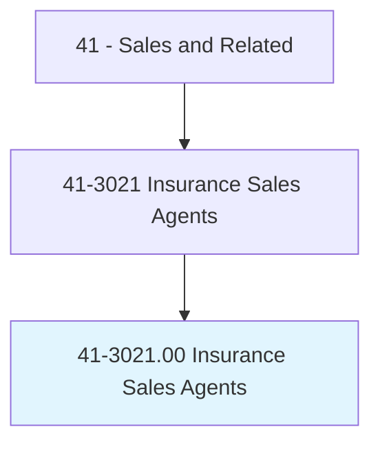
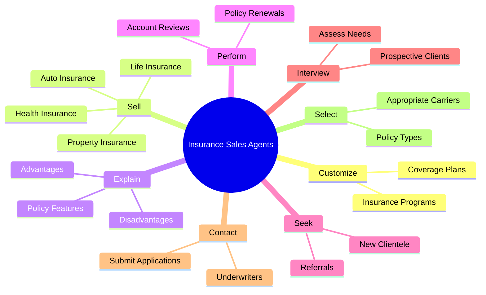
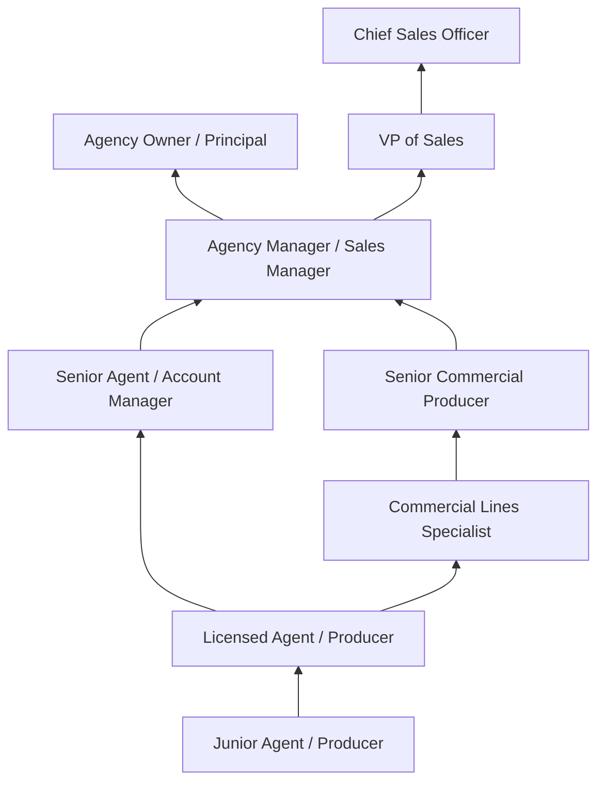
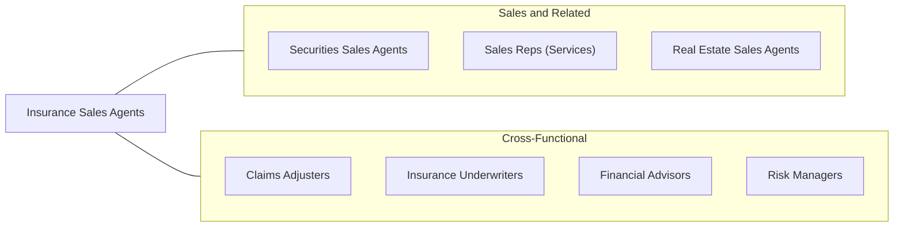

# Insurance Sales Agents

> Sell life, property, casualty, health, automotive, or other types of insurance. May refer clients to independent brokers, work as an independent broker, or be employed by an insurance company.

## Overview

Insurance Sales Agents are licensed professionals who sell insurance policies to individuals, families, and businesses, providing financial protection against risks ranging from property damage and liability to illness, disability, and death. They assess clients' needs, explain policy options, customize coverage plans, and help clients navigate the often-complex world of insurance products. Agents may specialize in personal lines (auto, home, life, health) or commercial lines (business liability, workers' compensation, professional indemnity), or they may sell across multiple product types.

The insurance sales landscape includes two primary models: captive agents who exclusively represent a single insurance company (such as State Farm or Allstate agents), and independent agents or brokers who represent multiple carriers and can shop the market on behalf of their clients. Both models require state licensing, ongoing continuing education, and adherence to insurance regulations. Independent agents typically have greater product flexibility but must manage relationships with multiple carriers, while captive agents benefit from brand recognition, marketing support, and structured career paths.

Insurance is a relationship-driven business where trust and credibility are paramount. Successful agents build long-term client relationships, earning renewals and referrals that create a sustainable book of business. The role involves significant consultative selling -- understanding clients' financial situations, risk exposures, and future needs -- and translating that understanding into appropriate coverage recommendations. Compensation typically combines base salary or draw with commissions on new policies and renewal commissions on existing business.

## Classification Hierarchy

## Key Statistics

| Metric | Value |
|--------|-------|
| SOC Code | 41-3021.00 |
| Job Zone | 3 (Medium Preparation) |
| Category | [Sales and Related](/occupations/Sales/index) |
| Median Annual Salary | $57,860 |
| Employment | ~530,000 |
| Projected Growth | 6% (faster than average) |
| Core Tasks | 68 |
| Source | O*NET |

## Core Tasks

### customize.InsurancePrograms

Insurance Sales Agents design tailored coverage solutions for each client.

**Actions:**
- `customize.InsurancePrograms.to.SuitIndividualCustomers` - Design personalized coverage plans
- `customize.InsurancePrograms.to.OftenCoveringVarietyOfRisks` - Bundle multiple risk coverages

### sell.VariousTypes

Insurance Sales Agents sell various types of insurance products.

**Actions:**
- `sell.VariousTypes.of.InsurancePoliciesToBusinesses` - Provide commercial lines coverage
- `sell.VariousTypes.of.InsurancePoliciesToIndividuals` - Sell personal lines policies
- `sell.VariousTypes.of.IncludingAutomobile` - Place auto insurance
- `sell.VariousTypes.of.LifeInsurance` - Sell life and annuity products

### explain.Features

Insurance Sales Agents educate clients on policy details and options.

**Actions:**
- `explain.Features.of.VariousPolicies.to.promote.SaleOfInsurancePlans` - Present policy benefits
- `explain.Advantages.of.VariousPolicies.to.promote.SaleOfInsurancePlans` - Highlight competitive advantages
- `explain.Disadvantages.of.VariousPolicies.to.promote.SaleOfInsurancePlans` - Provide balanced comparison

## Skills & Competencies

### Technical Skills
- **Insurance Product Knowledge** - Expert
- **Risk Assessment and Analysis** - Advanced
- **Underwriting Principles** - Intermediate
- **Regulatory Compliance** - Advanced
- **CRM and Agency Management Systems** - Advanced
- **Quoting and Rating Platforms** - Advanced
- **Claims Process Knowledge** - Intermediate
- **Financial Planning Basics** - Intermediate

### Soft Skills
- **Consultative Selling** - Critical
- **Relationship Building** - Critical
- **Trustworthiness and Integrity** - Critical
- **Communication (Oral and Written)** - Critical
- **Active Listening** - Essential
- **Persistence** - Essential
- **Empathy** - Essential
- **Networking** - Essential

## Education & Certifications

| Requirement | Details |
|-------------|---------|
| Typical Education | Bachelor's degree preferred (any field; business/finance common) |
| State Insurance License | Required; separate licenses for P&C, Life & Health, and Surplus Lines |
| Chartered Property Casualty Underwriter (CPCU) | Premier P&C industry designation |
| Certified Insurance Counselor (CIC) | National Alliance designation |
| Chartered Life Underwriter (CLU) | Life insurance specialization |
| Licensed Insurance Advisor (LIA) | Some states require additional advisory licenses |
| Continuing Education | Required for license renewal (varies by state, typically 24 hours biennially) |

## Career Progression

## Industry Variations

| Setting | Focus | Unique Aspects |
|---------|-------|----------------|
| Captive Agency (State Farm, Allstate) | Single-carrier products | Brand support; structured training; exclusive territory; career path |
| Independent Agency | Multi-carrier placement | Product flexibility; carrier management; higher independence |
| Insurance Brokerage | Commercial and specialty lines | Complex risks; wholesale market access; consultant role |
| Direct-to-Consumer (GEICO, Progressive) | High-volume personal lines | Call center environment; technology-driven; quote-focused |

## Technology & Tools

- **Agency Management Systems** - Applied Epic, Vertafore AMS360, HawkSoft
- **Quoting/Rating** - Comparative raters, carrier quoting portals
- **CRM** - Salesforce, AgencyBloc, Radius
- **E-signatures** - DocuSign, PandaDoc
- **Communication** - VoIP, email marketing, social media
- **Analytics** - Book of business analysis, retention reporting
- **Compliance** - CE tracking systems, licensing management

## Related Occupations

## Departments

This occupation typically works in:
- [Sales Department](/departments/Sales) - Revenue generation and client acquisition
- [Account Management](/departments/AccountManagement) - Client retention and service
- [Underwriting](/departments/Underwriting) - Risk assessment collaboration
- [Claims](/departments/Claims) - Client advocacy during claims

---

*Source: O*NET 41-3021.00 - ONETOccupation*
