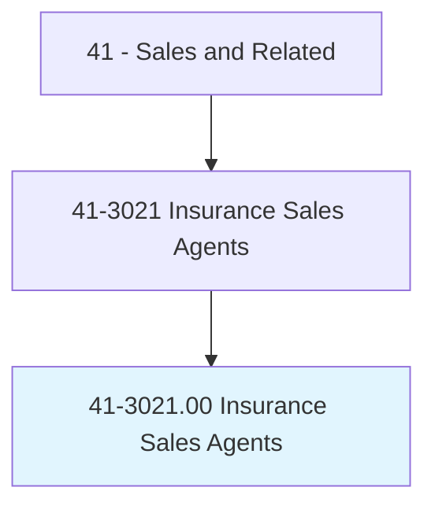
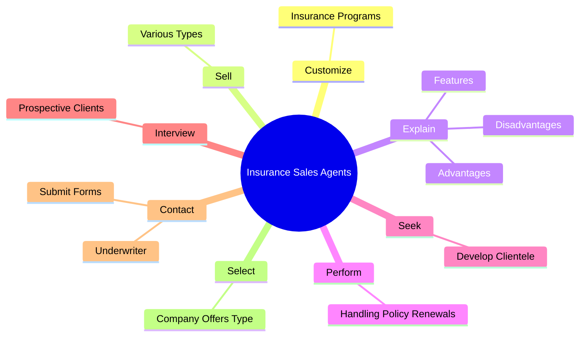
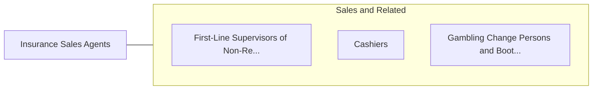

# Insurance Sales Agents

> Sell life, property, casualty, health, automotive, or other types of insurance. May refer clients to independent brokers, work as an independent broker, or be employed by an insurance company.

## Overview

Insurance Sales Agents is an occupation within the Sales and Related category. Sell life, property, casualty, health, automotive, or other types of insurance. 

## Classification Hierarchy

## Key Statistics

| Metric | Value |
|--------|-------|
| SOC Code | 41-3021.00 |
| Category | [Sales and Related](/occupations/Sales) |
| Task Count | 68 |
| Source | O*NET |

## Core Tasks

### customize.InsurancePrograms

Insurance Sales Agents customize insurance programs as part of their core responsibilities.

**Actions:**
- `customize.InsurancePrograms.to.SuitIndividualCustomers`
- `customize.InsurancePrograms.to.OftenCoveringVarietyOfRisks`

### sell.VariousTypes

Insurance Sales Agents sell various types as part of their core responsibilities.

**Actions:**
- `sell.VariousTypes.of.InsurancePoliciesToBusinessesOnBehalfOfInsuranceCompanies`
- `sell.VariousTypes.of.Individuals.on.BehalfOfInsuranceCompanies`
- `sell.VariousTypes.of.IncludingAutomobile`
- `sell.VariousTypes.of.Fire`

### explain.Features

Insurance Sales Agents explain features as part of their core responsibilities.

**Actions:**
- `explain.Features.of.VariousPolicies.to.promote.SaleOfInsurancePlans`
- `explain.Advantages.of.VariousPolicies.to.promote.SaleOfInsurancePlans`
- `explain.Disadvantages.of.VariousPolicies.to.promote.SaleOfInsurancePlans`

## Skills & Competencies

### Technical Skills
- **Sales Techniques** - Advanced
- **Customer Relations** - Advanced
- **Product Knowledge** - Advanced

### Soft Skills
- **Communication** - Essential
- **Problem Solving** - Essential
- **Critical Thinking** - Important
- **Teamwork** - Important
- **Adaptability** - Important

## Related Occupations

## Industries

This occupation is found across multiple industries. See [Industries](/industries) for sector-specific employment data.

## Career Progression

---

*Source: O*NET 41-3021.00 - ONETOccupation*
