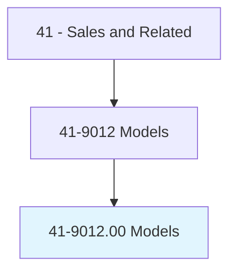
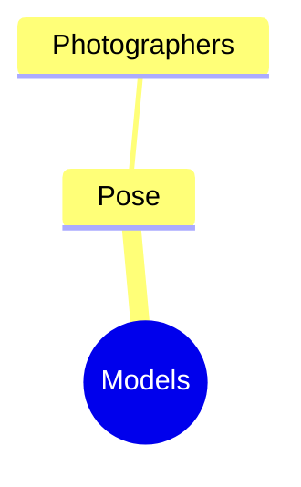
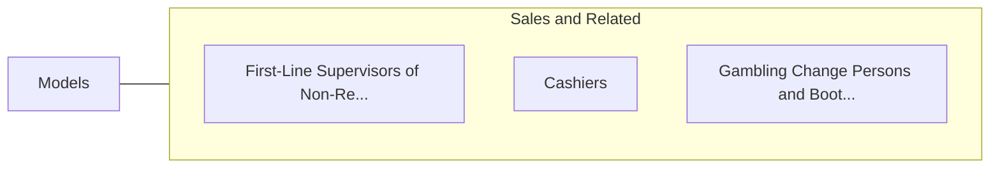

# Models

> Model garments or other apparel and accessories for prospective buyers at fashion shows, private showings, or retail establishments. May pose for photos to be used in magazines or advertisements. May pose as subject for paintings, sculptures, and other types of artistic expression.

## Overview

Models is an occupation within the Sales and Related category. Model garments or other apparel and accessories for prospective buyers at fashion shows, private showings, or retail establishments. May pose for photos to be used in magazines or advertisements.

## Classification Hierarchy

## Key Statistics

| Metric | Value |
|--------|-------|
| SOC Code | 41-9012.00 |
| Category | [Sales and Related](/occupations/Sales) |
| Task Count | 42 |
| Source | O*NET |

## Core Tasks

### pose.Photographers

Models pose photographers as part of their core responsibilities.

**Actions:**
- `pose.Photographers`

## Skills & Competencies

### Technical Skills
- **Sales Techniques** - Advanced
- **Customer Relations** - Advanced
- **Product Knowledge** - Advanced

### Soft Skills
- **Communication** - Essential
- **Problem Solving** - Essential
- **Critical Thinking** - Important
- **Teamwork** - Important
- **Adaptability** - Important

## Related Occupations

## Industries

This occupation is found across multiple industries. See [Industries](/industries) for sector-specific employment data.

## Career Progression

---

*Source: O*NET 41-9012.00 - ONETOccupation*
