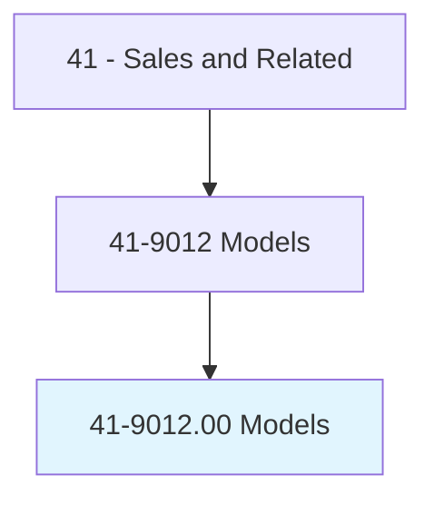
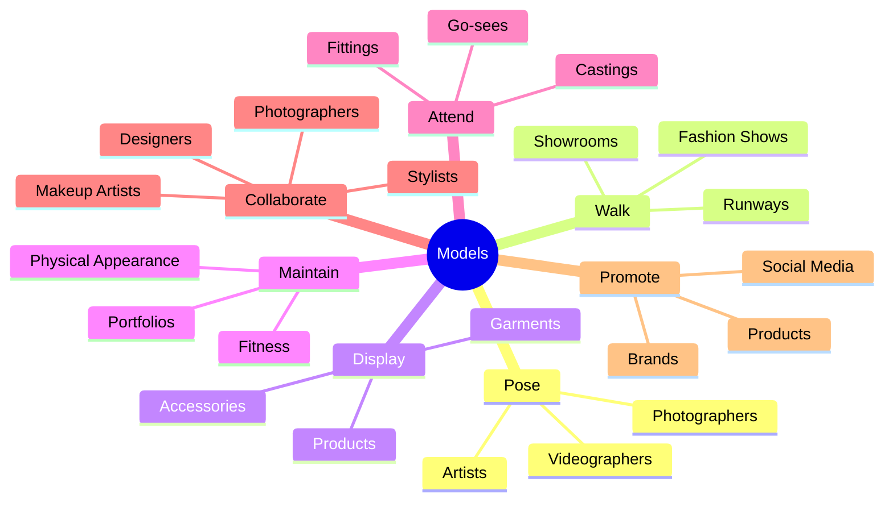
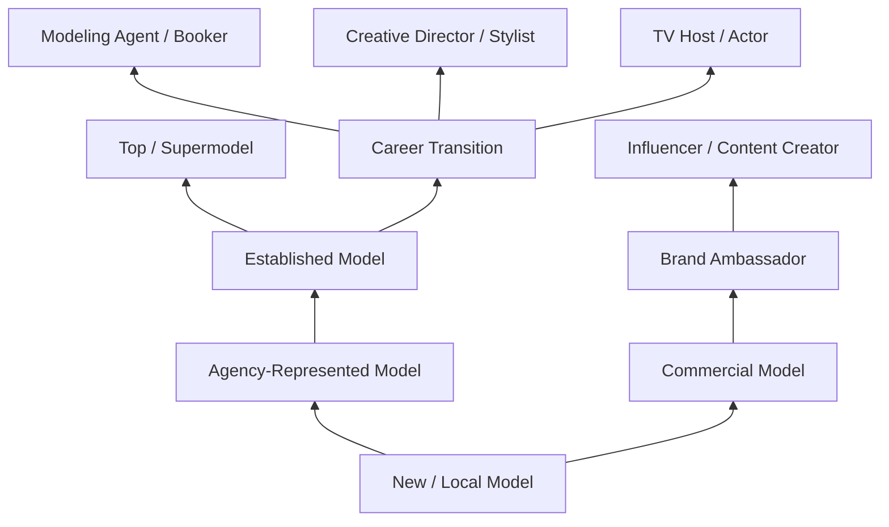
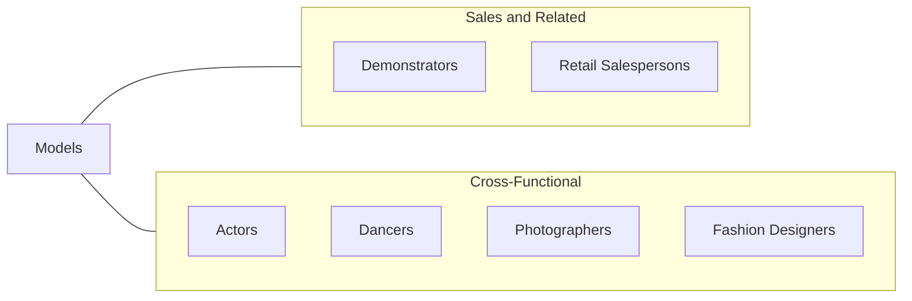

# Models

> Model garments or other apparel and accessories for prospective buyers at fashion shows, private showings, or retail establishments. May pose for photos to be used in magazines or advertisements. May pose as subject for paintings, sculptures, and other types of artistic expression.

## Overview

Models display clothing, accessories, and other products through fashion shows, photo shoots, video productions, and live appearances, serving as the visual embodiment of brands and designers. Their work is essential to the fashion, advertising, entertainment, and retail industries, where visual presentation directly influences consumer perception and purchasing decisions. Models must convey mood, style, and brand identity through their physical presence, posture, facial expressions, and movement.

The modeling industry encompasses several distinct categories: runway/fashion models who walk in designer shows and fashion weeks; commercial models who appear in advertisements for everyday products; editorial models who are photographed for magazines and fashion publications; catalog models who showcase clothing for retail publications and websites; fitness models who promote health and athletic products; and art models who pose for painters, sculptors, and art students. Each category has different physical requirements, skill sets, and career dynamics.

The profession is highly competitive and typically favors younger individuals, though the industry has expanded to include plus-size, mature, and diverse models in response to changing consumer expectations. Success requires not only physical attributes but also professionalism, reliability, the ability to take direction, and business acumen in managing one's personal brand. Many models work through agencies that handle bookings, negotiate rates, and manage career development, though freelance and digital-first modeling through social media platforms has become increasingly common.

## Classification Hierarchy

## Key Statistics

| Metric | Value |
|--------|-------|
| SOC Code | 41-9012.00 |
| Job Zone | 2 (Some Preparation) |
| Category | [Sales and Related](/occupations/Sales/index) |
| Median Annual Salary | $36,300 |
| Employment | ~8,200 |
| Projected Growth | 8% (faster than average) |
| Core Tasks | 42 |
| Source | O*NET |

## Core Tasks

### pose.Photographers

Models pose for photographers, artists, and other visual media creators.

**Actions:**
- `pose.Photographers` - Present products and create visual content for commercial and editorial use

### display.Garments

Models showcase clothing and products for buyers and consumers.

**Actions:**
- `display.Garments.at.FashionShows` - Walk runways presenting designer collections
- `display.Garments.at.PrivateShowings` - Present to buyers in showroom settings
- `display.Garments.at.RetailEstablishments` - Model merchandise in-store

## Skills & Competencies

### Technical Skills
- **Runway Walking Technique** - Advanced
- **Posing and Expression** - Advanced
- **Personal Brand Management** - Advanced
- **Social Media Marketing** - Intermediate to Advanced
- **Portfolio Development** - Advanced
- **Body Awareness and Movement** - Advanced
- **Wardrobe and Styling Knowledge** - Intermediate

### Soft Skills
- **Professionalism and Reliability** - Critical
- **Ability to Take Direction** - Critical
- **Confidence** - Critical
- **Adaptability** - Essential
- **Patience and Endurance** - Essential
- **Self-Discipline** - Essential
- **Networking** - Essential
- **Emotional Resilience** - Essential

## Education & Certifications

| Requirement | Details |
|-------------|---------|
| Typical Education | No formal education required |
| Modeling School / Training | Optional; posing, runway walking, photography preparation |
| Agency Representation | Primary credentialing mechanism in the industry |
| Portfolio / Comp Card | Professional photographs serving as resume |
| Social Media Presence | Increasingly required; Instagram, TikTok |
| Acting Classes | Beneficial for commercial and video work |
| Fitness / Nutrition Training | Personal development for physical maintenance |

## Career Progression

## Industry Variations

| Setting | Focus | Unique Aspects |
|---------|-------|----------------|
| High Fashion / Runway | Designer shows, fashion weeks | Height/size requirements; editorial focus; seasonal work cycles |
| Commercial / Advertising | Product promotion, ads | Broader physical diversity; consistent demand; brand representation |
| E-commerce / Catalog | Online retail photography | High volume; quick turnaround; standardized poses |
| Art / Fine Arts | Painting, sculpture, academic | Long static poses; art school settings; diverse body types welcomed |

## Technology & Tools

- **Portfolio Platforms** - Model Mayhem, The Fashion Model Directory
- **Booking Systems** - Agency booking software, casting platforms
- **Social Media** - Instagram, TikTok, YouTube
- **Photo Editing** - Basic Lightroom/Photoshop knowledge for self-promotion
- **Communication** - Agency apps, email, direct messaging
- **Fitness Apps** - Workout and nutrition tracking
- **Travel Tools** - Booking and itinerary management

## Related Occupations

## Departments

This occupation typically works in:
- [Marketing Department](/departments/Marketing) - Brand representation and promotion
- Creative Department - Visual content production
- Public Relations - Brand ambassadorship
- E-commerce - Product photography

---

*Source: O*NET 41-9012.00 - ONETOccupation*
