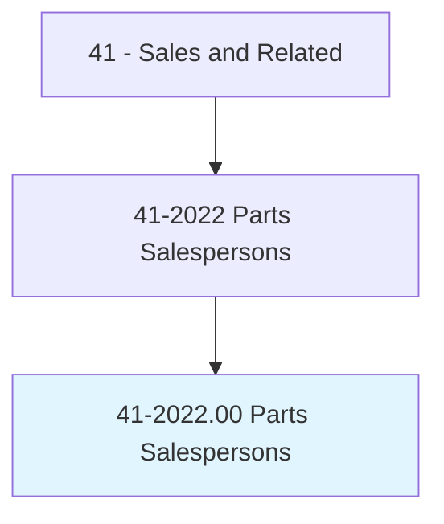
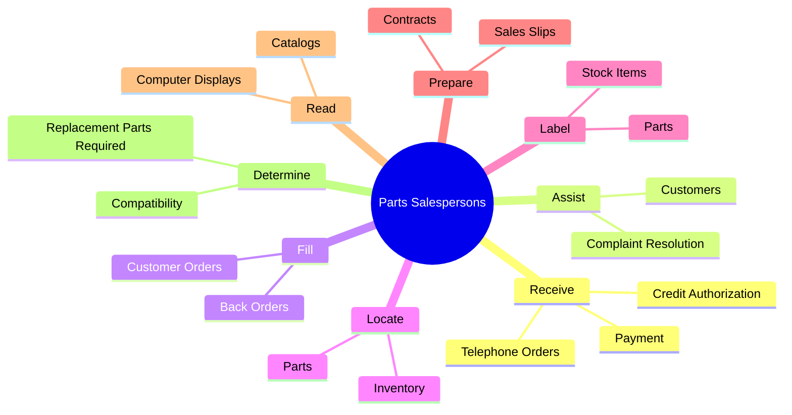
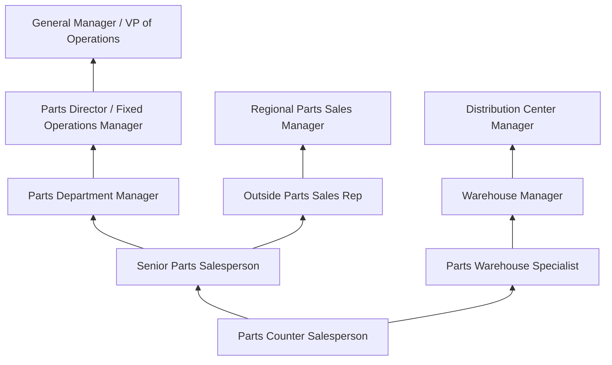
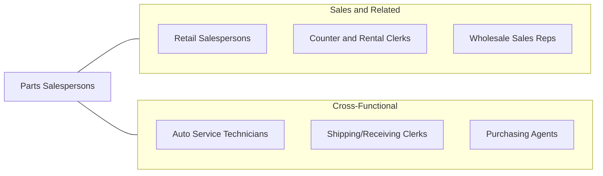

# Parts Salespersons

> Sell spare and replacement parts and equipment in repair shop or parts store.

## Overview

Parts Salespersons are specialized retail and wholesale sales professionals who sell replacement parts, components, and equipment for automobiles, trucks, heavy equipment, industrial machinery, and other mechanical systems. Working in auto parts stores, dealership parts departments, industrial supply houses, and equipment dealers, they help customers identify the correct parts for their needs, locate items in inventory or catalogs, process orders, and provide technical guidance on part compatibility and installation.

The role demands a unique combination of sales ability and technical knowledge. Parts Salespersons must understand mechanical systems, read technical diagrams and catalogs, cross-reference part numbers across manufacturers, and determine which components are compatible with specific makes, models, and years of equipment. They serve both professional mechanics and technicians (who represent the largest customer segment in many settings) and do-it-yourself consumers who need guidance on part selection and installation procedures.

The automotive and industrial aftermarket is a large and stable industry, with vehicles and equipment requiring ongoing maintenance and repair throughout their service lives. Parts Salespersons play a critical role in the supply chain, ensuring that repair shops and consumers have timely access to the components they need. The role is evolving with the growth of e-commerce, hybrid/electric vehicles, and advanced inventory management systems, but the need for knowledgeable parts professionals who can provide expert guidance remains strong.

## Classification Hierarchy

## Key Statistics

| Metric | Value |
|--------|-------|
| SOC Code | 41-2022.00 |
| Job Zone | 2 (Some Preparation) |
| Category | [Sales and Related](/occupations/Sales/index) |
| Median Annual Salary | $35,200 |
| Employment | ~265,000 |
| Projected Growth | 0% (little or no change) |
| Core Tasks | 53 |
| Source | O*NET |

## Core Tasks

### receive.Payment

Parts Salespersons process transactions and manage payment collection.

**Actions:**
- `receive.Payment` - Collect cash, credit, and account payments
- `receive.ObtainCreditAuthorization` - Process credit applications and charge accounts
- `receive.TelephoneOrders.for.Parts` - Take phone orders from shops and customers

### assist.Customers

Parts Salespersons help customers find and select the right components.

**Actions:**
- `assist.Customers.to.IdentifyCorrectParts` - Determine appropriate replacement parts
- `assist.Customers.to.UpdatingThemAboutBackOrderedParts` - Communicate order status
- `assist.Responding.to.CustomerComplaints` - Handle returns and warranty claims

### fill.CustomerOrders

Parts Salespersons fulfill orders from stock and manage back-orders.

**Actions:**
- `fill.CustomerOrders.from.Stock` - Pull and package parts from inventory
- `fill.CustomerOrders.from.PlaceOrdersWhenRequestedItemsAreOut.of.Stock` - Order unavailable items
- `fill.TelephoneOrders.for.Parts` - Process and ship phone orders

## Skills & Competencies

### Technical Skills
- **Automotive/Mechanical Systems Knowledge** - Advanced
- **Parts Catalog and Cross-Reference Systems** - Expert
- **Inventory Management** - Advanced
- **Point-of-Sale Systems** - Advanced
- **VIN Decoding and Application Lookup** - Advanced
- **Warranty Processing** - Intermediate
- **Technical Diagram Reading** - Intermediate

### Soft Skills
- **Technical Communication** - Critical
- **Customer Service** - Critical
- **Attention to Detail** - Critical
- **Problem Solving** - Essential
- **Patience** - Essential
- **Product Enthusiasm** - Important
- **Memory and Recall** - Important
- **Multitasking** - Essential

## Education & Certifications

| Requirement | Details |
|-------------|---------|
| Typical Education | High school diploma or equivalent |
| On-the-Job Training | Moderate; product line and system training |
| ASE Parts Specialist Certification (P2) | Automotive Service Excellence parts credential |
| Manufacturer Training | OEM-specific parts certification (Ford, GM, Toyota, etc.) |
| Forklift Certification | Required for warehouse-based parts roles |
| Inventory Management Training | Company-specific systems training |
| Hazmat Awareness | For handling batteries, fluids, and chemicals |

## Career Progression

## Industry Variations

| Setting | Focus | Unique Aspects |
|---------|-------|----------------|
| Auto Parts Retail (AutoZone, O'Reilly) | Consumer and DIY | Broad product range; walk-in customers; loaner tool programs |
| Dealership Parts Department | OEM parts for specific brands | Manufacturer systems; warranty parts; technician-focused |
| Heavy Equipment / Industrial | Machinery and fleet parts | Large-scale orders; technical specifications; field delivery |
| Marine / Powersports | Boats, motorcycles, ATVs | Seasonal demand; specialized applications; enthusiast customers |

## Technology & Tools

- **Parts Lookup** - Epicor PartExpert, Mitchell 1, AllData
- **Inventory Systems** - CDK Global, Reynolds & Reynolds, DMS platforms
- **POS Systems** - Retail POS, dealership DMS
- **Catalog Systems** - Electronic parts catalogs, VIN decode tools
- **E-commerce** - Online ordering platforms, B2B portals
- **Communication** - Multi-line phone systems, intercom
- **Shipping** - UPS/FedEx shipping integration

## Related Occupations

## Departments

This occupation typically works in:
- Parts Department - Inventory and sales operations
- Service Department - Technician parts support
- Warehouse - Stock management and distribution
- Customer Service - Client-facing support

---

*Source: O*NET 41-2022.00 - ONETOccupation*
