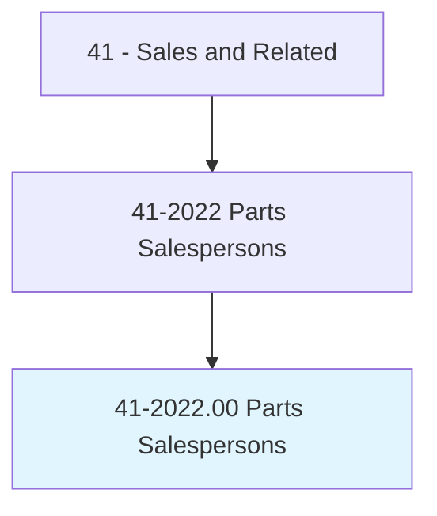
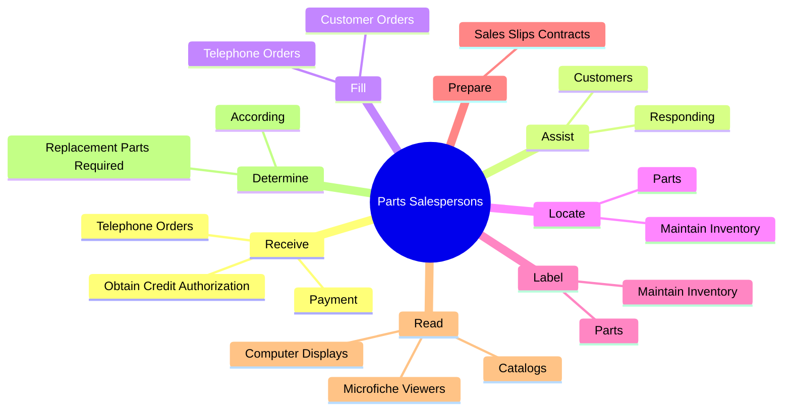
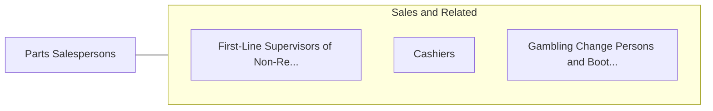

# Parts Salespersons

> Sell spare and replacement parts and equipment in repair shop or parts store.

## Overview

Parts Salespersons is classified under Sales and Related (SOC 41). Sell spare and replacement parts and equipment in repair shop or parts store.

## Classification Hierarchy

## Key Statistics

| Metric | Value |
|--------|-------|
| SOC Code | 41-2022.00 |
| Category | [Sales and Related](/occupations/Sales) |
| Task Count | 53 |
| Source | O*NET |

## Core Tasks

### receive.Payment

Parts Salespersons receive payment as part of their core responsibilities.

**Actions:**
- `receive.Payment`
- `receive.ObtainCreditAuthorization`
- `receive.TelephoneOrders.for.Parts`

### assist.Customers

Parts Salespersons assist customers as part of their core responsibilities.

**Actions:**
- `assist.Customers.to.CustomerComplaints`
- `assist.Customers.to.UpdatingThemAboutBackOrderedParts`
- `assist.Responding.to.CustomerComplaints`
- `assist.Responding.to.UpdatingThemAboutBackOrderedParts`

### fill.CustomerOrders

Parts Salespersons fill customer orders as part of their core responsibilities.

**Actions:**
- `fill.CustomerOrders.from.Stock`
- `fill.CustomerOrders.from.PlaceOrdersWhenRequestedItemsAreOut.of.Stock`
- `fill.TelephoneOrders.for.Parts`

## Skills & Competencies

### Technical Skills
- **Sales Techniques** - Advanced
- **Customer Relations** - Advanced
- **Product Knowledge** - Advanced

### Soft Skills
- **Communication** - Essential
- **Problem Solving** - Essential
- **Critical Thinking** - Important
- **Teamwork** - Important
- **Adaptability** - Important

## Related Occupations

## Industries

This occupation is found across multiple industries. See [Industries](/industries) for sector-specific employment data.

## Career Progression

---

*Source: O*NET 41-2022.00 - ONETOccupation*
