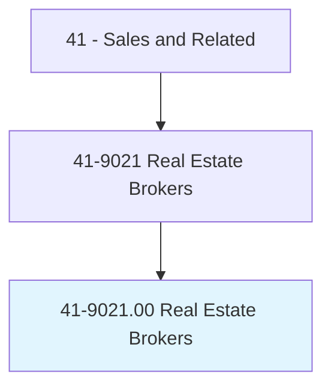
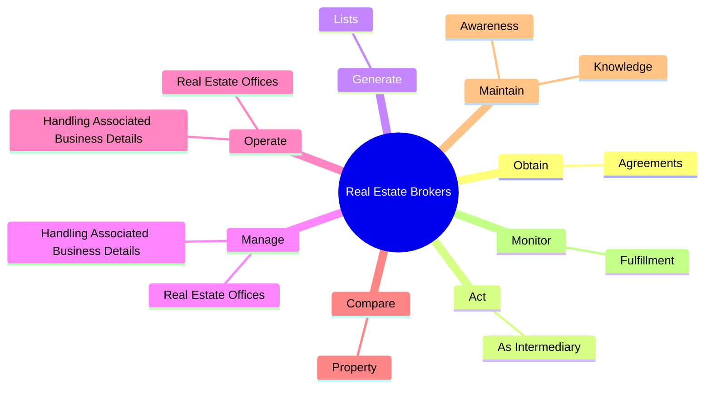

# Real Estate Brokers

> Operate real estate office, or work for commercial real estate firm, overseeing real estate transactions. Other duties usually include selling real estate or renting properties and arranging loans.

## Overview

Real Estate Brokers is an occupation within the Sales and Related category. Operate real estate office, or work for commercial real estate firm, overseeing real estate transactions. 

## Classification Hierarchy

## Key Statistics

| Metric | Value |
|--------|-------|
| SOC Code | 41-9021.00 |
| Category | [Sales and Related](/occupations/Sales/index) |
| Task Count | 36 |
| Source | O*NET |

## Core Tasks

### obtain.Agreements

Real Estate Brokers obtain agreements as part of their core responsibilities.

**Actions:**
- `obtain.Agreements.from.PropertyOwners.to.place.PropertiesForSaleWithRealEstateFirms`

### act.AsIntermediary

Real Estate Brokers act as intermediary as part of their core responsibilities.

**Actions:**
- `act.AsIntermediary.in.NegotiationsBetweenBuyersOverPropertyPricesSettlementDetailsDuringClosing.of.Sales`
- `act.AsIntermediary.in.SellersOverPropertyPricesSettlementDetailsDuringClosing.of.Sales`

### generate.Lists

Real Estate Brokers generate lists as part of their core responsibilities.

**Actions:**
- `generate.Lists.of.Properties.for.Sale`
- `generate.Lists.of.Locations`
- `generate.Lists.of.Descriptions`
- `generate.Lists.of.AvailableFinancingOptions`

## Skills & Competencies

### Technical Skills
- **Sales Techniques** - Advanced
- **Customer Relations** - Advanced
- **Product Knowledge** - Advanced

### Soft Skills
- **Communication** - Essential
- **Problem Solving** - Essential
- **Critical Thinking** - Important
- **Teamwork** - Important
- **Adaptability** - Important

## Related Occupations

## Industries

This occupation is found across multiple industries. See [Industries](/industries) for sector-specific employment data.

## Career Progression

---

*Source: O*NET 41-9021.00 - ONETOccupation*
