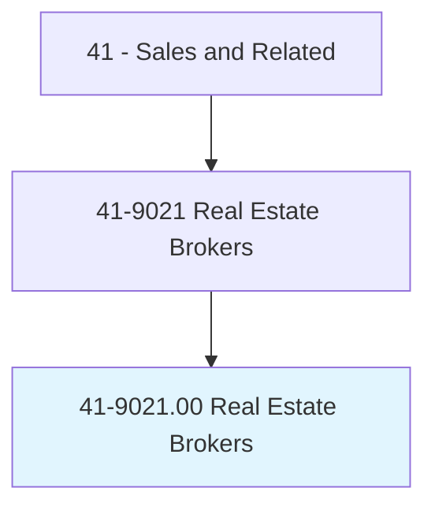
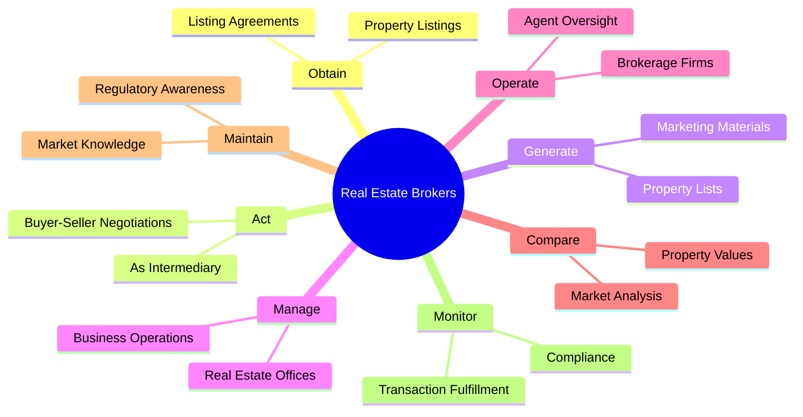
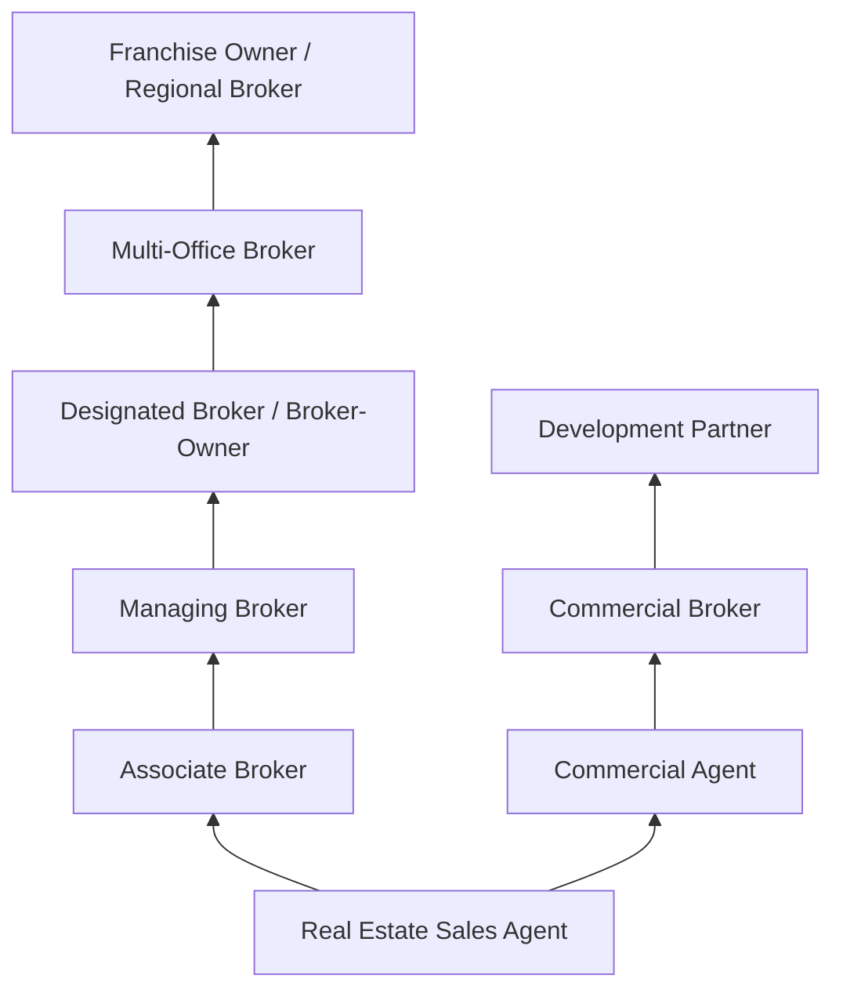
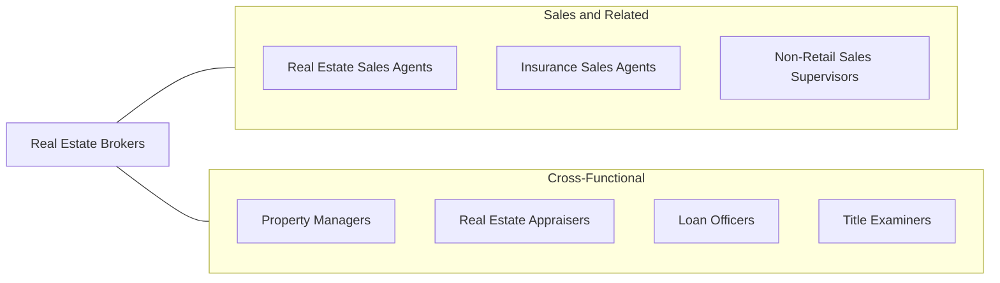

# Real Estate Brokers

> Operate real estate office, or work for commercial real estate firm, overseeing real estate transactions. Other duties usually include selling real estate or renting properties and arranging loans.

## Overview

Real Estate Brokers are licensed professionals who operate real estate offices or oversee real estate transactions for commercial firms, managing both the business operations of a brokerage and the transactional aspects of buying, selling, and leasing property. Unlike sales agents, brokers hold a higher-level license that allows them to operate independently, manage other agents, and take legal responsibility for transactions conducted under their brokerage. They serve as the principal authority in real estate offices, ensuring compliance with state and federal regulations.

Brokers fulfill dual roles: as business operators, they recruit, train, and supervise sales agents, manage office finances, develop marketing strategies, and maintain compliance with real estate laws. As transaction facilitators, they negotiate between buyers and sellers, oversee contract execution, coordinate closings, and ensure that all parties' interests are properly represented. Many brokers maintain their own client portfolios while managing their teams, particularly in smaller brokerages.

The real estate brokerage industry operates in a cyclical market influenced by interest rates, economic conditions, housing inventory, and demographic trends. Successful brokers build strong market reputations, develop deep local knowledge, and create efficient operations that support their agents' success. Compensation typically includes a share of commissions earned by agents under their supervision, plus commissions on their own transactions, creating strong incentives for both personal production and team development.

## Classification Hierarchy

## Key Statistics

| Metric | Value |
|--------|-------|
| SOC Code | 41-9021.00 |
| Job Zone | 4 (Considerable Preparation) |
| Category | [Sales and Related](/occupations/Sales/index) |
| Median Annual Salary | $63,060 |
| Employment | ~56,000 |
| Projected Growth | 3% (slower than average) |
| Core Tasks | 36 |
| Source | O*NET |

## Core Tasks

### obtain.Agreements

Real Estate Brokers secure listing agreements from property owners.

**Actions:**
- `obtain.Agreements.from.PropertyOwners.to.place.PropertiesForSaleWithRealEstateFirms` - Secure exclusive and open listings

### act.AsIntermediary

Real Estate Brokers negotiate between buyers and sellers.

**Actions:**
- `act.AsIntermediary.in.NegotiationsBetweenBuyers.and.Sellers` - Facilitate price and terms negotiations
- `act.AsIntermediary.in.SettlementDetails.during.Closing` - Coordinate closing processes

### manage.RealEstateOffices

Real Estate Brokers oversee brokerage operations.

**Actions:**
- `manage.RealEstateOffices.with.AssociatedBusinessDetails` - Run day-to-day office operations
- `manage.AgentTeams.for.ProductionAndCompliance` - Supervise and develop agent teams

## Skills & Competencies

### Technical Skills
- **Real Estate Law and Contracts** - Expert
- **Property Valuation and Market Analysis** - Expert
- **Transaction Management** - Expert
- **Brokerage Operations and Compliance** - Expert
- **Mortgage and Financing Knowledge** - Advanced
- **Marketing and Lead Generation** - Advanced
- **Negotiation** - Expert
- **Agent Recruitment and Development** - Advanced

### Soft Skills
- **Leadership and Management** - Critical
- **Relationship Building** - Critical
- **Communication** - Critical
- **Business Acumen** - Critical
- **Integrity and Ethics** - Critical
- **Negotiation** - Critical
- **Strategic Thinking** - Essential
- **Adaptability** - Essential

## Education & Certifications

| Requirement | Details |
|-------------|---------|
| Typical Education | Some college; bachelor's degree beneficial |
| Real Estate Broker License | State-specific; requires agent experience (typically 2-3 years) and additional coursework |
| Real Estate Salesperson License | Prerequisite for broker license |
| Broker's Pre-License Course | 60-200 hours depending on state |
| Certified Commercial Investment Member (CCIM) | Commercial real estate designation |
| Certified Residential Specialist (CRS) | NAR designation for residential experts |
| Graduate REALTOR Institute (GRI) | NAR professional development designation |
| Continuing Education | Required for license renewal (varies by state) |

## Career Progression

## Industry Variations

| Setting | Focus | Unique Aspects |
|---------|-------|----------------|
| Residential Brokerage | Home buying and selling | High volume; emotional transactions; local market expertise |
| Commercial Brokerage | Office, retail, industrial, land | Longer cycles; complex financing; investment analysis |
| Property Management | Rental and lease management | Ongoing revenue; tenant relations; maintenance oversight |
| Real Estate Development | Land acquisition and development | Project management; zoning expertise; partnership structures |

## Technology & Tools

- **MLS Systems** - Multiple Listing Service platforms
- **CRM** - Follow Up Boss, kvCORE, BoomTown
- **Transaction Management** - Dotloop, SkySlope, Brokermint
- **Marketing** - Zillow Premier Agent, Realtor.com, social media
- **E-signatures** - DocuSign, Authentisign
- **Comparative Market Analysis** - RPR, Realtors Property Resource
- **Accounting** - QuickBooks, brokerage accounting systems
- **Communication** - Texting platforms, drip email campaigns

## Related Occupations

## Departments

This occupation typically works in:
- [Sales Department](/departments/Sales) - Transaction management and revenue
- [Operations](/departments/Operations) - Brokerage office management
- Compliance - Regulatory and licensing compliance
- [Marketing Department](/departments/Marketing) - Property marketing and lead generation

---

*Source: O*NET 41-9021.00 - ONETOccupation*
