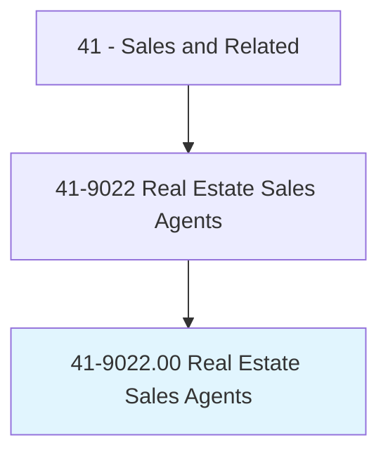
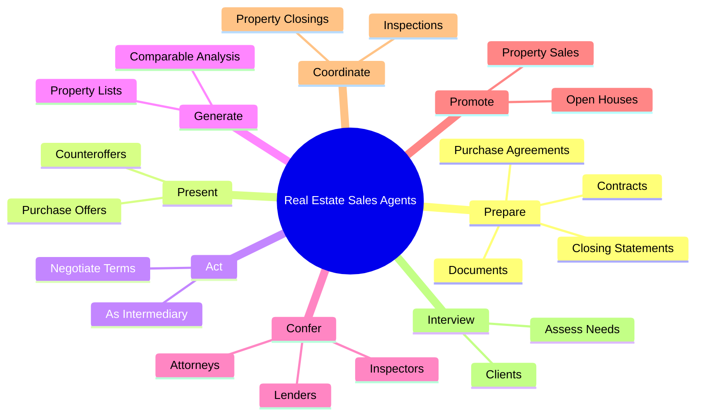
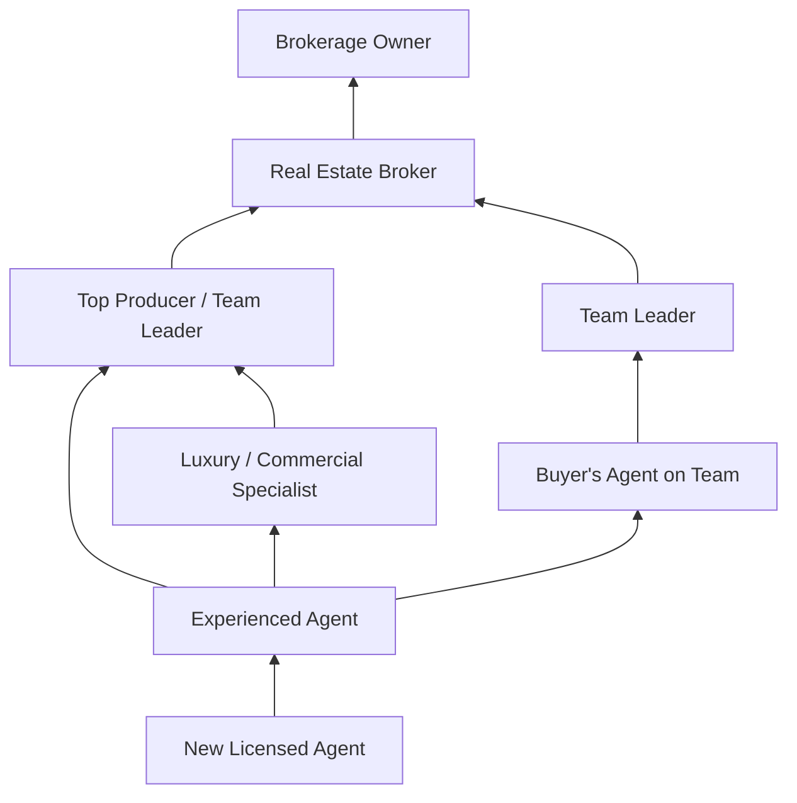
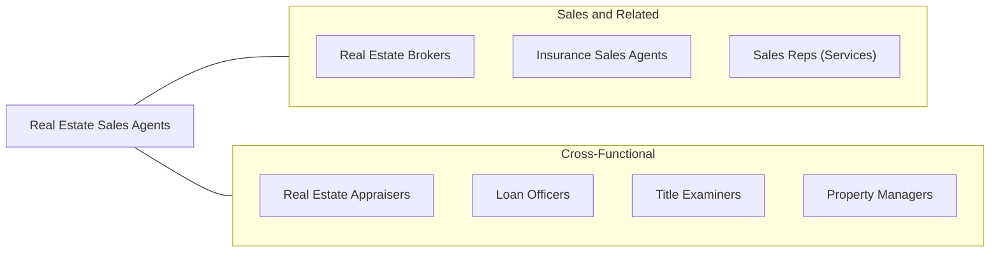

# Real Estate Sales Agents

> Rent, buy, or sell property for clients. Perform duties such as study property listings, interview prospective clients, accompany clients to property site, discuss conditions of sale, and draw up real estate contracts. Includes agents who represent buyer.

## Overview

Real Estate Sales Agents are licensed professionals who help individuals and businesses buy, sell, and rent residential and commercial properties. They serve as intermediaries between parties, guiding clients through what is often the largest financial transaction of their lives. Agents research property listings, interview prospective clients to understand their needs, show properties, prepare comparative market analyses, negotiate offers, and coordinate the complex closing process involving inspections, appraisals, financing, and title work.

The profession operates on a commission-based model, with agents typically earning a percentage of the sale price split between the listing agent, buyer's agent, and their respective brokerages. This compensation structure means income can vary significantly based on market conditions, transaction volume, and price points. Successful agents build pipelines through referrals, repeat business, networking, marketing, and online lead generation. The role requires self-motivation, entrepreneurial drive, and the ability to manage multiple transactions simultaneously.

Real estate is fundamentally a local business, and agents must develop deep knowledge of their markets -- understanding neighborhood characteristics, school districts, zoning regulations, development trends, and property values. They must also stay current on financing options, tax implications, and legal requirements that affect transactions. The profession has been transformed by technology, with online listings, virtual tours, digital marketing, and electronic transaction management becoming standard practices, but the personal relationship and local expertise that agents provide remain essential.

## Classification Hierarchy

## Key Statistics

| Metric | Value |
|--------|-------|
| SOC Code | 41-9022.00 |
| Job Zone | 3 (Medium Preparation) |
| Category | [Sales and Related](/occupations/Sales/index) |
| Median Annual Salary | $49,980 |
| Employment | ~170,000 |
| Projected Growth | 3% (slower than average) |
| Core Tasks | 91 |
| Source | O*NET |

## Core Tasks

### prepare.Documents

Real Estate Sales Agents draft and prepare transactional documents.

**Actions:**
- `prepare.Documents` - Create standardized real estate forms
- `prepare.RepresentationContracts` - Draft buyer and listing agreements
- `prepare.PurchaseAgreements` - Write offers and counteroffers
- `prepare.ClosingStatements` - Compile closing documentation

### present.PurchaseOffers

Real Estate Sales Agents present offers and negotiate terms.

**Actions:**
- `present.PurchaseOffers.to.SellersForConsideration` - Submit and explain buyer offers

### act.AsIntermediary

Real Estate Sales Agents negotiate between buyers and sellers.

**Actions:**
- `act.AsIntermediary.in.NegotiationsBetweenBuyers` - Represent buyer interests
- `act.AsIntermediary.in.Sellers` - Represent seller interests
- `act.AsIntermediary.in.GenerallyRepresentingOne.Party` - Advocate for client position

## Skills & Competencies

### Technical Skills
- **Real Estate Law and Contracts** - Advanced
- **Comparative Market Analysis (CMA)** - Advanced
- **MLS and Property Search Systems** - Expert
- **Mortgage and Financing Knowledge** - Intermediate
- **Property Marketing** - Advanced
- **Negotiation** - Advanced
- **Digital Marketing and Social Media** - Intermediate
- **Transaction Coordination** - Advanced

### Soft Skills
- **Relationship Building** - Critical
- **Communication** - Critical
- **Empathy and Patience** - Essential
- **Self-Motivation** - Critical
- **Time Management** - Essential
- **Negotiation** - Critical
- **Integrity** - Critical
- **Local Market Knowledge** - Critical

## Education & Certifications

| Requirement | Details |
|-------------|---------|
| Typical Education | High school diploma required; some college preferred |
| Real Estate Salesperson License | State-specific; requires pre-license course (40-180 hours) and exam |
| NAR REALTOR Membership | Access to MLS and professional designation |
| Accredited Buyer's Representative (ABR) | NAR buyer specialization designation |
| Seller Representative Specialist (SRS) | NAR listing specialization designation |
| e-PRO Certification | NAR technology and online marketing credential |
| Continuing Education | Required for license renewal (varies by state) |
| Errors and Omissions Insurance | Required in many states |

## Career Progression

## Industry Variations

| Setting | Focus | Unique Aspects |
|---------|-------|----------------|
| Residential Resale | Existing home sales | Largest segment; emotional buyers; staging and presentation |
| New Construction | Builder sales | Model home presence; spec and custom options; builder relationships |
| Luxury Real Estate | High-end properties | Affluent clients; discretion; international buyers; marketing sophistication |
| Commercial Real Estate | Office, retail, industrial | Investment analysis; tenant representation; longer sales cycles |

## Technology & Tools

- **MLS Systems** - Regional MLS platforms, Bright MLS, Stellar MLS
- **CRM** - Follow Up Boss, kvCORE, LionDesk
- **Marketing** - Zillow, Realtor.com, social media, Matterport virtual tours
- **E-signatures** - DocuSign, Authentisign, SkySlope
- **Communication** - Text messaging platforms, video calling
- **Photography** - Professional photography, drone imagery, virtual staging
- **Transaction Management** - Dotloop, SkySlope, Brokermint

## Related Occupations

## Departments

This occupation typically works in:
- [Sales Department](/departments/Sales) - Property transactions
- [Marketing Department](/departments/Marketing) - Property promotion
- Client Services - Buyer and seller representation
- Transaction Management - Closing coordination

---

*Source: O*NET 41-9022.00 - ONETOccupation*
