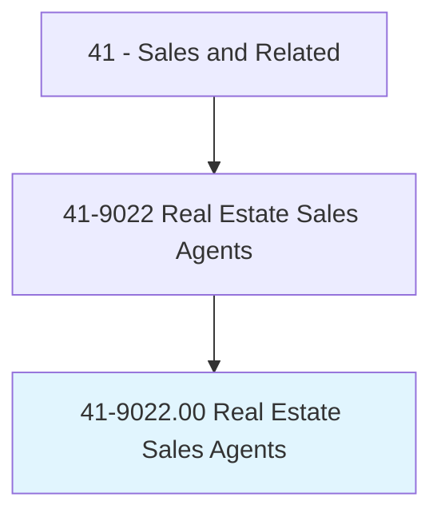
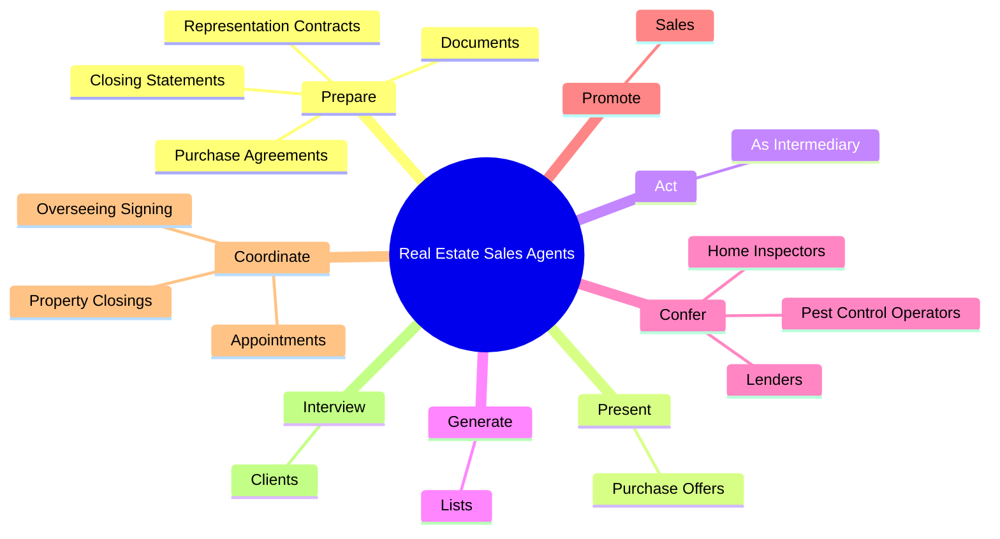

# Real Estate Sales Agents

> Rent, buy, or sell property for clients. Perform duties such as study property listings, interview prospective clients, accompany clients to property site, discuss conditions of sale, and draw up real estate contracts. Includes agents who represent buyer.

## Overview

Real Estate Sales Agents is an occupation within the Sales and Related category. Rent, buy, or sell property for clients. Perform duties such as study property listings, interview prospective clients, accompany clients to property site, discuss conditions of sale, and draw up real estate contracts.

## Classification Hierarchy

## Key Statistics

| Metric | Value |
|--------|-------|
| SOC Code | 41-9022.00 |
| Category | [Sales and Related](/occupations/Sales/index) |
| Task Count | 91 |
| Source | O*NET |

## Core Tasks

### prepare.Documents

Real Estate Sales Agents prepare documents as part of their core responsibilities.

**Actions:**
- `prepare.Documents`
- `prepare.RepresentationContracts`
- `prepare.PurchaseAgreements`
- `prepare.ClosingStatements`

### present.PurchaseOffers

Real Estate Sales Agents present purchase offers as part of their core responsibilities.

**Actions:**
- `present.PurchaseOffers.to.SellersForConsideration`

### act.AsIntermediary

Real Estate Sales Agents act as intermediary as part of their core responsibilities.

**Actions:**
- `act.AsIntermediary.in.NegotiationsBetweenBuyers`
- `act.AsIntermediary.in.Sellers`
- `act.AsIntermediary.in.GenerallyRepresentingOne`
- `act.AsIntermediary.in.Other`

## Skills & Competencies

### Technical Skills
- **Sales Techniques** - Advanced
- **Customer Relations** - Advanced
- **Product Knowledge** - Advanced

### Soft Skills
- **Communication** - Essential
- **Problem Solving** - Essential
- **Critical Thinking** - Important
- **Teamwork** - Important
- **Adaptability** - Important

## Related Occupations

## Industries

This occupation is found across multiple industries. See [Industries](/industries) for sector-specific employment data.

## Career Progression

---

*Source: O*NET 41-9022.00 - ONETOccupation*
