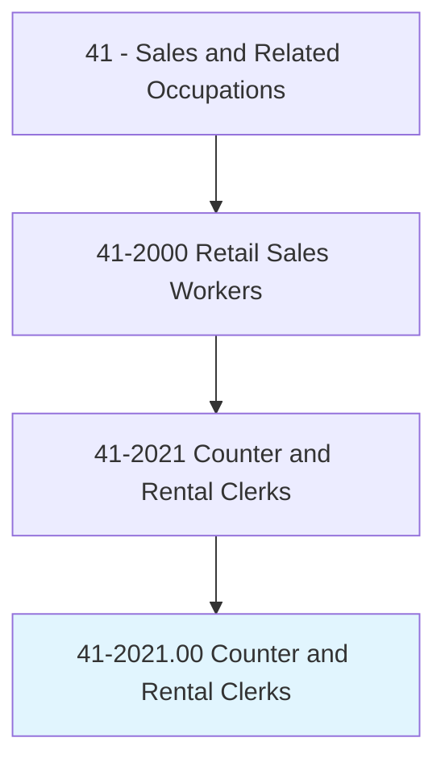
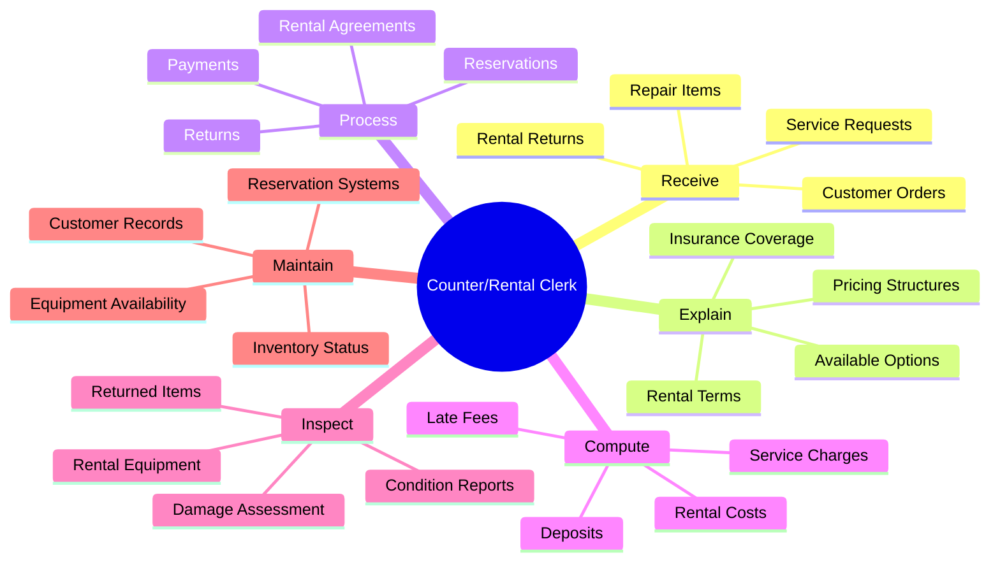
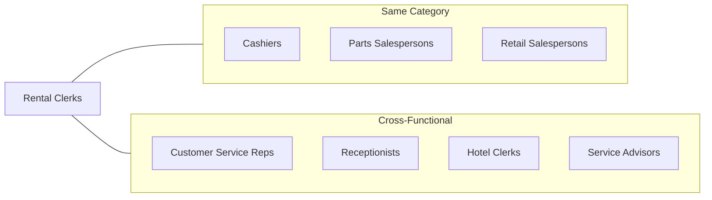
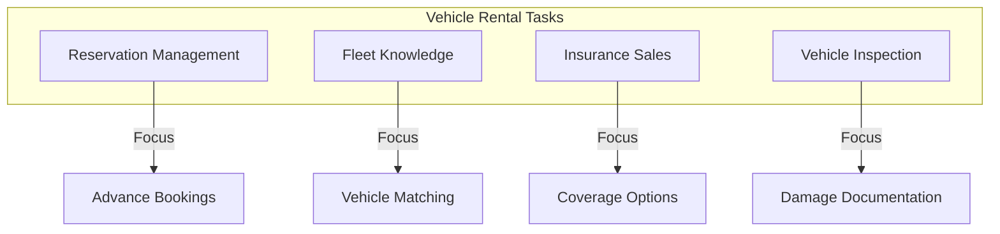
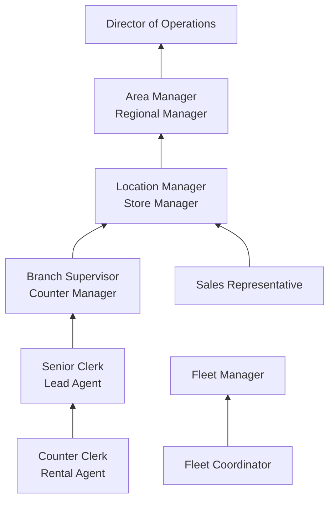
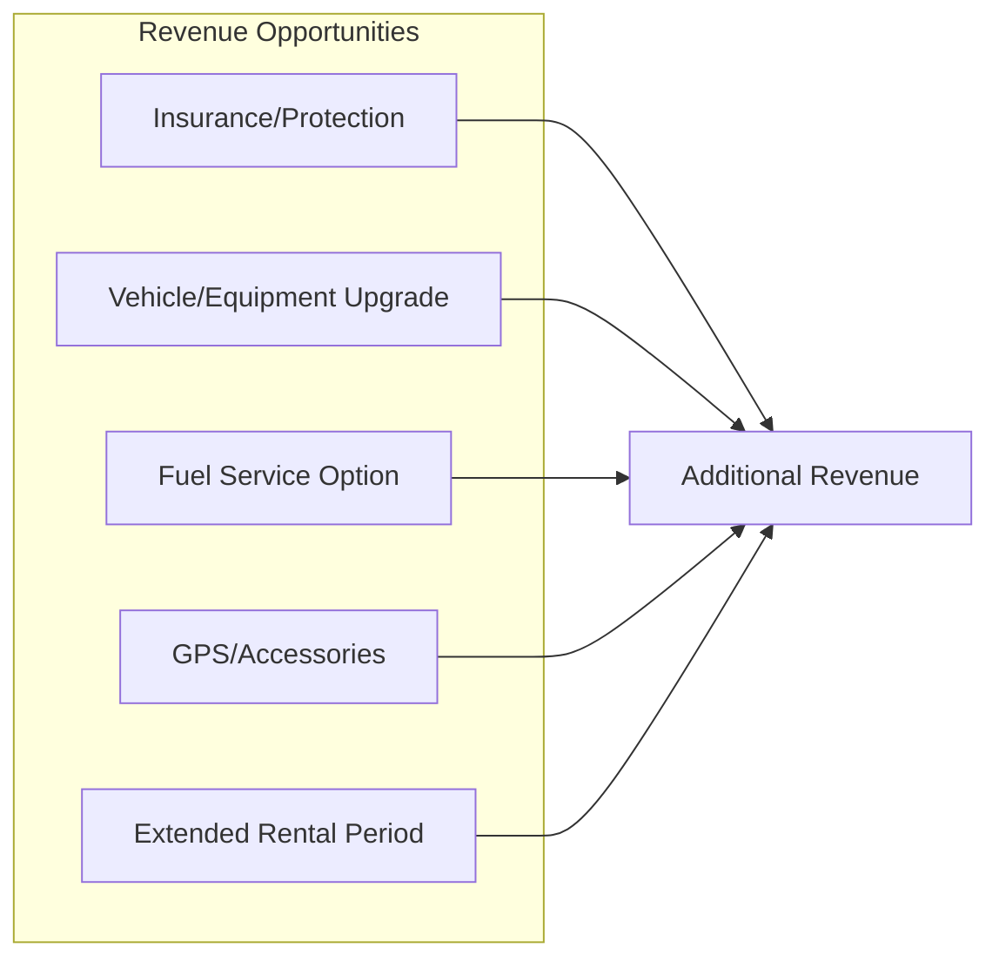

# Counter and Rental Clerks

> Receive orders, generally in person, for repairs, rentals, and services. May describe available options, compute cost, and accept payment.

## Overview

Counter and Rental Clerks serve as the primary point of contact for customers seeking rental services, repairs, or other service transactions. They work across a diverse range of industries including vehicle rental, equipment rental, video/media rental, dry cleaning, and repair services. These professionals combine sales skills with customer service expertise, explaining product options, processing transactions, and ensuring customer satisfaction. The role requires strong interpersonal skills, attention to detail, and the ability to handle multiple tasks while maintaining accurate records of rentals, returns, and payments.

## Classification Hierarchy

## Key Statistics

| Metric | Value |
|--------|-------|
| SOC Code | 41-2021.00 |
| Job Zone | 2 (Some Preparation) |
| Category | [Sales and Related](/occupations/Sales) |
| Core Tasks | 20+ |
| Source | O*NET |

## Core Tasks

### receive.CustomerOrders

Counter and Rental Clerks accept orders for rentals, repairs, and services from customers.

**Actions:**
- `receive.Orders.from.Customers` - Take rental and service requests
- `accept.Items.for.Repair` - Receive merchandise needing service
- `process.Returns.from.Customers` - Handle rental returns
- `greet.Customers.at.Counter` - Welcome and assist walk-in customers

### explain.AvailableOptions

Describing products, services, and rental terms to help customers make informed decisions.

**Actions:**
- `describe.Options.to.Customers` - Present available choices
- `explain.RentalTerms.for.Agreement` - Clarify contract conditions
- `recommend.Products.based.on.Needs` - Suggest appropriate rentals
- `present.UpgradePossibilities.to.Customers` - Offer premium alternatives

### process.RentalAgreements

Creating and managing rental contracts and transactions.

**Actions:**
- `process.RentalAgreements.with.Customers` - Complete contract paperwork
- `verify.Identification.for.Rentals` - Confirm customer identity
- `collect.Deposits.for.Rentals` - Secure damage deposits
- `obtain.Signatures.on.Contracts` - Finalize rental agreements

### compute.Costs

Calculating charges for rentals, services, and additional fees.

**Actions:**
- `compute.RentalCosts.for.Customers` - Calculate total charges
- `calculate.ServiceCharges.for.Repairs` - Determine repair costs
- `apply.Discounts.to.Transactions` - Process promotional rates
- `assess.LateFees.for.Overdue.Rentals` - Add overdue charges

### inspect.Equipment

Evaluating rental items before and after use to assess condition.

**Actions:**
- `inspect.Equipment.before.Rental` - Check item condition
- `document.Damage.on.Returns` - Record condition issues
- `verify.Completeness.of.ReturnedItems` - Ensure all components returned
- `prepare.ConditionReports.for.Records` - Create inspection documentation

## Skills & Competencies

### Technical Skills
- **Rental Management Software** - Proficient
- **Point-of-Sale Systems** - Proficient
- **Microsoft Office** - Intermediate
- **Inventory Management** - Intermediate
- **Basic Equipment Knowledge** - Required (industry-specific)

### Soft Skills
- **Customer Service** - Critical
- **Communication** - Essential
- **Sales Ability** - Essential
- **Attention to Detail** - Essential
- **Problem Solving** - Important
- **Organization** - Important

## Related Occupations

## Industry Variations

### Vehicle Rental (Car, Truck, RV)

Key differences:
- Driver's license verification
- Insurance coverage sales
- Fleet availability management
- Vehicle condition documentation
- Airport/off-site location operations
- One-way rental coordination

### Equipment Rental (Construction, Party, Tools)

Key differences:
- Technical equipment knowledge
- Safety instruction delivery
- Maintenance scheduling
- Delivery coordination
- Damage liability assessment
- Hourly/daily/weekly rate structures

### Formal Wear and Costume Rental

Key differences:
- Fitting and measurement assistance
- Alteration coordination
- Event date management
- Ensemble coordination
- Last-minute adjustments
- Seasonal demand fluctuations

### Dry Cleaning and Laundry

Key differences:
- Garment care knowledge
- Special handling instructions
- Stain identification
- Rush service coordination
- Quality inspection
- Claim processing for damage

### Video/Media Rental (Legacy)

Key differences:
- Membership management
- Late fee administration
- New release reservations
- Genre recommendations
- Multi-day rental tracking

### Sporting Goods Rental (Ski, Bike, Water Sports)

Key differences:
- Equipment sizing and fitting
- Safety equipment requirements
- Seasonal operations
- Resort/location integration
- Group rental coordination
- Weather-related adjustments

## Industries

- [Automotive Rental and Leasing](/industries/VehicleRental) - Primary sector
- [Consumer Goods Rental](/industries/ConsumerRental) - Equipment and furniture
- [Commercial Equipment Rental](/industries/CommercialRental) - Construction and industrial
- [Personal Services](/industries/PersonalServices) - Dry cleaning, laundry
- [Recreation Industries](/industries/Recreation) - Sports equipment, party supplies
- [Repair Services](/industries/RepairServices) - Electronics, appliances

## Career Progression

### Typical Timeline

| Stage | Years Experience | Typical Title |
|-------|-----------------|---------------|
| Entry | 0-1 | Counter Clerk, Rental Agent |
| Experienced | 1-3 | Senior Clerk, Lead Agent |
| Supervisor | 3-5 | Branch Supervisor, Counter Manager |
| Management | 5-8 | Location Manager, Store Manager |
| Leadership | 8+ | Area Manager, Director |

## Education & Training

| Requirement | Details |
|-------------|---------|
| Typical Education | High school diploma or equivalent |
| Work Experience | Customer service experience preferred |
| On-the-Job Training | 2-4 weeks industry-specific training |
| Certifications | Driver's license required for vehicle rental |

### Training Topics

- Company products and services
- Rental management systems
- Contract terms and conditions
- Insurance and protection products
- Customer service techniques
- Upselling and cross-selling
- Damage assessment procedures
- Safety and liability awareness

## Departments

This occupation typically works in:
- [Sales and Service Counter](/departments/ServiceCounter)
- [Customer Service](/departments/CustomerService)
- [Rental Operations](/departments/RentalOps)
- [Branch Operations](/departments/BranchOps)

## Technology & Tools

### Rental Management Systems
- Rent Centric
- Point of Rental
- EZRentOut
- Rentec Direct
- Enterprise/National/Alamo systems (vehicle)

### Point-of-Sale Systems
- Square
- Lightspeed
- Clover
- Industry-specific POS

### Customer Management
- CRM systems
- Reservation platforms
- Loyalty program software
- Email marketing tools

### Inspection Tools
- Digital cameras/smartphones
- Condition report apps
- Vehicle inspection systems
- Barcode/RFID scanners

## Work Environment

### Physical Demands
- Standing for extended periods
- Walking around rental areas
- Light lifting (moving equipment, garments)
- Computer work at counter

### Work Schedule
- Variable hours including weekends
- Extended hours during peak seasons
- Holiday work (vehicle rental especially)
- Early morning/late evening at travel locations

### Work Conditions
- Indoor counter environment
- Outdoor lot/equipment inspection
- Customer-facing position
- Fast-paced during peak times

## Performance Metrics

| Metric | Description |
|--------|-------------|
| Rental Revenue | Total rental income generated |
| Upsell Rate | Protection products and upgrades sold |
| Customer Satisfaction | Survey scores and reviews |
| Turnaround Time | Vehicle/equipment prep efficiency |
| Damage Recovery | Successful damage claim processing |
| Contract Accuracy | Error-free documentation |
| Return On-Time Rate | Customer compliance tracking |

## Sales Opportunities

### Common Upsells and Add-ons

### Key Sales Metrics
- Protection product attachment rate
- Upgrade acceptance percentage
- Accessory attachment rate
- Average transaction value
- Fuel service acceptance

## Challenges and Considerations

### Common Challenges
- Managing customer expectations
- Handling damage disputes
- Peak period volume
- Inventory availability
- Seasonal demand fluctuations
- No-shows and cancellations

### Customer Interaction Scenarios

| Scenario | Approach |
|----------|----------|
| Damage Discovery | Document thoroughly, explain policy calmly |
| Unavailable Reservation | Offer upgrade or alternative at no charge |
| Late Return | Calculate fees, offer solutions |
| Complaint Handling | Listen, empathize, find resolution |
| Price Objection | Highlight value, offer alternatives |

## Geographic Considerations

### Airport Locations
- Extended hours (early/late flights)
- High volume, fast pace
- Shuttle coordination
- Quick turnaround requirements

### Downtown/City Locations
- Business traveler focus
- Hourly/daily rentals common
- Limited parking/lot space
- Delivery/pickup services

### Resort/Vacation Areas
- Seasonal fluctuations
- Recreational equipment focus
- Longer rental periods
- Package deals with accommodations

---

*Source: O*NET 41-2021.00 - ONETOccupation*
