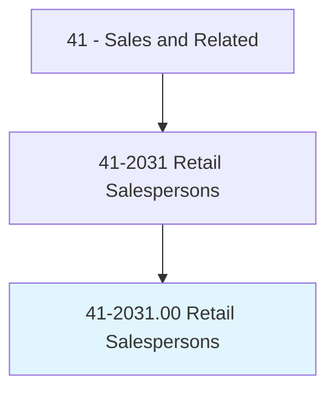
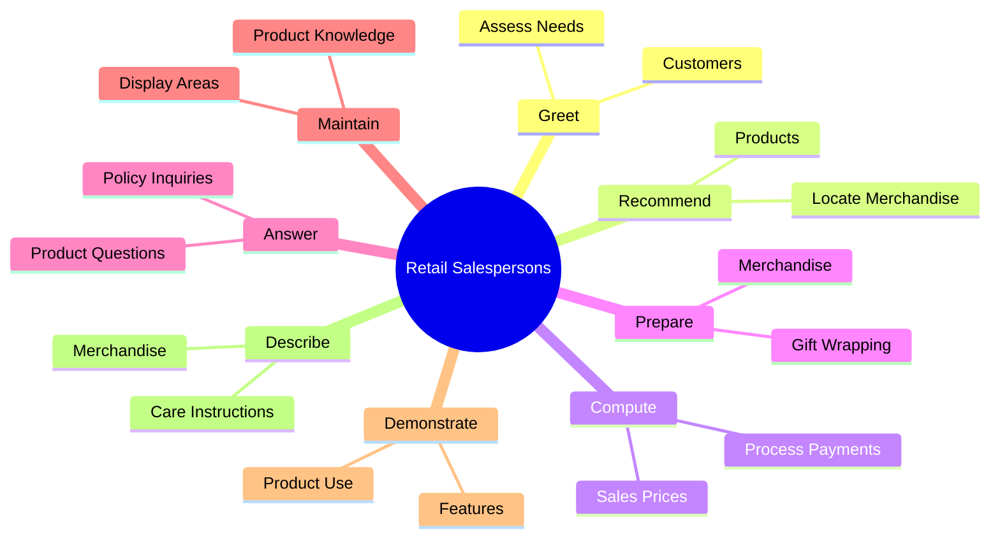
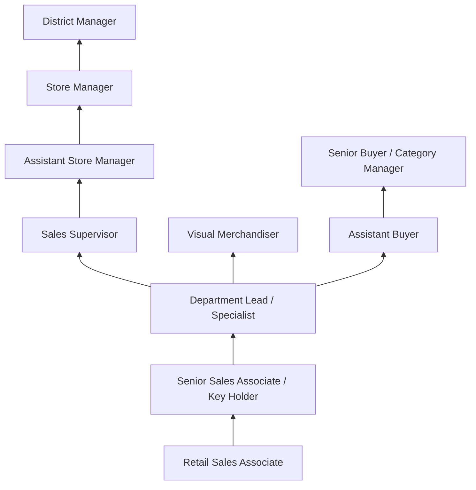
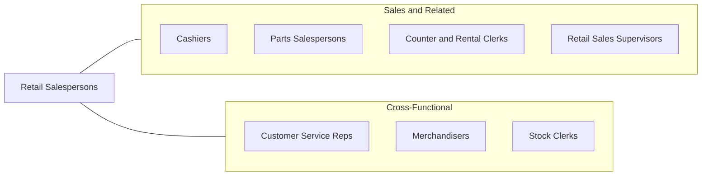

# Retail Salespersons

> Sell merchandise, such as furniture, motor vehicles, appliances, or apparel to consumers.

## Overview

Retail Salespersons are the front-line representatives of the retail industry, directly assisting customers in selecting and purchasing merchandise across virtually every product category. From clothing and electronics to furniture, automobiles, jewelry, and sporting goods, these professionals greet customers, assess their needs, demonstrate products, explain features and pricing, process transactions, and handle returns and exchanges. They are the human face of retail brands, and their interactions significantly influence customer satisfaction, loyalty, and spending.

The retail landscape is undergoing profound transformation as e-commerce reshapes consumer behavior. In-store salespersons increasingly differentiate themselves through expertise, personalized service, and experiential selling that online channels cannot replicate. High-touch product categories -- luxury goods, electronics, furniture, automobiles, and bridal wear -- continue to rely heavily on knowledgeable salespersons who can guide customers through complex purchasing decisions. Many retailers now equip their floor staff with mobile devices to check inventory, compare products, and process transactions anywhere in the store.

Retail Salespersons constitute one of the largest occupational groups in the United States, with millions of workers across diverse retail environments. The role serves as an important entry point to the workforce, providing foundational customer service, communication, and business skills. Compensation varies widely -- from minimum wage in general merchandise to substantial earnings with commissions in automotive, furniture, and luxury retail.

## Classification Hierarchy

## Key Statistics

| Metric | Value |
|--------|-------|
| SOC Code | 41-2031.00 |
| Job Zone | 2 (Some Preparation) |
| Category | [Sales and Related](/occupations/Sales/index) |
| Median Annual Salary | $31,600 |
| Employment | ~4,100,000 |
| Projected Growth | -2% (declining slightly) |
| Core Tasks | 72 |
| Source | O*NET |

## Core Tasks

### greet.Customers

Retail Salespersons engage customers and assess their needs.

**Actions:**
- `greet.AscertainWhatCustomerWants` - Welcome customers and identify needs
- `greet.Needs` - Determine customer preferences and budget

### recommend.Products

Retail Salespersons guide customers to appropriate merchandise.

**Actions:**
- `recommend.SelectHelpLocateObtainMerchandiseBased.on.CustomerneedsDesires` - Match products to customer requirements

### compute.SalesPrices

Retail Salespersons calculate prices and process transactions.

**Actions:**
- `compute.SalesPrices` - Calculate discounts and final pricing
- `compute.TotalPurchases` - Tally multi-item transactions
- `compute.ReceiveCashCreditPayment` - Accept various payment methods
- `compute.ProcessCashCreditPayment` - Complete transaction processing

## Skills & Competencies

### Technical Skills
- **Product Knowledge** - Advanced (category-specific)
- **Point-of-Sale Systems** - Advanced
- **Inventory Management** - Intermediate
- **Visual Merchandising** - Intermediate
- **Cash Handling** - Advanced
- **Returns and Exchange Processing** - Intermediate
- **Digital Tools (Clienteling Apps)** - Intermediate

### Soft Skills
- **Customer Service** - Critical
- **Communication** - Critical
- **Active Listening** - Essential
- **Persuasion** - Essential
- **Patience** - Essential
- **Adaptability** - Essential
- **Product Enthusiasm** - Important
- **Teamwork** - Important

## Education & Certifications

| Requirement | Details |
|-------------|---------|
| Typical Education | High school diploma or equivalent |
| On-the-Job Training | Short to moderate; product-specific training |
| Brand/Product Training | Company-provided certification programs |
| NRF RISE Up | National Retail Federation customer service credential |
| Sales Methodology Training | Employer-provided consultative selling programs |
| Specialized Licenses | Required for firearms, alcohol, or pharmaceutical sales |
| Loss Prevention Training | Company-specific LP awareness programs |

## Career Progression

## Industry Variations

| Setting | Focus | Unique Aspects |
|---------|-------|----------------|
| Luxury Retail | High-end products, clienteling | Relationship-driven; commission-heavy; brand knowledge essential |
| Electronics | Technology products | Technical expertise; warranty/service plans; rapid product cycles |
| Automotive | Vehicle sales | High-value transactions; F&I knowledge; test drives; licensing |
| Apparel / Fashion | Clothing and accessories | Style advice; fitting rooms; seasonal inventory; trend awareness |

## Technology & Tools

- **POS Systems** - Shopify POS, Square, Oracle Retail, NCR
- **Clienteling** - Tulip, Salesfloor, HERO
- **Inventory** - Real-time stock lookup, RFID scanning
- **Communication** - Walkie-talkies, team messaging
- **E-commerce** - Ship-from-store, BOPIS (buy online, pick up in store)
- **Training** - LMS platforms, product knowledge apps
- **Mobile Checkout** - Handheld POS devices, Apple Pay

## Related Occupations

## Departments

This occupation typically works in:
- [Sales Department](/departments/Sales) - Revenue generation
- Customer Service - Client support
- Visual Merchandising - Display and presentation
- [Operations](/departments/Operations) - Store operations

---

*Source: O*NET 41-2031.00 - ONETOccupation*
