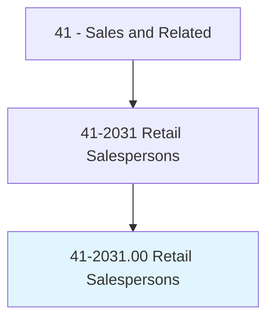
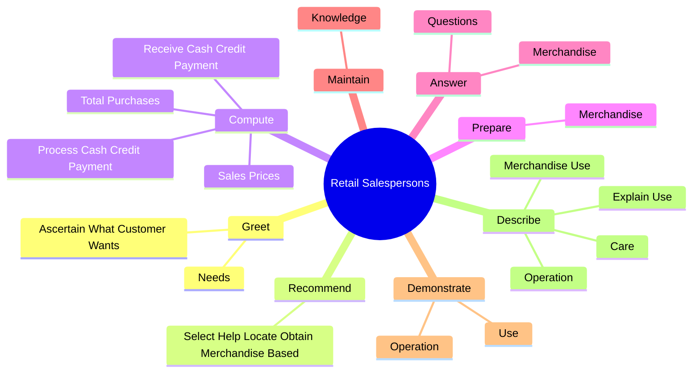
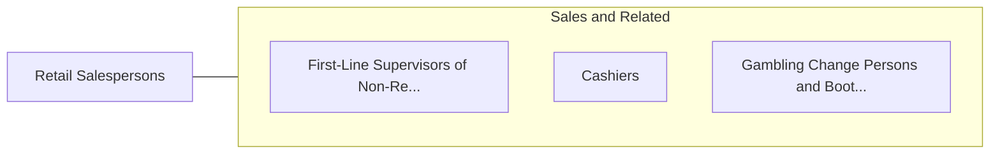

# Retail Salespersons

> Sell merchandise, such as furniture, motor vehicles, appliances, or apparel to consumers.

## Overview

Retail Salespersons is classified under Sales and Related (SOC 41). Sell merchandise, such as furniture, motor vehicles, appliances, or apparel to consumers.

## Classification Hierarchy

## Key Statistics

| Metric | Value |
|--------|-------|
| SOC Code | 41-2031.00 |
| Category | [Sales and Related](/occupations/Sales) |
| Task Count | 72 |
| Source | O*NET |

## Core Tasks

### greet.AscertainWhatCustomerWants

Retail Salespersons greet ascertain what customer wants as part of their core responsibilities.

**Actions:**
- `greet.AscertainWhatCustomerWants`
- `greet.Needs`

### recommend.SelectHelpLocateObtainMerchandiseBased

Retail Salespersons recommend select help locate obtain merchandise based as part of their core responsibilities.

**Actions:**
- `recommend.SelectHelpLocateObtainMerchandiseBased.on.CustomerneedsDesires`

### compute.SalesPrices

Retail Salespersons compute sales prices as part of their core responsibilities.

**Actions:**
- `compute.SalesPrices`
- `compute.TotalPurchases`
- `compute.ReceiveCashCreditPayment`
- `compute.ProcessCashCreditPayment`

## Skills & Competencies

### Technical Skills
- **Sales Techniques** - Advanced
- **Customer Relations** - Advanced
- **Product Knowledge** - Advanced

### Soft Skills
- **Communication** - Essential
- **Problem Solving** - Essential
- **Critical Thinking** - Important
- **Teamwork** - Important
- **Adaptability** - Important

## Related Occupations

## Industries

This occupation is found across multiple industries. See [Industries](/industries) for sector-specific employment data.

## Career Progression

---

*Source: O*NET 41-2031.00 - ONETOccupation*
