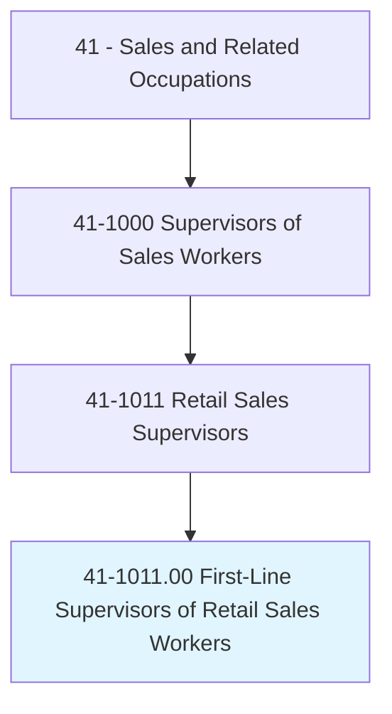
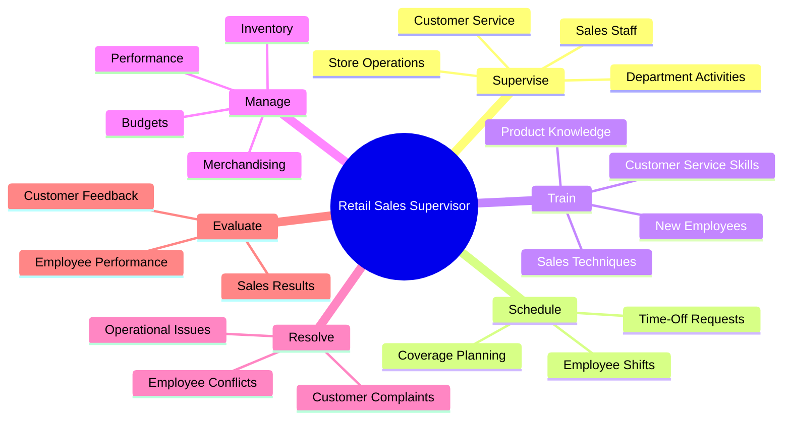
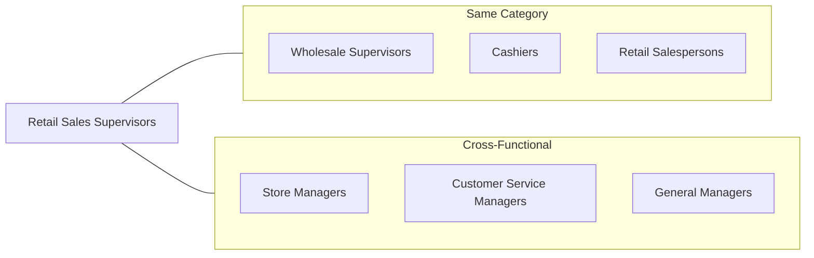
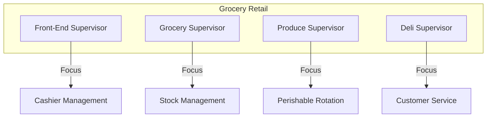
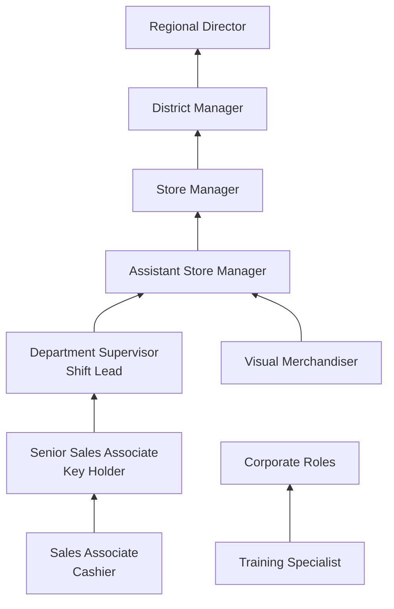

# First-Line Supervisors of Retail Sales Workers

> Directly supervise and coordinate activities of retail sales workers in an establishment or department. Duties may include management functions, such as purchasing, budgeting, accounting, and personnel work, in addition to supervisory duties.

## Overview

First-Line Supervisors of Retail Sales Workers serve as the critical link between store management and frontline sales staff. They are responsible for ensuring smooth daily operations, meeting sales targets, maintaining customer satisfaction, and developing their teams. These supervisors balance multiple responsibilities including scheduling, training, inventory management, and resolving customer issues while also contributing to sales efforts during peak periods. Their role is essential to retail success, as they directly influence employee performance, customer experience, and store profitability.

## Classification Hierarchy

## Key Statistics

| Metric | Value |
|--------|-------|
| SOC Code | 41-1011.00 |
| Job Zone | 3 (Medium Preparation) |
| Category | [Sales and Related](/occupations/Sales) |
| Core Tasks | 20+ |
| Source | O*NET |

## Core Tasks

### supervise.RetailSalesWorkers

Retail Sales Supervisors directly oversee the activities of sales associates to ensure efficient operations and quality customer service.

**Actions:**
- `supervise.SalesWorkers.in.Establishment` - Oversee daily activities of retail staff
- `supervise.SalesWorkers.in.Department` - Manage department-specific operations
- `coordinate.Activities.of.RetailSalesWorkers` - Synchronize team efforts for optimal performance
- `direct.Staff.to.meet.SalesTargets` - Guide team toward revenue goals

### schedule.Employees

Creating and managing work schedules to ensure adequate coverage during all operating hours.

**Actions:**
- `schedule.Employees.for.Shifts` - Create weekly and daily work schedules
- `assign.Duties.to.Workers` - Allocate specific responsibilities to staff members
- `plan.Coverage.for.PeakPeriods` - Ensure adequate staffing during busy times
- `approve.TimeOff.for.Employees` - Manage vacation and leave requests

### train.NewEmployees

Developing employee skills through structured training and ongoing coaching.

**Actions:**
- `train.NewEmployees.on.Procedures` - Orient new hires to store policies
- `train.Staff.on.ProductKnowledge` - Ensure team understands merchandise
- `coach.Employees.on.SalesTechniques` - Improve selling skills
- `develop.Skills.of.TeamMembers` - Enhance overall team capabilities

### manage.Inventory

Overseeing merchandise levels, displays, and stock management.

**Actions:**
- `manage.Inventory.in.Department` - Monitor stock levels and reordering
- `coordinate.Merchandising.for.Displays` - Ensure attractive product presentation
- `monitor.StockLevels.to.prevent.Shortages` - Maintain adequate inventory
- `review.Sales.to.plan.Purchases` - Analyze data for purchasing decisions

### resolve.CustomerComplaints

Handling escalated customer issues and ensuring satisfaction.

**Actions:**
- `resolve.Complaints.from.Customers` - Address and solve customer concerns
- `handle.Returns.for.Customers` - Process refunds and exchanges
- `approve.Discounts.for.CustomerSatisfaction` - Authorize price adjustments when appropriate
- `escalate.Issues.to.Management` - Communicate serious concerns to upper management

## Skills & Competencies

### Technical Skills
- **Point-of-Sale Systems** - Advanced
- **Inventory Management Software** - Proficient
- **Scheduling Systems** - Proficient
- **Microsoft Office** - Intermediate
- **Loss Prevention Techniques** - Intermediate

### Soft Skills
- **Leadership** - Critical
- **Communication** - Critical
- **Conflict Resolution** - Essential
- **Customer Service** - Essential
- **Time Management** - Essential
- **Decision Making** - Important

## Related Occupations

## Industry Variations

### Grocery and Supermarkets

Key differences:
- Heavy focus on perishable inventory management
- Multiple specialized departments
- High-volume transaction oversight
- Food safety compliance requirements

### Department Stores

Key differences:
- Commission sales management
- Visual merchandising emphasis
- Cross-department coordination
- Seasonal staffing fluctuations

### Specialty Retail

Key differences:
- Deep product expertise required
- Customer relationship building
- Lower volume, higher ticket sales
- Brand representation emphasis

### Convenience Stores

Key differences:
- 24/7 operations management
- Security and safety focus
- Multi-tasking environment
- Faster decision-making required

## Industries

- [Retail Trade](/industries/RetailTrade) - Primary sector, highest employment
- [Food and Beverage Stores](/industries/FoodStores) - Grocery and specialty food
- [General Merchandise Stores](/industries/GeneralMerchandise) - Department and big-box stores
- [Clothing and Accessories](/industries/ClothingRetail) - Fashion retail
- [Electronics and Appliance Stores](/industries/ElectronicsRetail) - Tech retail

## Career Progression

### Typical Timeline

| Stage | Years Experience | Typical Title |
|-------|-----------------|---------------|
| Entry | 0-1 | Sales Associate, Cashier |
| Development | 1-2 | Senior Associate, Key Holder |
| Supervisor | 2-5 | Department Supervisor, Shift Lead |
| Management | 5-8 | Assistant Manager, Store Manager |
| Leadership | 8+ | District Manager, Regional Director |

## Education & Training

| Requirement | Details |
|-------------|---------|
| Typical Education | High school diploma; some college preferred |
| Work Experience | 1-3 years in retail sales |
| On-the-Job Training | 3-6 months of supervisory training |
| Certifications | Retail management certificates beneficial |

### Recommended Development

- Customer Service Excellence certification
- Leadership and Management training
- Loss Prevention certification
- Inventory Management courses
- HR Fundamentals for supervisors

## Departments

This occupation typically works in:
- [Store Operations](/departments/StoreOperations)
- [Sales](/departments/Sales)
- [Customer Service](/departments/CustomerService)
- [Inventory Management](/departments/Inventory)

## Technology & Tools

### Point-of-Sale Systems
- NCR POS systems
- Square for Retail
- Lightspeed Retail
- Shopify POS

### Workforce Management
- Kronos/UKG
- ADP Workforce Now
- Deputy
- When I Work

### Inventory Systems
- SAP Retail
- Oracle Retail
- Fishbowl Inventory
- TradeGecko

## Performance Metrics

| Metric | Description |
|--------|-------------|
| Sales per Employee | Revenue generated per team member |
| Customer Satisfaction Score | NPS or CSAT ratings |
| Employee Turnover Rate | Staff retention metrics |
| Shrinkage Rate | Inventory loss percentage |
| Conversion Rate | Visitors to purchasers ratio |
| Average Transaction Value | Revenue per transaction |

---

*Source: O*NET 41-1011.00 - ONETOccupation*
