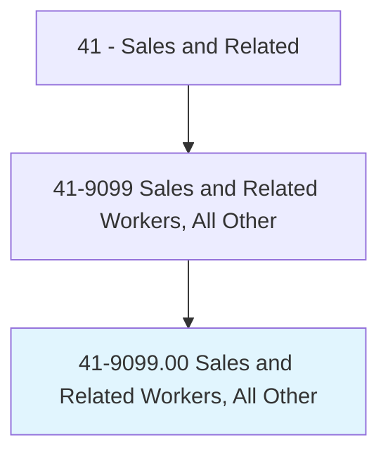
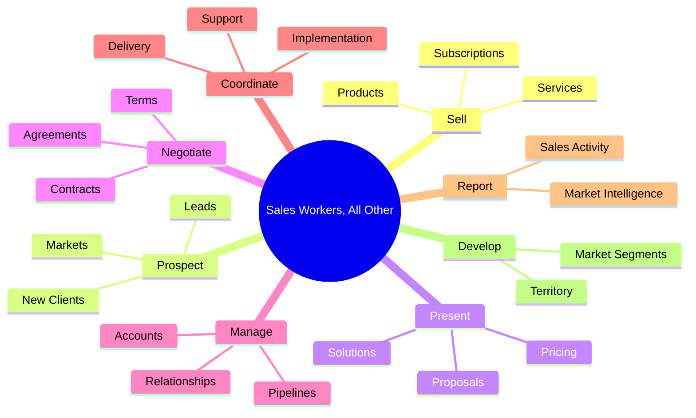
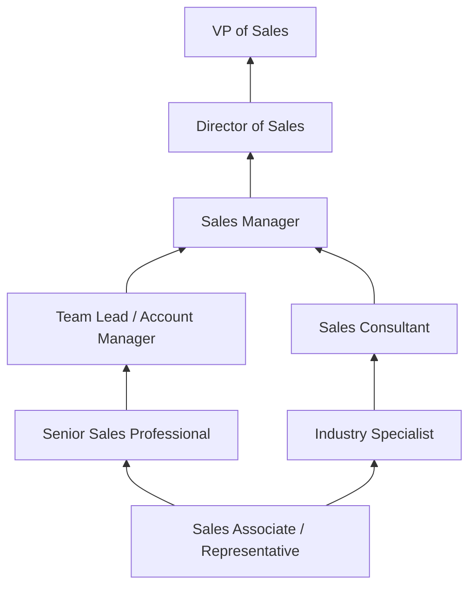
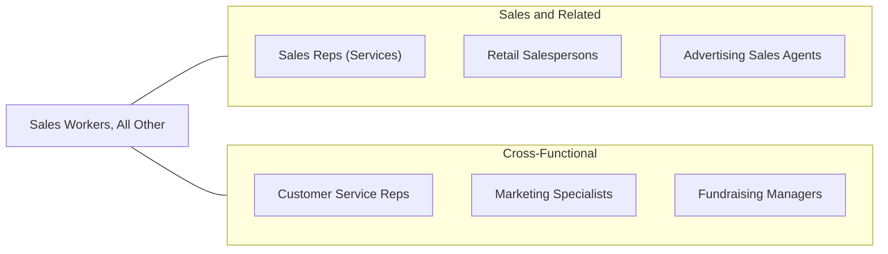

# Sales and Related Workers, All Other

> All sales and related workers not listed separately.

## Overview

Sales and Related Workers, All Other encompasses a broad category of sales professionals whose specific roles do not fit neatly into other classified sales occupations. This residual category captures emerging, niche, and hybrid sales positions that combine selling with specialized industry knowledge, technical capabilities, or unique business models. Examples include fundraising specialists, auction clerks, energy brokers, online marketplace sellers, subscription sales specialists, and sales professionals in rapidly evolving industries.

The diversity of this category reflects the evolving nature of sales work, where new roles continuously emerge in response to changing business models, technologies, and consumer behaviors. The growth of e-commerce, subscription services, SaaS (software-as-a-service), gig economy platforms, and digital marketplaces has created sales positions that do not correspond to traditional occupational classifications. Many of these roles blend sales with customer success, account management, or technical consulting functions.

Professionals in this category share core sales competencies -- prospecting, relationship building, needs assessment, presentation, negotiation, and closing -- but apply them in specialized contexts that differentiate their work from mainstream sales occupations. Entry requirements, compensation structures, and career paths vary widely depending on the specific role and industry.

## Classification Hierarchy

## Key Statistics

| Metric | Value |
|--------|-------|
| SOC Code | 41-9099.00 |
| Job Zone | 2-4 (Varies by role) |
| Category | [Sales and Related](/occupations/Sales/index) |
| Median Annual Salary | $38,000 |
| Employment | ~72,000 |
| Projected Growth | 3% (average) |
| Core Tasks | Varies by specialty |
| Source | O*NET |

## Core Tasks

### sell.Products

Sales workers sell products, services, or subscriptions to customers.

**Actions:**
- `sell.Products.to.Customers` - Close transactions across various channels
- `sell.Services.to.BusinessesAndIndividuals` - Provide service-based solutions
- `sell.Subscriptions.to.RecurringRevenueCustomers` - Manage subscription sales

### prospect.NewClients

Sales workers identify and pursue new business opportunities.

**Actions:**
- `prospect.NewClients.through.Outreach` - Generate new business leads
- `prospect.Markets.for.Expansion` - Identify new market segments

## Skills & Competencies

### Technical Skills
- **Sales Process and Methodology** - Advanced
- **CRM and Sales Tools** - Advanced
- **Product/Service Knowledge** - Intermediate to Advanced
- **Market Research** - Intermediate
- **Contract Negotiation** - Intermediate
- **Digital Sales Channels** - Intermediate to Advanced
- **Data Analysis** - Intermediate

### Soft Skills
- **Communication** - Critical
- **Persuasion** - Essential
- **Resilience** - Essential
- **Self-Motivation** - Critical
- **Relationship Building** - Essential
- **Adaptability** - Essential
- **Problem Solving** - Important
- **Time Management** - Important

## Education & Certifications

| Requirement | Details |
|-------------|---------|
| Typical Education | High school diploma to bachelor's degree (varies) |
| Industry-Specific Licenses | Varies by product/service (energy, finance, etc.) |
| Sales Methodology Certifications | Sandler, SPIN, Challenger, MEDDIC |
| CRM Certification | Salesforce, HubSpot credentials |
| Digital Sales Training | Social selling, e-commerce certifications |
| Continuing Education | Industry conferences, product training |

## Career Progression

## Industry Variations

| Setting | Focus | Unique Aspects |
|---------|-------|----------------|
| SaaS / Technology | Software subscriptions, cloud services | Recurring revenue; product demos; customer success integration |
| Energy / Utilities | Energy plans, efficiency solutions | Deregulated markets; regulatory knowledge; sustainability focus |
| Fundraising | Donations, grants, pledges | Nonprofit sector; emotional appeals; donor management |
| E-commerce / Marketplace | Online product sales | Digital-first; platform knowledge; logistics coordination |

## Technology & Tools

- **CRM** - Salesforce, HubSpot, Pipedrive
- **Sales Engagement** - Outreach, SalesLoft, Apollo
- **Communication** - Zoom, Teams, Slack
- **E-commerce** - Shopify, Amazon Seller Central
- **Analytics** - Tableau, Google Analytics
- **Payment Processing** - Stripe, PayPal, Square
- **Document Management** - DocuSign, PandaDoc

## Related Occupations

## Departments

This occupation typically works in:
- [Sales Department](/departments/Sales) - Revenue generation
- Business Development - New market development
- Customer Success - Account growth
- [Marketing Department](/departments/Marketing) - Lead generation support

---

*Source: O*NET 41-9099.00 - ONETOccupation*
