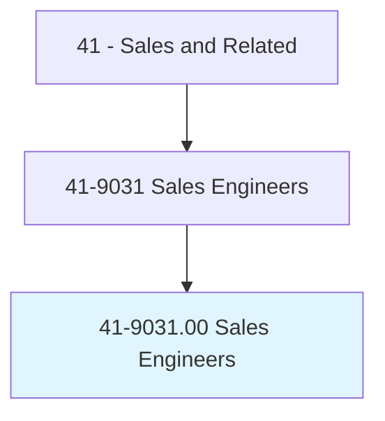
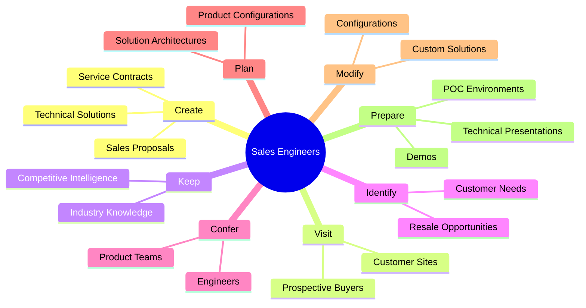
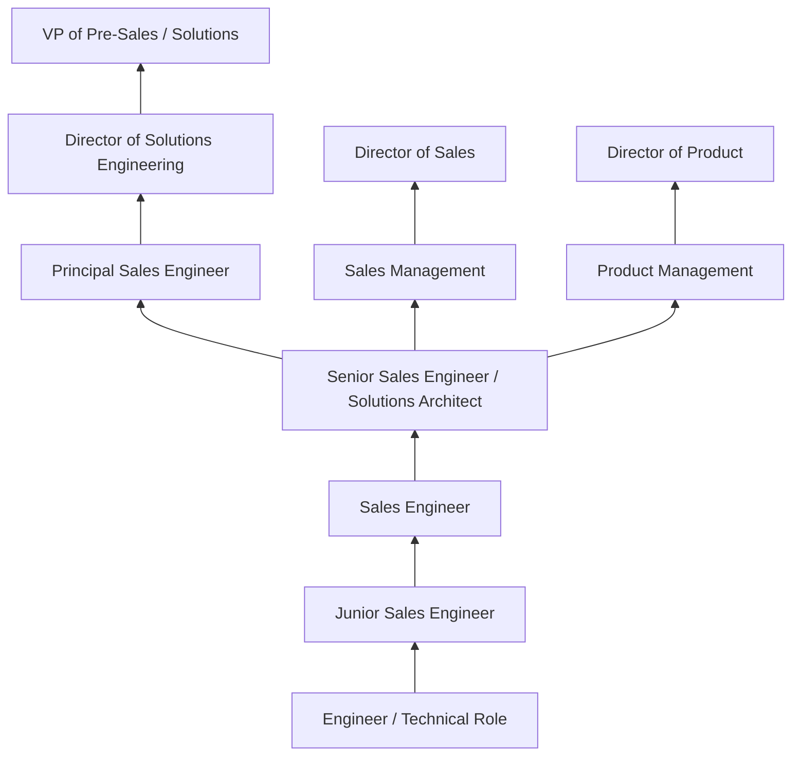
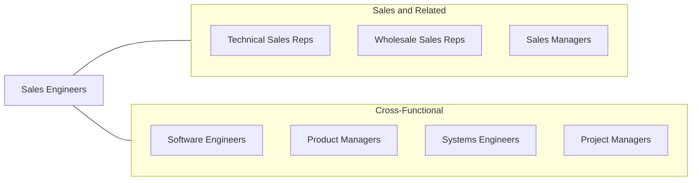

# Sales Engineers

> Sell business goods or services, the selling of which requires a technical background equivalent to a baccalaureate degree in engineering.

## Overview

Sales Engineers occupy a unique intersection of technical expertise and sales acumen, selling complex products and services that require engineering-level knowledge to explain, configure, and implement. They serve as the technical authority in the sales process, translating sophisticated product capabilities into business value propositions that resonate with decision-makers. Working alongside account executives, they conduct technical presentations, product demonstrations, proof-of-concept evaluations, and solution design sessions that help prospects understand how technical products solve their specific challenges.

The role is found across industries where products have significant technical complexity -- including software, telecommunications, industrial equipment, medical devices, aerospace, and scientific instruments. Sales Engineers (also known as Solutions Engineers, Pre-Sales Engineers, or Technical Account Managers) must maintain deep understanding of both their own products and the competitive landscape, while also understanding the operational environments, technical requirements, and business objectives of their customers. This dual expertise enables them to propose solutions that are both technically sound and commercially compelling.

Sales Engineers are among the highest-paid professionals in the sales field, reflecting the combination of technical education, engineering experience, and commercial skills required for the role. Compensation typically includes a base salary plus commission or bonus tied to team revenue targets. The position is critical to the sales cycle for complex products, as prospects rely on Sales Engineers to validate that proposed solutions will meet their needs before making significant purchasing decisions.

## Classification Hierarchy

## Key Statistics

| Metric | Value |
|--------|-------|
| SOC Code | 41-9031.00 |
| Job Zone | 4 (Considerable Preparation) |
| Category | [Sales and Related](/occupations/Sales/index) |
| Median Annual Salary | $108,530 |
| Employment | ~65,000 |
| Projected Growth | 5% (average) |
| Core Tasks | 88 |
| Source | O*NET |

## Core Tasks

### create.Sales

Sales Engineers create proposals and service agreements for complex technical solutions.

**Actions:**
- `create.Sales.for.Products` - Design and propose product solutions
- `create.Sales.for.Services` - Develop professional services proposals
- `create.ServiceContracts.for.Products` - Structure ongoing support agreements
- `create.ServiceContracts.for.Services` - Design managed service contracts

### visit.ProspectiveBuyers

Sales Engineers conduct on-site visits to assess customer environments.

**Actions:**
- `visit.ProspectiveBuyers.at.Commercial.Sites` - Evaluate commercial customer needs
- `visit.ProspectiveBuyers.at.Industrial.Sites` - Assess industrial applications
- `visit.ProspectiveBuyers.at.Establishments.to.show.Samples` - Demonstrate products on-site

### prepare.TechnicalPresentations

Sales Engineers develop and deliver technical content for sales engagements.

**Actions:**
- `prepare.TechnicalPresentations.to.explain.ProductSpecifications` - Create solution-focused presentations
- `prepare.Demos.for.ProspectiveCustomers` - Build demonstration environments
- `prepare.POCEnvironments.for.TechnicalValidation` - Set up proof-of-concept evaluations

## Skills & Competencies

### Technical Skills
- **Engineering/Technical Domain Expertise** - Expert
- **Solution Architecture and Design** - Advanced
- **Product Demonstration and POC Delivery** - Expert
- **Technical Writing and Proposals** - Advanced
- **Systems Integration Knowledge** - Advanced
- **Competitive Technical Analysis** - Advanced
- **API and Software Integration** - Intermediate to Advanced
- **Project Scoping and Estimation** - Advanced

### Soft Skills
- **Technical Communication** - Critical
- **Presentation Skills** - Critical
- **Consultative Problem Solving** - Critical
- **Relationship Building** - Essential
- **Active Listening** - Essential
- **Collaboration with Sales Teams** - Essential
- **Adaptability** - Essential
- **Business Acumen** - Essential

## Education & Certifications

| Requirement | Details |
|-------------|---------|
| Typical Education | Bachelor's degree in Engineering, Computer Science, or related technical field |
| Industry Certifications | AWS Solutions Architect, Cisco CCNA/CCNP, Azure, Google Cloud |
| Sales Methodology | MEDDIC, Challenger Sale, Value Selling |
| Professional Engineer (PE) | Beneficial in traditional engineering industries |
| Product Certifications | Vendor-specific technical certifications |
| MBA | Beneficial for leadership track |
| Continuing Education | Technical conferences, vendor training, industry certifications |

## Career Progression

## Industry Variations

| Setting | Focus | Unique Aspects |
|---------|-------|----------------|
| Enterprise Software / SaaS | Platform demos, integrations, POC | Technical POC/POV; multi-stakeholder selling; recurring revenue |
| Telecommunications | Network solutions, infrastructure | Complex network design; RFP responses; carrier relationships |
| Industrial / Manufacturing | Machinery, automation, equipment | On-site assessments; custom engineering; long sales cycles |
| Medical Devices | Clinical equipment, diagnostic systems | Regulatory knowledge; clinical trials; physician relationships |

## Technology & Tools

- **Demo Environments** - Sandbox platforms, virtual labs, demo scripts
- **CRM** - Salesforce, HubSpot
- **Presentation** - PowerPoint, Prezi, Miro, Figma
- **Technical Documentation** - Confluence, Notion, technical proposal templates
- **Video Conferencing** - Zoom, Teams, Webex
- **Competitive Intel** - Klue, Crayon, Gartner
- **Configuration Tools** - CPQ (Configure-Price-Quote) platforms
- **Version Control** - GitHub, GitLab (for technical demos)

## Related Occupations

## Departments

This occupation typically works in:
- [Sales Department](/departments/Sales) - Pre-sales technical support
- Solutions Engineering - Technical solution design
- Product Management - Customer feedback and product direction
- Professional Services - Implementation handoff

---

*Source: O*NET 41-9031.00 - ONETOccupation*
