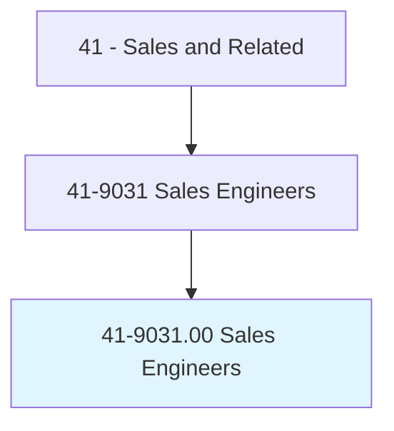
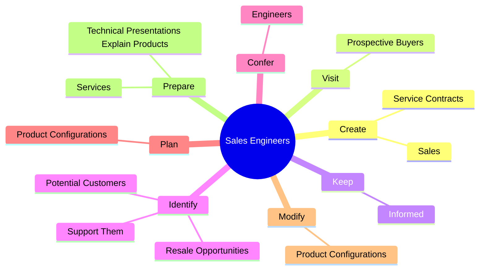
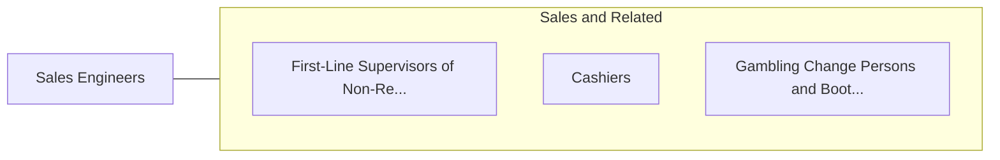

# Sales Engineers

> Sell business goods or services, the selling of which requires a technical background equivalent to a baccalaureate degree in engineering.

## Overview

Sales Engineers is classified under Sales and Related (SOC 41). Sell business goods or services, the selling of which requires a technical background equivalent to a baccalaureate degree in engineering.

## Classification Hierarchy

## Key Statistics

| Metric | Value |
|--------|-------|
| SOC Code | 41-9031.00 |
| Category | [Sales and Related](/occupations/Sales/index) |
| Task Count | 88 |
| Source | O*NET |

## Core Tasks

### create.Sales

Sales Engineers create sales as part of their core responsibilities.

**Actions:**
- `create.Sales.for.Products`
- `create.Sales.for.Services`
- `create.ServiceContracts.for.Products`
- `create.ServiceContracts.for.Services`

### visit.ProspectiveBuyers

Sales Engineers visit prospective buyers as part of their core responsibilities.

**Actions:**
- `visit.ProspectiveBuyers.at.Commercial`
- `visit.ProspectiveBuyers.at.Industrial`
- `visit.ProspectiveBuyers.at.OtherEstablishments.to.show.Samples`
- `visit.ProspectiveBuyers.at.Catalogs`

### keep.Informed

Sales Engineers keep informed as part of their core responsibilities.

**Actions:**
- `keep.Informed.on.IndustryNews`
- `keep.Informed.on.Trends`
- `keep.Informed.on.Products`
- `keep.Informed.on.Services`

## Skills & Competencies

### Technical Skills
- **Sales Techniques** - Advanced
- **Customer Relations** - Advanced
- **Product Knowledge** - Advanced

### Soft Skills
- **Communication** - Essential
- **Problem Solving** - Essential
- **Critical Thinking** - Important
- **Teamwork** - Important
- **Adaptability** - Important

## Related Occupations

## Industries

This occupation is found across multiple industries. See [Industries](/industries) for sector-specific employment data.

## Career Progression

---

*Source: O*NET 41-9031.00 - ONETOccupation*
