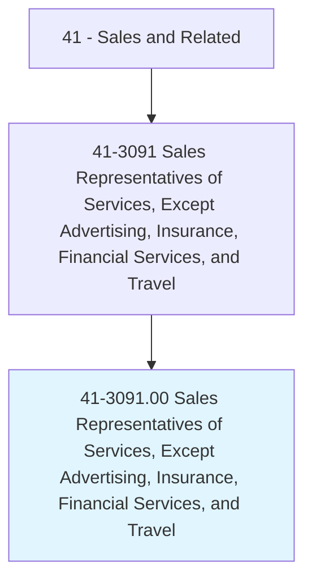

# Sales Representatives of Services, Except Advertising, Insurance, Financial Services, and Travel

> Sell services to individuals or businesses. May describe options or resolve client problems.

## Overview

Sales Representatives of Services, Except Advertising, Insurance, Financial Services, and Travel is an occupation within the Sales and Related category. Sell services to individuals or businesses. 

## Classification Hierarchy

## Key Statistics

| Metric | Value |
|--------|-------|
| SOC Code | 41-3091.00 |
| Category | [Sales and Related](/occupations/Sales) |
| Task Count | 55 |
| Source | O*NET |

## Core Tasks

### answer.CustomersQuestions

Sales Representatives of Services, Except Advertising, Insurance, Financial Services, and Travel answer customers questions as part of their core responsibilities.

**Actions:**
- `answer.CustomersQuestions.about.Services`
- `answer.Prices`
- `answer.Availability`
- `answer.CreditTerms`

### attend.Sales

Sales Representatives of Services, Except Advertising, Insurance, Financial Services, and Travel attend sales as part of their core responsibilities.

**Actions:**
- `attend.Sales.to.obtain.InformationAboutMarketConditions`
- `attend.Sales.to.BusinessTrends`
- `attend.Sales.to.Regulations`
- `attend.Sales.to.IndustryDevelopments`

### compute.Costs

Sales Representatives of Services, Except Advertising, Insurance, Financial Services, and Travel compute costs as part of their core responsibilities.

**Actions:**
- `compute.Costs.of.Services`

## Skills & Competencies

### Technical Skills
- **Sales Techniques** - Advanced
- **Customer Relations** - Advanced
- **Product Knowledge** - Advanced

### Soft Skills
- **Communication** - Essential
- **Problem Solving** - Essential
- **Critical Thinking** - Important
- **Teamwork** - Important
- **Adaptability** - Important

## Related Occupations

## Industries

This occupation is found across multiple industries. See [Industries](/industries) for sector-specific employment data.

## Career Progression

---

*Source: O*NET 41-3091.00 - ONETOccupation*
