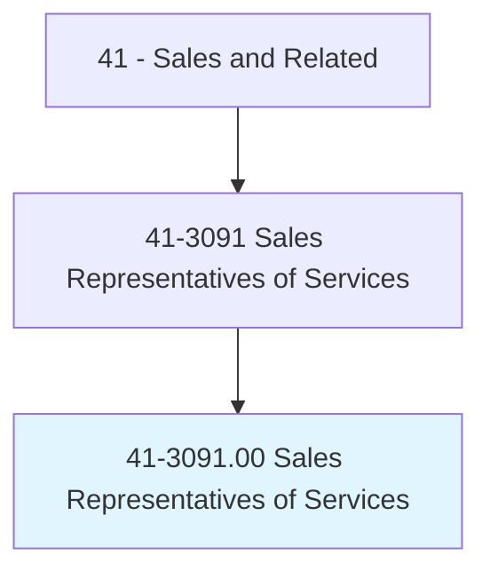
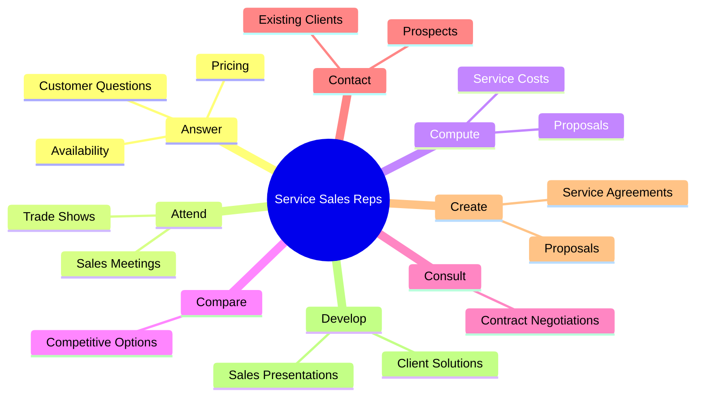
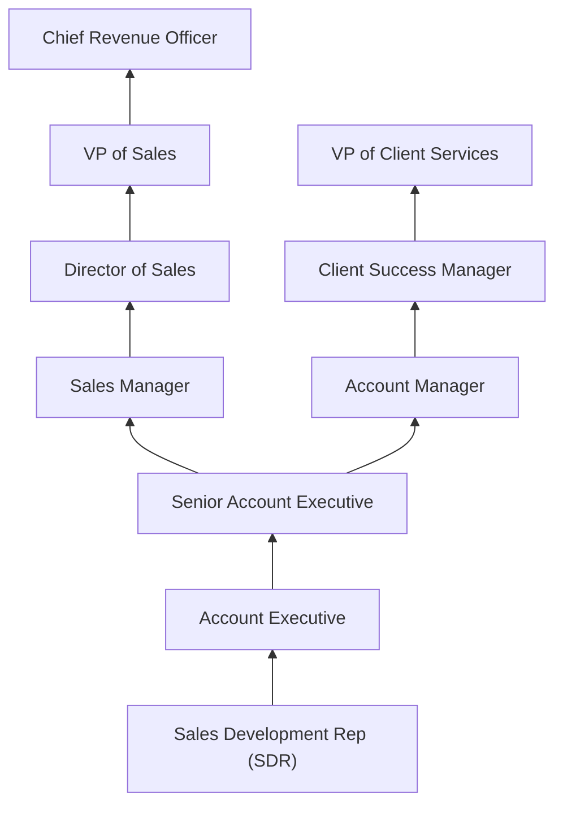
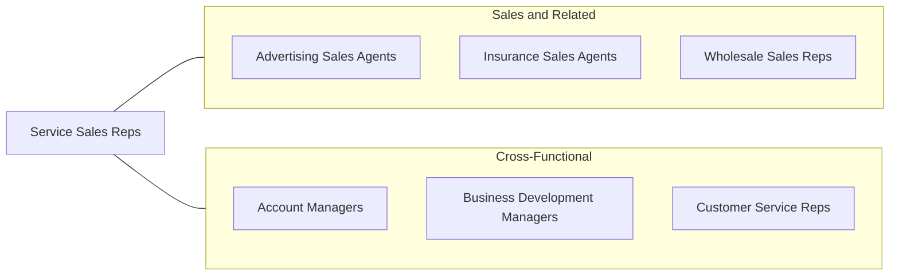

# Sales Representatives of Services, Except Advertising, Insurance, Financial Services, and Travel

> Sell services to individuals or businesses. May describe options or resolve client problems.

## Overview

Sales Representatives of Services sell a wide range of non-product offerings to individuals and businesses, including telecommunications, technology services, cleaning and maintenance, security, staffing, consulting, logistics, and professional services. Unlike product sales, service selling requires the ability to communicate intangible value, build trust around delivery promises, and often manage ongoing client relationships that extend well beyond the initial sale. These representatives identify prospects, assess needs, present service solutions, negotiate contracts, and ensure client satisfaction.

The services sector represents the largest and fastest-growing portion of the economy, creating sustained demand for professionals who can effectively sell service offerings. Service sales differ fundamentally from product sales: customers cannot physically examine what they are buying, making the sales representative's credibility, communication skills, and ability to articulate ROI particularly important. Many service sales involve recurring revenue models -- monthly contracts, annual agreements, or ongoing retainers -- requiring representatives to focus on both acquisition and retention.

These professionals work across diverse industries including telecommunications, IT services, janitorial and facilities management, pest control, waste management, business process outsourcing, consulting, and dozens of other service categories. Compensation typically includes base salary plus commission, with top performers in B2B service sales earning well above median incomes through large contract values and multi-year agreements.

## Classification Hierarchy

## Key Statistics

| Metric | Value |
|--------|-------|
| SOC Code | 41-3091.00 |
| Job Zone | 3 (Medium Preparation) |
| Category | [Sales and Related](/occupations/Sales/index) |
| Median Annual Salary | $62,890 |
| Employment | ~1,050,000 |
| Projected Growth | 4% (average) |
| Core Tasks | 55 |
| Source | O*NET |

## Core Tasks

### answer.CustomersQuestions

Service Sales Reps respond to client inquiries about services and pricing.

**Actions:**
- `answer.CustomersQuestions.about.Services` - Explain service offerings and capabilities
- `answer.Prices` - Provide pricing information and quotes
- `answer.Availability` - Confirm service availability and timelines
- `answer.CreditTerms` - Explain payment and financing options

### contact.Prospects

Service Sales Reps reach out to potential and existing clients.

**Actions:**
- `contact.ProspectiveCustomers.to.develop.Opportunities` - Generate new business through outreach
- `contact.ExistingCustomers.to.maintain.Relationships` - Nurture accounts for retention and upsell

### develop.SalesPresentations

Service Sales Reps create compelling proposals and presentations.

**Actions:**
- `develop.SalesPresentations.for.ClientMeetings` - Build customized service proposals
- `develop.Proposals.for.ContractNegotiation` - Prepare detailed SOW and pricing documents

## Skills & Competencies

### Technical Skills
- **Consultative Sales Methodology** - Advanced
- **Service Industry Knowledge** - Advanced
- **CRM and Pipeline Management** - Advanced
- **Proposal and Presentation Development** - Advanced
- **Contract Negotiation** - Advanced
- **ROI and Business Case Development** - Intermediate
- **Competitive Analysis** - Intermediate

### Soft Skills
- **Relationship Building** - Critical
- **Communication** - Critical
- **Active Listening** - Critical
- **Persuasion** - Essential
- **Persistence** - Essential
- **Problem Solving** - Essential
- **Time Management** - Essential
- **Empathy** - Important

## Education & Certifications

| Requirement | Details |
|-------------|---------|
| Typical Education | Bachelor's degree in Business, Marketing, Communications |
| Sales Methodology Certifications | Sandler, SPIN, Challenger, Solution Selling |
| Industry Certifications | Varies by service type (IT, telecom, staffing) |
| CRM Certification | Salesforce, HubSpot |
| Certified Professional Sales Person (CPSP) | NASP certification |
| Continuing Education | Industry conferences, product/service training |

## Career Progression

## Industry Variations

| Setting | Focus | Unique Aspects |
|---------|-------|----------------|
| IT / Technology Services | Managed services, consulting, cloud | Technical knowledge; recurring revenue; solution selling |
| Staffing / Employment Services | Temporary and permanent placement | Relationship-driven; candidate sourcing; margin management |
| Facilities / Janitorial | Building maintenance, cleaning | Bid-based; site assessments; service level agreements |
| Telecommunications | Voice, data, internet services | Technology complexity; bundled solutions; regulatory awareness |

## Technology & Tools

- **CRM** - Salesforce, HubSpot, Zoho CRM
- **Sales Engagement** - Outreach, SalesLoft, Apollo
- **Proposal Software** - PandaDoc, Proposify, Qwilr
- **Communication** - Zoom, Teams, phone systems
- **Analytics** - Gong, Chorus, sales dashboards
- **Contract Management** - DocuSign, Ironclad
- **Prospecting** - LinkedIn Sales Navigator, ZoomInfo

## Related Occupations

## Departments

This occupation typically works in:
- [Sales Department](/departments/Sales) - Revenue generation
- Business Development - New client acquisition
- Account Management - Client retention
- Customer Success - Client satisfaction

---

*Source: O*NET 41-3091.00 - ONETOccupation*
