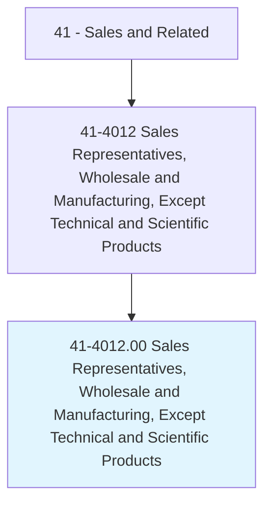
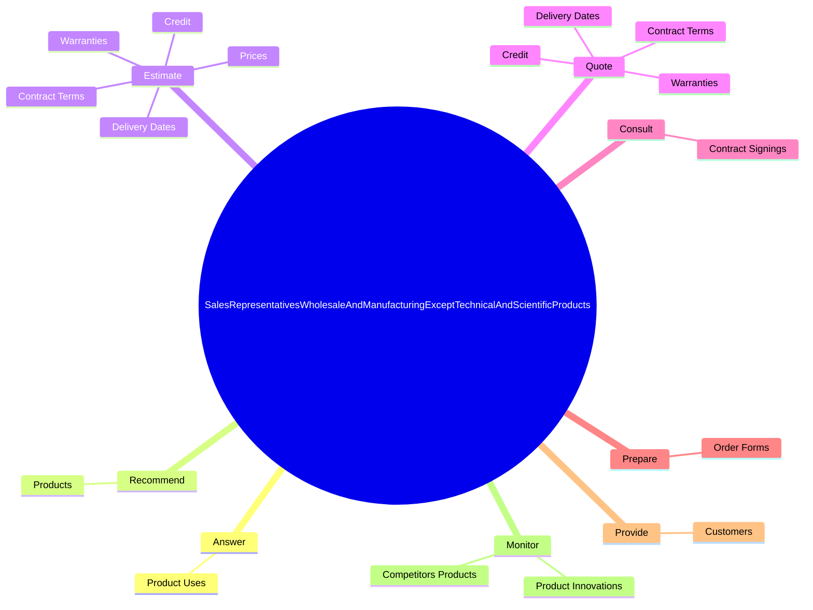

# Sales Representatives, Wholesale and Manufacturing, Except Technical and Scientific Products

> Sell goods for wholesalers or manufacturers to businesses or groups of individuals. Work requires substantial knowledge of items sold.

## Overview

Sales Representatives, Wholesale and Manufacturing, Except Technical and Scientific Products is an occupation within the Sales and Related category. Sell goods for wholesalers or manufacturers to businesses or groups of individuals. 

## Classification Hierarchy

## Key Statistics

| Metric | Value |
|--------|-------|
| SOC Code | 41-4012.00 |
| Category | [Sales and Related](/occupations/Sales) |
| Task Count | 63 |
| Source | O*NET |

## Core Tasks

### answer.ProductUses

Sales Representatives, Wholesale and Manufacturing, Except Technical and Scientific Products answer product uses as part of their core responsibilities.

**Actions:**
- `answer.ProductUses`

### recommend.Products

Sales Representatives, Wholesale and Manufacturing, Except Technical and Scientific Products recommend products as part of their core responsibilities.

**Actions:**
- `recommend.Products.to.Customers`
- `recommend.Products.to.BasedOnCustomersNeeds`
- `recommend.Products.to.Interests`

### estimate.Prices

Sales Representatives, Wholesale and Manufacturing, Except Technical and Scientific Products estimate prices as part of their core responsibilities.

**Actions:**
- `estimate.Prices`
- `estimate.Credit`
- `estimate.ContractTerms`
- `estimate.Warranties`

## Skills & Competencies

### Technical Skills
- **Sales Techniques** - Advanced
- **Customer Relations** - Advanced
- **Product Knowledge** - Advanced

### Soft Skills
- **Communication** - Essential
- **Problem Solving** - Essential
- **Critical Thinking** - Important
- **Teamwork** - Important
- **Adaptability** - Important

## Related Occupations

## Industries

This occupation is found across multiple industries. See [Industries](/industries) for sector-specific employment data.

## Career Progression

---

*Source: O*NET 41-4012.00 - ONETOccupation*
