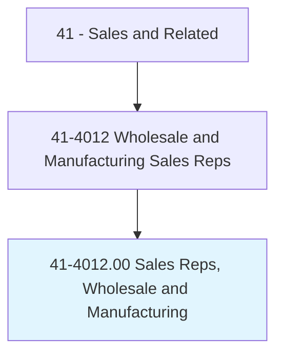
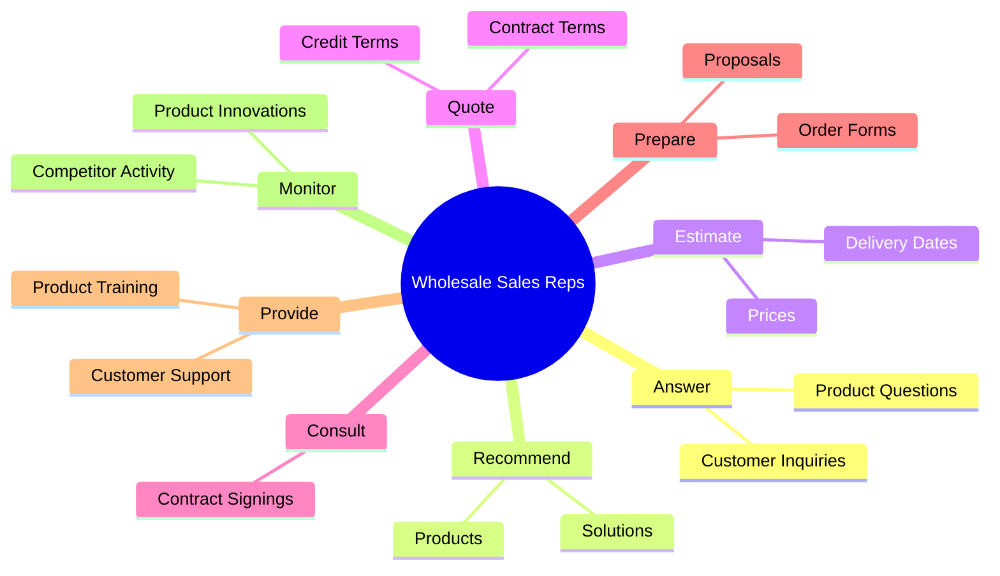
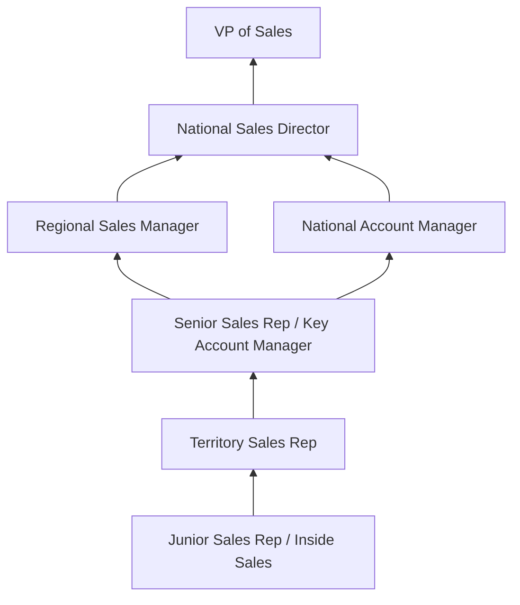
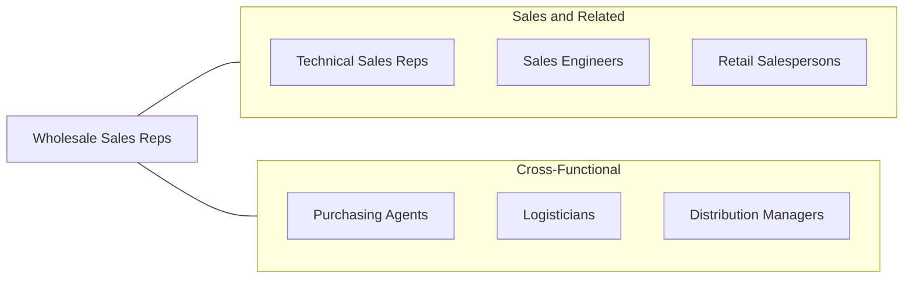

# Sales Representatives, Wholesale and Manufacturing, Except Technical and Scientific Products

> Sell goods for wholesalers or manufacturers to businesses or groups of individuals. Work requires substantial knowledge of items sold.

## Overview

Wholesale and Manufacturing Sales Representatives sell goods produced by manufacturers and distributors to retailers, wholesalers, government agencies, and other business customers. They serve as the critical link in the supply chain between producers and the businesses that ultimately sell or use their products. Working across industries from food and beverages to office supplies, textiles, building materials, and consumer goods, these representatives manage territories, build client relationships, negotiate pricing and terms, and drive revenue for their companies.

The role requires deep product knowledge, an understanding of customers' business operations, and the ability to match product offerings to client needs. Representatives typically manage assigned territories or accounts, visiting customers regularly to take orders, introduce new products, resolve complaints, and strengthen relationships. They monitor inventory levels at customer locations, track competitive activity, and provide market intelligence back to their companies. Many work independently with significant autonomy over their schedules and selling strategies.

This occupation is one of the largest in the sales category, reflecting the vast volume of goods that move through wholesale and distribution channels. While e-commerce and direct-to-consumer models have disrupted some segments, the complexity of B2B purchasing, the need for relationship-based selling, and the value of consultative product expertise continue to sustain demand for skilled wholesale representatives.

## Classification Hierarchy

## Key Statistics

| Metric | Value |
|--------|-------|
| SOC Code | 41-4012.00 |
| Job Zone | 3 (Medium Preparation) |
| Category | [Sales and Related](/occupations/Sales/index) |
| Median Annual Salary | $63,230 |
| Employment | ~1,350,000 |
| Projected Growth | 1% (slower than average) |
| Core Tasks | 63 |
| Source | O*NET |

## Core Tasks

### answer.ProductQuestions

Wholesale Sales Reps respond to client questions about product applications and specifications.

**Actions:**
- `answer.ProductUses` - Explain product applications and specifications

### recommend.Products

Wholesale Sales Reps suggest products that match customer needs.

**Actions:**
- `recommend.Products.to.Customers` - Propose products based on customer requirements
- `recommend.Products.to.BasedOnCustomersNeeds` - Match offerings to specific business needs
- `recommend.Products.to.Interests` - Suggest complementary products and upgrades

### estimate.Prices

Wholesale Sales Reps provide pricing and contractual terms.

**Actions:**
- `estimate.Prices` - Calculate pricing for volume orders
- `estimate.Credit` - Assess credit terms and payment options
- `estimate.ContractTerms` - Propose contract structures
- `estimate.Warranties` - Explain warranty coverage and terms

## Skills & Competencies

### Technical Skills
- **Product Knowledge** - Expert
- **Territory Management** - Advanced
- **CRM and Order Management Systems** - Advanced
- **Pricing and Margin Analysis** - Advanced
- **Supply Chain and Logistics** - Intermediate
- **Contract Negotiation** - Advanced
- **Market and Competitive Analysis** - Intermediate
- **Inventory Management** - Intermediate

### Soft Skills
- **Relationship Building** - Critical
- **Communication** - Critical
- **Negotiation** - Essential
- **Self-Motivation** - Critical
- **Problem Solving** - Essential
- **Persistence** - Essential
- **Organizational Skills** - Essential
- **Adaptability** - Important

## Education & Certifications

| Requirement | Details |
|-------------|---------|
| Typical Education | Bachelor's degree preferred; high school diploma with experience accepted |
| Certified Professional Sales Person (CPSP) | NASP sales certification |
| Industry-Specific Training | Product line certification from manufacturers |
| Sales Methodology | SPIN Selling, Sandler, Miller Heiman |
| CRM Certification | Salesforce, HubSpot |
| Driver's License | Required for territory management |
| Continuing Education | Trade shows, manufacturer training, industry conferences |

## Career Progression

## Industry Variations

| Setting | Focus | Unique Aspects |
|---------|-------|----------------|
| Food and Beverage | Grocery, foodservice distribution | Perishable inventory; frequent orders; route sales; planogram compliance |
| Building Materials | Construction supply, lumber | Project-based; contractor relationships; seasonal demand |
| Office Products | Supplies, furniture, equipment | E-commerce competition; catalog selling; contract pricing |
| Apparel and Textiles | Fashion, uniforms, fabrics | Seasonal buying; trend awareness; showroom presentations |

## Technology & Tools

- **CRM** - Salesforce, SAP CRM, Microsoft Dynamics
- **Order Management** - ERP systems, EDI platforms
- **Route Planning** - Territory mapping, GPS routing
- **Presentation** - Product catalogs, digital samples, tablet presentations
- **Communication** - Mobile phone, email, video conferencing
- **Analytics** - Sales dashboards, margin reports
- **Expense Management** - Concur, Expensify

## Related Occupations

## Departments

This occupation typically works in:
- [Sales Department](/departments/Sales) - Territory and account management
- Business Development - New account acquisition
- Customer Service - Order support and issue resolution
- Distribution - Logistics coordination

---

*Source: O*NET 41-4012.00 - ONETOccupation*
