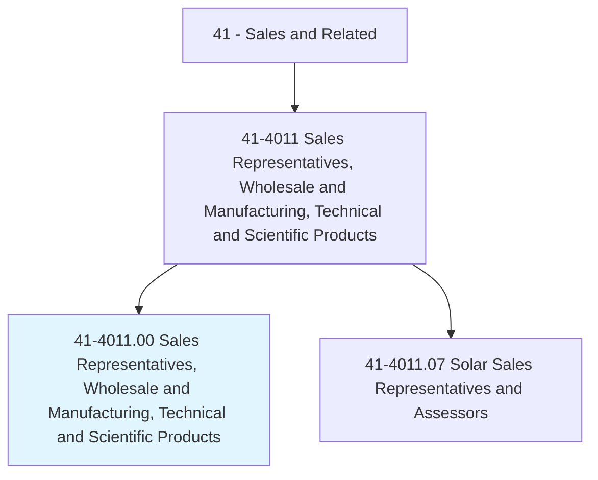
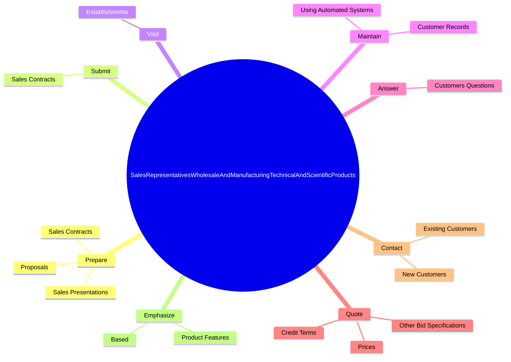

# Sales Representatives, Wholesale and Manufacturing, Technical and Scientific Products

> Sell goods for wholesalers or manufacturers where technical or scientific knowledge is required in such areas as biology, engineering, chemistry, and electronics, normally obtained from at least 2 years of postsecondary education.

## Overview

Sales Representatives, Wholesale and Manufacturing, Technical and Scientific Products is classified under Sales and Related (SOC 41). Sell goods for wholesalers or manufacturers where technical or scientific knowledge is required in such areas as biology, engineering, chemistry, and electronics, normally obtained from at least 2 years of postsecondary education.

## Classification Hierarchy

## Key Statistics

| Metric | Value |
|--------|-------|
| SOC Code | 41-4011.00 |
| Category | [Sales and Related](/occupations/Sales) |
| Task Count | 99 |
| Source | O*NET |

## Core Tasks

### prepare.SalesContracts

Sales Representatives, Wholesale and Manufacturing, Technical and Scientific Products prepare sales contracts as part of their core responsibilities.

**Actions:**
- `prepare.SalesContracts.for.Orders`
- `prepare.SalesPresentations.to.explain.Productspecifications`
- `prepare.SalesPresentations.to.Applications`
- `prepare.Proposals.to.explain.Productspecifications`

### submit.SalesContracts

Sales Representatives, Wholesale and Manufacturing, Technical and Scientific Products submit sales contracts as part of their core responsibilities.

**Actions:**
- `submit.SalesContracts.for.Orders`

### visit.Establishments

Sales Representatives, Wholesale and Manufacturing, Technical and Scientific Products visit establishments as part of their core responsibilities.

**Actions:**
- `visit.Establishments.to.evaluate.NeedsPromoteProductServiceSales`
- `visit.Establishments.to.ToPromoteProductServiceSales`

## Skills & Competencies

### Technical Skills
- **Sales Techniques** - Advanced
- **Customer Relations** - Advanced
- **Product Knowledge** - Advanced

### Soft Skills
- **Communication** - Essential
- **Problem Solving** - Essential
- **Critical Thinking** - Important
- **Teamwork** - Important
- **Adaptability** - Important

## Related Occupations

## Industries

This occupation is found across multiple industries. See [Industries](/industries) for sector-specific employment data.

## Career Progression

---

*Source: O*NET 41-4011.00 - ONETOccupation*
