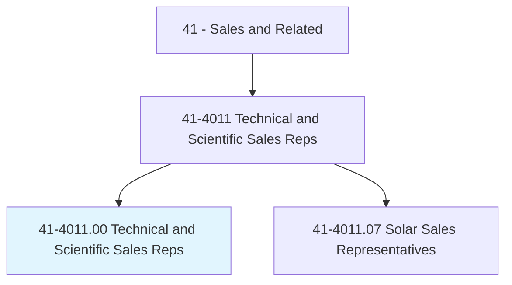
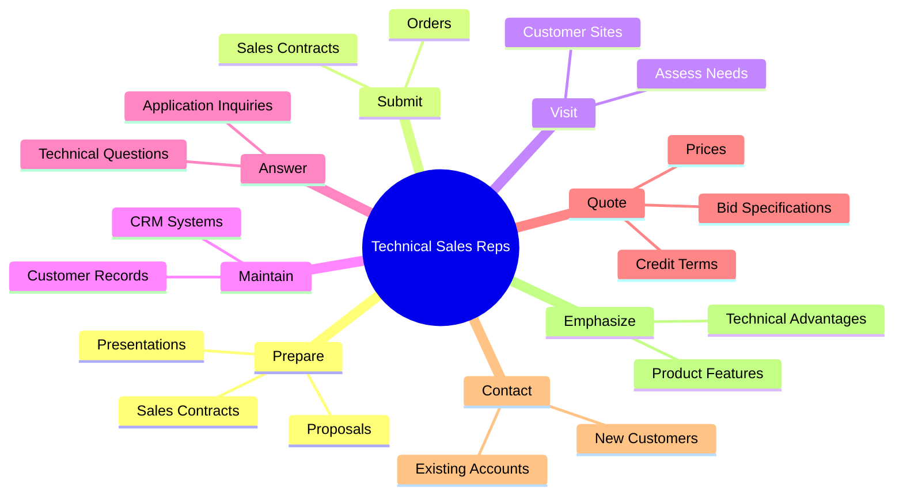
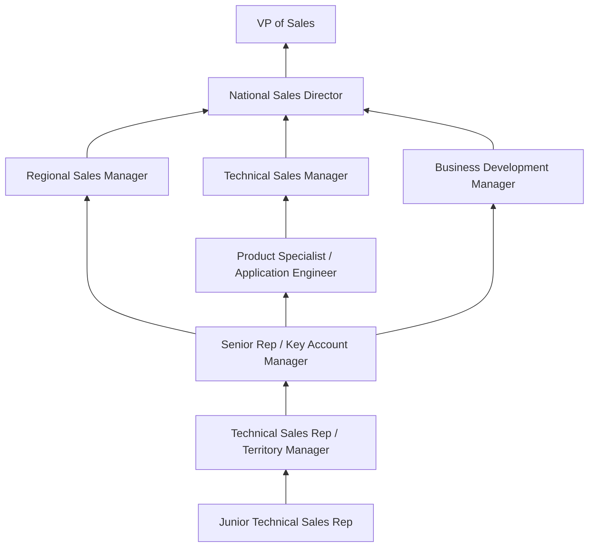
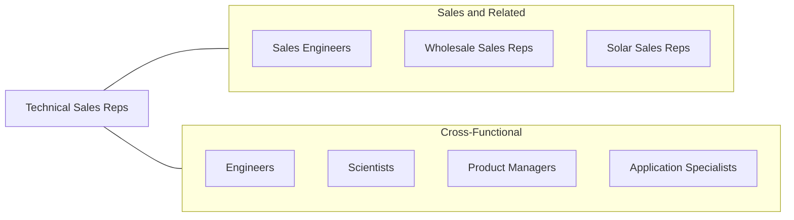

# Sales Representatives, Wholesale and Manufacturing, Technical and Scientific Products

> Sell goods for wholesalers or manufacturers where technical or scientific knowledge is required in such areas as biology, engineering, chemistry, and electronics, normally obtained from at least 2 years of postsecondary education.

## Overview

Technical and Scientific Sales Representatives sell sophisticated products that require specialized knowledge in fields such as engineering, chemistry, biology, electronics, pharmaceuticals, and medical devices. Unlike general wholesale representatives, these professionals must understand the scientific or technical underpinnings of the products they sell, enabling them to explain product specifications, recommend appropriate solutions for complex applications, and serve as trusted technical advisors to their customers. Their clients include hospitals, laboratories, manufacturing plants, research institutions, and technology companies.

The role demands a rare combination of scientific/technical education and commercial selling ability. Representatives must translate complex technical information into business value, understand customer applications deeply enough to recommend appropriate products, and provide technical support that builds long-term relationships. Many technical sales roles involve consultative selling processes with multiple stakeholders -- purchasing agents, engineers, scientists, and executives -- each requiring different levels of technical detail and business justification.

This occupation spans some of the most dynamic and lucrative industries in the economy, including medical devices, pharmaceuticals, laboratory equipment, industrial automation, semiconductor equipment, and scientific instruments. Compensation is typically above average for sales roles, reflecting the educational requirements and technical expertise demanded. Many employers provide extensive product training programs and ongoing technical education.

## Classification Hierarchy

## Key Statistics

| Metric | Value |
|--------|-------|
| SOC Code | 41-4011.00 |
| Job Zone | 4 (Considerable Preparation) |
| Category | [Sales and Related](/occupations/Sales/index) |
| Median Annual Salary | $97,710 |
| Employment | ~295,000 |
| Projected Growth | 3% (average) |
| Core Tasks | 99 |
| Source | O*NET |

## Core Tasks

### prepare.SalesContracts

Technical Sales Reps create contracts and technical proposals.

**Actions:**
- `prepare.SalesContracts.for.Orders` - Draft purchase agreements for technical products
- `prepare.SalesPresentations.to.explain.Productspecifications` - Create technical product presentations
- `prepare.Proposals.to.explain.Productspecifications` - Develop detailed technical proposals

### visit.Establishments

Technical Sales Reps visit customer sites to assess needs and promote products.

**Actions:**
- `visit.Establishments.to.evaluate.NeedsPromoteProductServiceSales` - Conduct site assessments
- `visit.Establishments.to.ToPromoteProductServiceSales` - Present solutions on-site

### quote.Prices

Technical Sales Reps provide detailed pricing and bid specifications.

**Actions:**
- `quote.Prices.for.TechnicalProducts` - Calculate pricing for complex configurations
- `quote.CreditTerms.for.LargeOrders` - Propose favorable payment terms
- `quote.BidSpecifications.for.RFPs` - Respond to formal procurement requests

## Skills & Competencies

### Technical Skills
- **Scientific/Engineering Domain Knowledge** - Expert
- **Product Technical Specifications** - Expert
- **Solution Design and Configuration** - Advanced
- **Technical Proposal Writing** - Advanced
- **CRM and Sales Tools** - Advanced
- **Laboratory/Industrial Process Knowledge** - Advanced
- **Competitive Technical Analysis** - Advanced
- **RFP/Bid Response** - Advanced

### Soft Skills
- **Technical Communication** - Critical
- **Consultative Selling** - Critical
- **Relationship Building** - Critical
- **Presentation Skills** - Essential
- **Problem Solving** - Essential
- **Persistence** - Essential
- **Integrity** - Essential
- **Adaptability** - Essential

## Education & Certifications

| Requirement | Details |
|-------------|---------|
| Typical Education | Bachelor's degree in Engineering, Science, or related technical field |
| Industry Certifications | Varies (CNPR for pharma, CBET for biomedical, etc.) |
| Product Certifications | Manufacturer-specific technical training and certification |
| Sales Methodology | SPIN, Miller Heiman, Value Selling |
| Advanced Degree | Master's or PhD beneficial in pharma, biotech |
| Professional Engineering (PE) | Beneficial for certain industrial products |
| Continuing Education | Technical conferences, manufacturer training |

## Career Progression

## Industry Variations

| Setting | Focus | Unique Aspects |
|---------|-------|----------------|
| Medical Devices | Surgical, diagnostic, implant products | FDA regulation; clinical expertise; OR access; surgeon relationships |
| Pharmaceuticals | Drug products, therapies | Detailing to physicians; clinical trial data; regulatory compliance |
| Laboratory Equipment | Instruments, reagents, consumables | Scientific expertise; application support; grant funding awareness |
| Industrial Automation | Controls, robotics, sensors | Engineering design support; system integration; project timelines |

## Technology & Tools

- **CRM** - Salesforce, Veeva (pharma), SAP CRM
- **Technical Documentation** - Product spec sheets, application notes
- **Presentation** - PowerPoint, Keynote, product demo units
- **Configuration Tools** - CPQ platforms, product configurators
- **Communication** - Video conferencing, CRM mobile apps
- **Analytics** - Territory analysis, pipeline reporting
- **Sampling** - Product trial and evaluation management

## Related Occupations

## Departments

This occupation typically works in:
- [Sales Department](/departments/Sales) - Revenue and territory management
- Applications Engineering - Technical customer support
- Business Development - New market development
- [Marketing](/departments/Marketing) - Product launch and positioning

---

*Source: O*NET 41-4011.00 - ONETOccupation*
