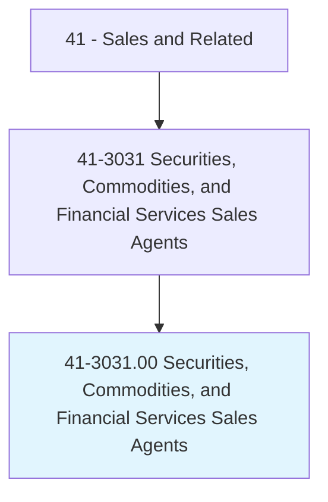
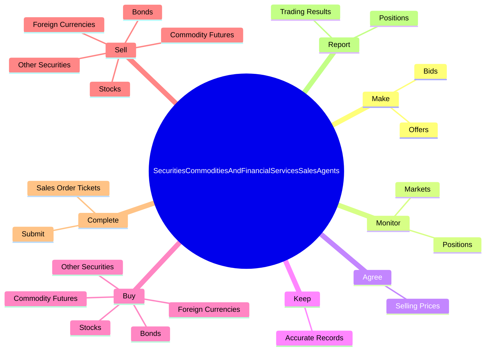

# Securities, Commodities, and Financial Services Sales Agents

> Buy and sell securities or commodities in investment and trading firms, or provide financial services to businesses and individuals. May advise customers about stocks, bonds, mutual funds, commodities, and market conditions.

## Overview

Securities, Commodities, and Financial Services Sales Agents is an occupation within the Sales and Related category. Buy and sell securities or commodities in investment and trading firms, or provide financial services to businesses and individuals. 

## Classification Hierarchy

## Key Statistics

| Metric | Value |
|--------|-------|
| SOC Code | 41-3031.00 |
| Category | [Sales and Related](/occupations/Sales) |
| Task Count | 102 |
| Source | O*NET |

## Core Tasks

### make.Bids

Securities, Commodities, and Financial Services Sales Agents make bids as part of their core responsibilities.

**Actions:**
- `make.Bids.to.buy.Securities`
- `make.Bids.to.sell.Securities`
- `make.Offers.to.buy.Securities`
- `make.Offers.to.sell.Securities`

### monitor.Markets

Securities, Commodities, and Financial Services Sales Agents monitor markets as part of their core responsibilities.

**Actions:**
- `monitor.Markets`
- `monitor.Positions`

### agree.SellingPrices

Securities, Commodities, and Financial Services Sales Agents agree selling prices as part of their core responsibilities.

**Actions:**
- `agree.SellingPrices.at.OptimalLevels.for.Clients`

## Skills & Competencies

### Technical Skills
- **Sales Techniques** - Advanced
- **Customer Relations** - Advanced
- **Product Knowledge** - Advanced

### Soft Skills
- **Communication** - Essential
- **Problem Solving** - Essential
- **Critical Thinking** - Important
- **Teamwork** - Important
- **Adaptability** - Important

## Related Occupations

## Industries

This occupation is found across multiple industries. See [Industries](/industries) for sector-specific employment data.

## Career Progression

---

*Source: O*NET 41-3031.00 - ONETOccupation*
