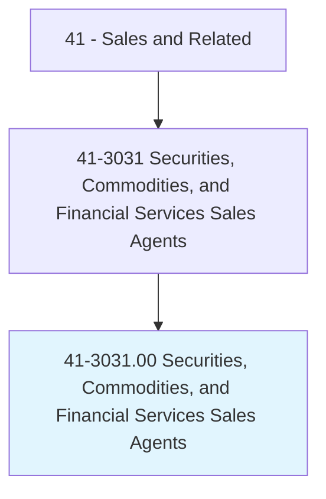
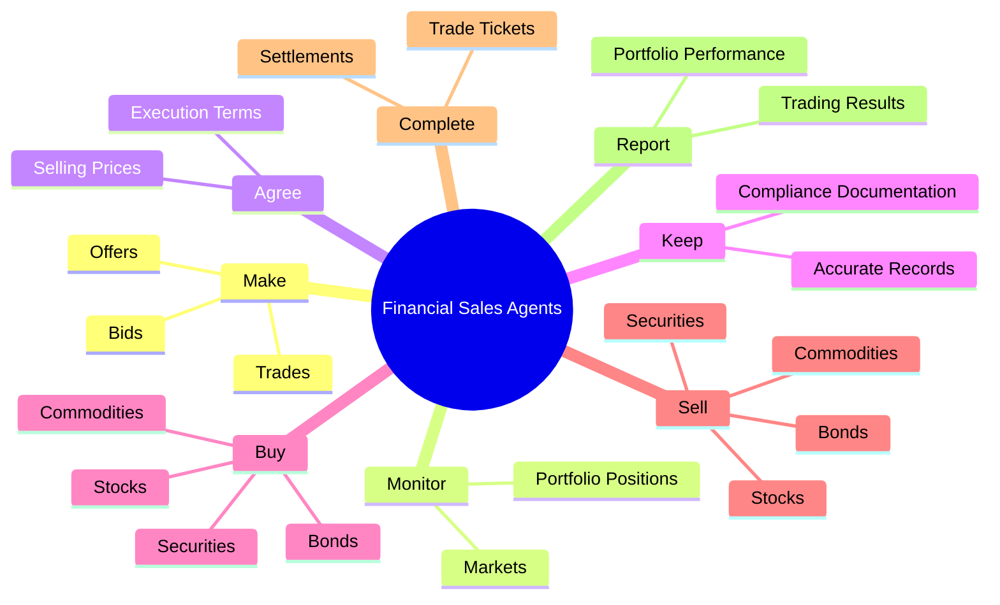
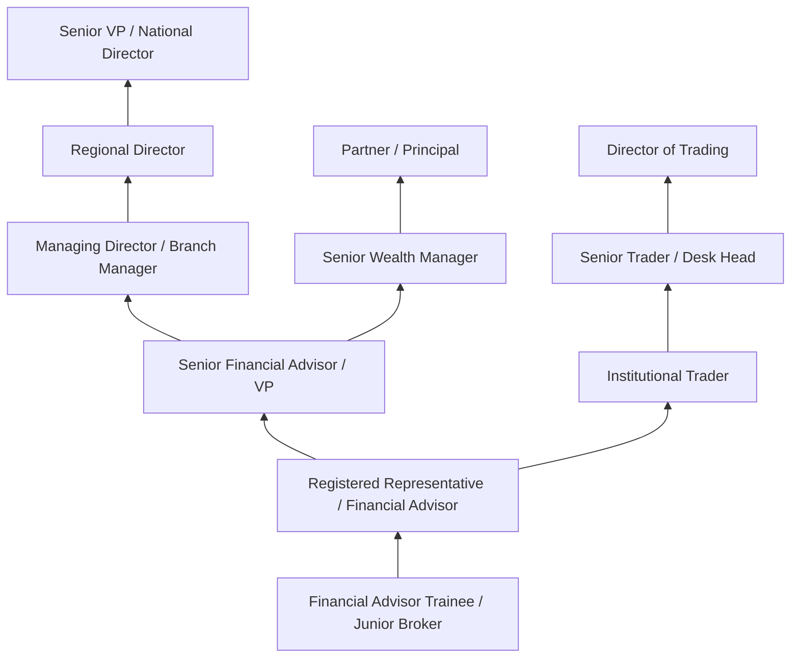
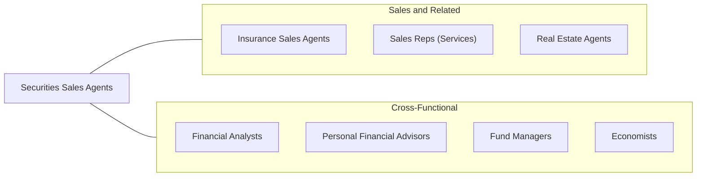

# Securities, Commodities, and Financial Services Sales Agents

> Buy and sell securities or commodities in investment and trading firms, or provide financial services to businesses and individuals. May advise customers about stocks, bonds, mutual funds, commodities, and market conditions.

## Overview

Securities, Commodities, and Financial Services Sales Agents are licensed financial professionals who buy and sell investment products, trade securities and commodities, and provide financial advisory services to individuals and institutional clients. Working in brokerage firms, investment banks, wealth management companies, and trading floors, they help clients build and manage investment portfolios, execute trades, and navigate complex financial markets. Their advice and execution directly impact clients' financial well-being and wealth accumulation.

The profession encompasses several distinct roles: stockbrokers and registered representatives who sell stocks, bonds, and mutual funds to retail clients; commodities traders who buy and sell futures contracts; financial advisors who provide comprehensive wealth management; and institutional sales professionals who serve hedge funds, pension funds, and other large investors. Each role operates under extensive regulatory oversight from the Securities and Exchange Commission (SEC), Financial Industry Regulatory Authority (FINRA), and state regulators.

This is one of the most highly compensated sales professions, reflecting the significant responsibility agents bear for their clients' financial assets and the extensive licensing requirements to practice. Compensation typically includes base salary plus commissions, bonuses tied to assets under management, or fee-based advisory income. The profession demands continuous market awareness, strong analytical skills, ethical conduct, and the ability to build and maintain trust-based client relationships over decades.

## Classification Hierarchy

## Key Statistics

| Metric | Value |
|--------|-------|
| SOC Code | 41-3031.00 |
| Job Zone | 4 (Considerable Preparation) |
| Category | [Sales and Related](/occupations/Sales/index) |
| Median Annual Salary | $67,480 |
| Employment | ~464,000 |
| Projected Growth | 7% (faster than average) |
| Core Tasks | 102 |
| Source | O*NET |

## Core Tasks

### make.Bids

Financial Sales Agents execute buy and sell orders for securities.

**Actions:**
- `make.Bids.to.buy.Securities` - Place buy orders on behalf of clients
- `make.Bids.to.sell.Securities` - Execute sell orders at market or limit prices
- `make.Offers.to.buy.Securities` - Submit offers for investment opportunities
- `make.Offers.to.sell.Securities` - Market securities for distribution

### monitor.Markets

Financial Sales Agents track market conditions and portfolio performance.

**Actions:**
- `monitor.Markets` - Track market movements, news, and economic indicators
- `monitor.Positions` - Review portfolio holdings and performance

### agree.SellingPrices

Financial Sales Agents negotiate optimal execution terms.

**Actions:**
- `agree.SellingPrices.at.OptimalLevels.for.Clients` - Secure best execution pricing

## Skills & Competencies

### Technical Skills
- **Securities Analysis** - Expert
- **Portfolio Management** - Advanced
- **Financial Markets Knowledge** - Expert
- **Regulatory Compliance (SEC, FINRA)** - Expert
- **Trading Platforms and Systems** - Advanced
- **Financial Planning** - Advanced
- **Risk Assessment** - Advanced
- **Tax and Estate Planning** - Intermediate

### Soft Skills
- **Client Relationship Management** - Critical
- **Trustworthiness and Integrity** - Critical
- **Communication** - Critical
- **Analytical Thinking** - Critical
- **Emotional Intelligence** - Essential
- **Resilience Under Pressure** - Essential
- **Persuasion** - Essential
- **Attention to Detail** - Essential

## Education & Certifications

| Requirement | Details |
|-------------|---------|
| Typical Education | Bachelor's degree in Finance, Economics, Business, or related field |
| Series 7 (General Securities Representative) | FINRA license required for selling securities |
| Series 66 or Series 63/65 | State investment advisor license |
| Series 3 | Required for commodities/futures trading |
| Certified Financial Planner (CFP) | Comprehensive financial planning credential |
| Chartered Financial Analyst (CFA) | Investment analysis and portfolio management |
| Chartered Market Technician (CMT) | Technical analysis certification |
| State Insurance License | Required for selling variable annuities and insurance products |
| Continuing Education | FINRA CE requirements; firm-specific training |

## Career Progression

## Industry Variations

| Setting | Focus | Unique Aspects |
|---------|-------|----------------|
| Full-Service Brokerage (Morgan Stanley, Merrill) | Wealth management, comprehensive advisory | High-net-worth clients; full product suite; team-based practice |
| Discount/Online Brokerage (Schwab, Fidelity) | Execution and planning | Volume-based; technology-driven; self-directed and advised models |
| Investment Banking | Institutional sales, IPOs, bond offerings | Institutional clients; large transactions; deal-focused |
| Independent RIA | Fee-based financial planning | Fiduciary standard; independence; comprehensive planning |

## Technology & Tools

- **Trading Platforms** - Bloomberg Terminal, Reuters Eikon, ThinkOrSwim
- **CRM** - Salesforce Financial Services Cloud, Redtail
- **Financial Planning** - eMoney, MoneyGuidePro, NaviPlan
- **Portfolio Management** - Black Diamond, Orion, Envestnet
- **Research** - Morningstar, S&P Capital IQ, FactSet
- **Compliance** - Smarsh, Global Relay, RegEd
- **Communication** - Secure messaging, client portals

## Related Occupations

## Departments

This occupation typically works in:
- Sales and Trading - Securities execution and distribution
- Wealth Management - Client advisory services
- Compliance - Regulatory compliance
- [Research](/departments/Research) - Market and investment research

---

*Source: O*NET 41-3031.00 - ONETOccupation*
