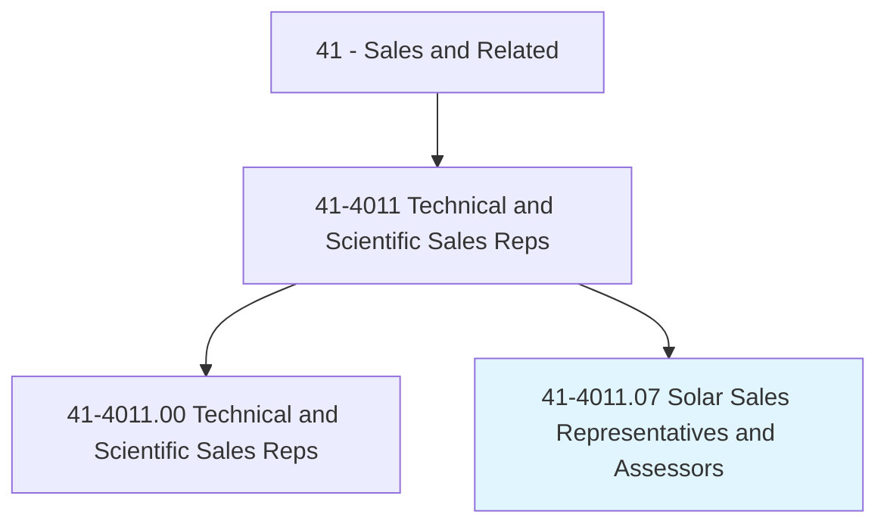
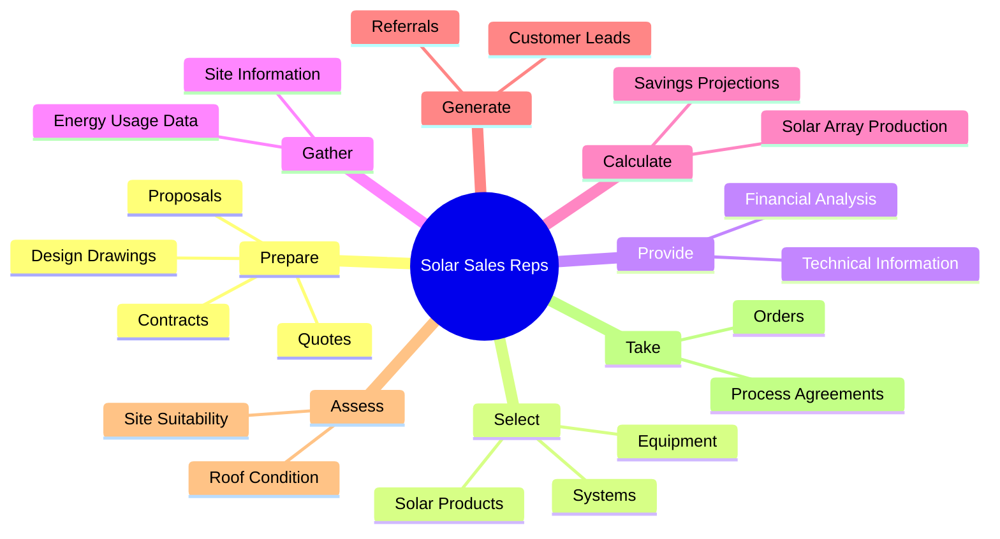
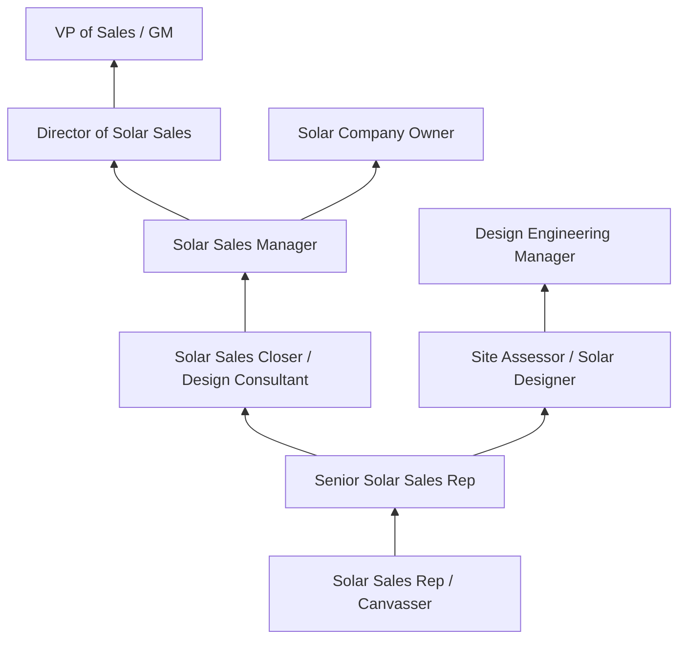
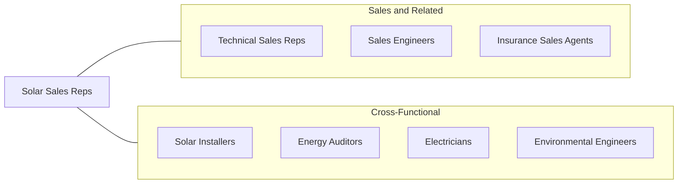

# Solar Sales Representatives and Assessors

> Contact new or existing customers to determine their solar equipment needs, suggest systems or equipment, or estimate costs.

## Overview

Solar Sales Representatives and Assessors are specialized technical sales professionals who help residential and commercial customers transition to solar energy by assessing their properties, designing appropriate solar systems, explaining financial benefits, and closing sales for solar installations. They combine knowledge of photovoltaic technology, energy systems, building construction, and financial incentives to guide customers through what is often a significant investment decision with long-term economic and environmental implications.

The solar industry has experienced explosive growth driven by declining equipment costs, federal and state tax incentives, rising electricity prices, and growing environmental awareness. Solar Sales Representatives operate at the intersection of technology, finance, and sustainability, helping customers understand how solar panels, battery storage, and energy management systems can reduce their electricity costs and carbon footprints. They must be proficient in site assessment techniques, energy production calculations, financing options (purchase, loan, lease, PPA), and the regulatory landscape of net metering, interconnection agreements, and building permits.

This occupation requires both technical competence and strong sales skills. Representatives conduct property assessments using satellite imagery, on-site measurements, and shading analysis to determine solar potential. They use design software to create system proposals showing expected energy production, financial projections, and environmental impact. The sales process involves educating customers who may be unfamiliar with solar technology, addressing common objections, and navigating complex financing structures. Many solar sales positions involve door-to-door canvassing, community events, and referral networks as lead generation strategies.

## Classification Hierarchy

## Key Statistics

| Metric | Value |
|--------|-------|
| SOC Code | 41-4011.07 |
| Job Zone | 3 (Medium Preparation) |
| Category | [Sales and Related](/occupations/Sales/index) |
| Median Annual Salary | $58,000 |
| Employment | ~35,000 |
| Projected Growth | 15%+ (much faster than average) |
| Core Tasks | 64 |
| Source | O*NET |

## Core Tasks

### prepare.Proposals

Solar Sales Reps create detailed proposals including system design and financial projections.

**Actions:**
- `prepare.Proposals.for.PotentialSolarCustomers` - Design complete solar proposals
- `prepare.Quotes.for.PotentialSolarCustomers` - Calculate system pricing and financing
- `prepare.Contracts.for.PotentialSolarCustomers` - Draft purchase/lease agreements
- `prepare.Presentations.for.PotentialSolarCustomers` - Create educational and sales presentations

### select.SolarEnergyProducts

Solar Sales Reps choose appropriate equipment based on site conditions.

**Actions:**
- `select.SolarEnergyProducts.for.CustomersBased.on.ElectricalEnergyRequirements` - Size systems to usage
- `select.SolarEnergyProducts.for.SiteConditions` - Account for roof type, orientation, shading
- `select.SolarEnergyProducts.for.Price` - Balance performance with budget constraints

### calculate.SolarArrayProduction

Solar Sales Reps model expected energy production and financial returns.

**Actions:**
- `calculate.SolarArrayProduction.for.ProposedSystems` - Project kWh production annually
- `calculate.SavingsProjections.for.Customers` - Estimate utility bill reduction and ROI

## Skills & Competencies

### Technical Skills
- **Solar PV System Design** - Advanced
- **Energy Production Modeling** - Advanced
- **Site Assessment and Shading Analysis** - Advanced
- **Solar Financing (Loan, Lease, PPA)** - Expert
- **Federal/State Incentive Programs (ITC, SRECs)** - Expert
- **Electrical Systems Basics** - Intermediate
- **Building Construction and Roofing** - Intermediate
- **Permitting and Interconnection** - Intermediate

### Soft Skills
- **Consultative Selling** - Critical
- **Communication** - Critical
- **Trustworthiness** - Critical
- **Persistence** - Essential
- **Education and Patience** - Essential
- **Relationship Building** - Essential
- **Environmental Passion** - Important
- **Problem Solving** - Essential

## Education & Certifications

| Requirement | Details |
|-------------|---------|
| Typical Education | Bachelor's degree preferred; associate's or experience accepted |
| NABCEP PV Technical Sales Certification | Industry-recognized solar sales credential |
| NABCEP PV Associate | Entry-level solar knowledge certification |
| Solar Sales Training | Company-provided product and sales process training |
| BPI Building Analyst | Beneficial for energy efficiency assessments |
| State Contractor License | Required in some states for sales involving installation contracts |
| Continuing Education | Solar technology updates, incentive program changes, financing trends |

## Career Progression

## Industry Variations

| Setting | Focus | Unique Aspects |
|---------|-------|----------------|
| Residential Solar | Rooftop PV for homeowners | Door-to-door; emotional selling; financing-heavy; high volume |
| Commercial Solar | Roof and ground-mount for businesses | Larger systems; ROI-focused; longer sales cycles; facility assessments |
| Community Solar | Shared solar garden subscriptions | Subscription selling; no installation required; income-based programs |
| Solar + Storage | Battery and energy management | Technical complexity; backup power value; time-of-use optimization |

## Technology & Tools

- **Design Software** - Aurora Solar, Helioscope, OpenSolar
- **CRM** - Salesforce, EnergySage, HubSpot
- **Site Assessment** - Google Earth Pro, SunEye, drones
- **Financial Modeling** - Solar financing calculators, NREL PVWatts
- **E-signatures** - DocuSign, PandaDoc
- **Proposal Tools** - Company-specific proposal generators
- **Communication** - Door-to-door apps (SalesRabbit, Spotio), text platforms

## Related Occupations

## Departments

This occupation typically works in:
- [Sales Department](/departments/Sales) - Revenue and customer acquisition
- [Design Engineering](/departments/DesignEngineering) - System design and assessment
- [Operations](/departments/Operations) - Installation coordination
- [Marketing](/departments/Marketing) - Lead generation and community outreach

---

*Source: O*NET 41-4011.07 - ONETOccupation*
