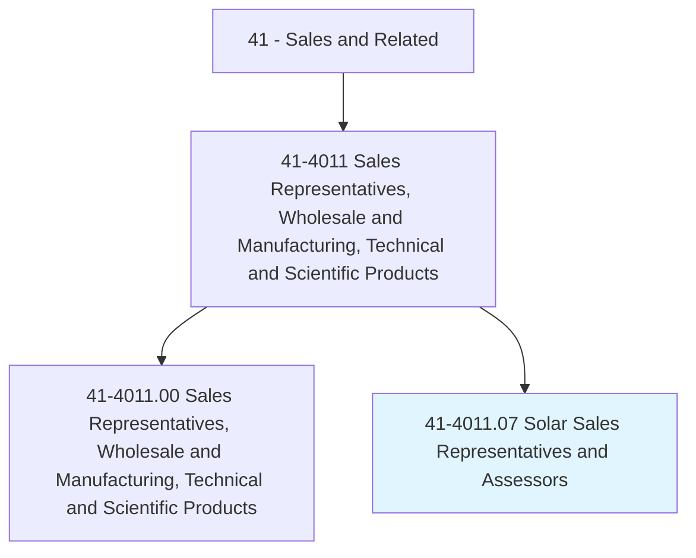
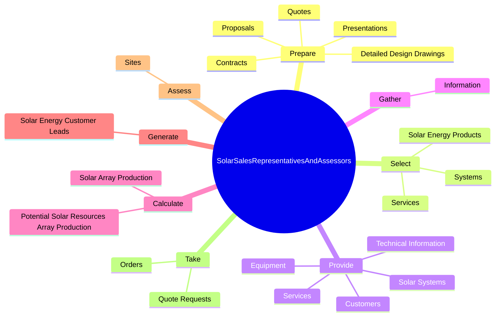
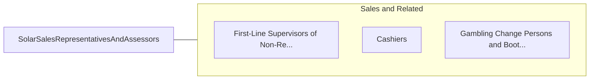

# Solar Sales Representatives and Assessors

> Contact new or existing customers to determine their solar equipment needs, suggest systems or equipment, or estimate costs.

## Overview

Solar Sales Representatives and Assessors is classified under Sales and Related (SOC 41). Contact new or existing customers to determine their solar equipment needs, suggest systems or equipment, or estimate costs.

## Classification Hierarchy

## Key Statistics

| Metric | Value |
|--------|-------|
| SOC Code | 41-4011.07 |
| Category | [Sales and Related](/occupations/Sales) |
| Task Count | 64 |
| Source | O*NET |

## Core Tasks

### prepare.Proposals

Solar Sales Representatives and Assessors prepare proposals as part of their core responsibilities.

**Actions:**
- `prepare.Proposals.for.PotentialSolarCustomers`
- `prepare.Quotes.for.PotentialSolarCustomers`
- `prepare.Contracts.for.PotentialSolarCustomers`
- `prepare.Presentations.for.PotentialSolarCustomers`

### select.SolarEnergyProducts

Solar Sales Representatives and Assessors select solar energy products as part of their core responsibilities.

**Actions:**
- `select.SolarEnergyProducts.for.CustomersBased.on.ElectricalEnergyRequirements`
- `select.SolarEnergyProducts.for.SiteConditions`
- `select.SolarEnergyProducts.for.Price`
- `select.SolarEnergyProducts.for.OtherFactors`

### provide.Customers

Solar Sales Representatives and Assessors provide customers as part of their core responsibilities.

**Actions:**
- `provide.Customers.with.Information`
- `provide.Customers.with.Quotes`
- `provide.Customers.with.Orders`
- `provide.Customers.with.Sales`

## Skills & Competencies

### Technical Skills
- **Sales Techniques** - Advanced
- **Customer Relations** - Advanced
- **Product Knowledge** - Advanced

### Soft Skills
- **Communication** - Essential
- **Problem Solving** - Essential
- **Critical Thinking** - Important
- **Teamwork** - Important
- **Adaptability** - Important

## Related Occupations

## Industries

This occupation is found across multiple industries. See [Industries](/industries) for sector-specific employment data.

## Career Progression

---

*Source: O*NET 41-4011.07 - ONETOccupation*
