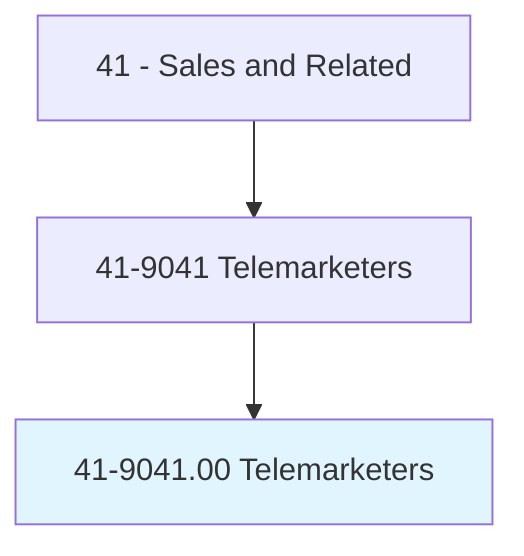
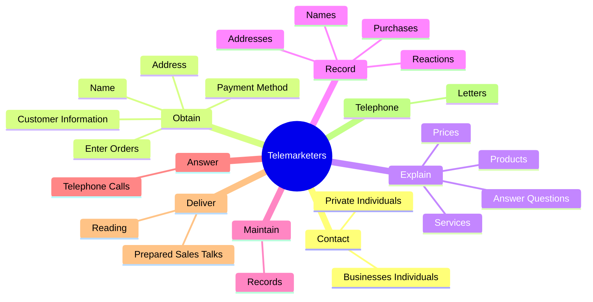
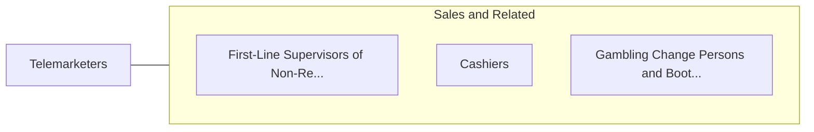

# Telemarketers

> Solicit donations or orders for goods or services over the telephone.

## Overview

Telemarketers is classified under Sales and Related (SOC 41). Solicit donations or orders for goods or services over the telephone.

## Classification Hierarchy

## Key Statistics

| Metric | Value |
|--------|-------|
| SOC Code | 41-9041.00 |
| Category | [Sales and Related](/occupations/Sales/index) |
| Task Count | 53 |
| Source | O*NET |

## Core Tasks

### contact.BusinessesIndividuals

Telemarketers contact businesses individuals as part of their core responsibilities.

**Actions:**
- `contact.BusinessesIndividuals.by.Telephone.to.solicit.SalesForGoods`
- `contact.BusinessesIndividuals.by.Services`
- `contact.BusinessesIndividuals.by..to.request.DonationsF`
- `contact.BusinessesIndividuals.by.CharitableCauses`

### obtain.CustomerInformation

Telemarketers obtain customer information as part of their core responsibilities.

**Actions:**
- `obtain.CustomerInformation`
- `obtain.Name`
- `obtain.Address`
- `obtain.PaymentMethod`

### explain.Products

Telemarketers explain products as part of their core responsibilities.

**Actions:**
- `explain.Products.from.Customers`
- `explain.Services.from.Customers`
- `explain.Prices.from.Customers`
- `explain.AnswerQuestions.from.Customers`

## Skills & Competencies

### Technical Skills
- **Sales Techniques** - Advanced
- **Customer Relations** - Advanced
- **Product Knowledge** - Advanced

### Soft Skills
- **Communication** - Essential
- **Problem Solving** - Essential
- **Critical Thinking** - Important
- **Teamwork** - Important
- **Adaptability** - Important

## Related Occupations

## Industries

This occupation is found across multiple industries. See [Industries](/industries) for sector-specific employment data.

## Career Progression

---

*Source: O*NET 41-9041.00 - ONETOccupation*
