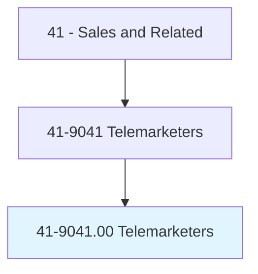
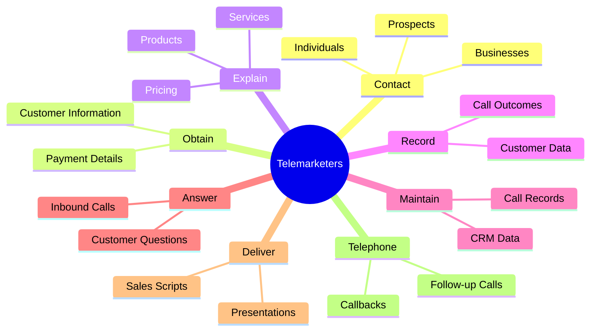
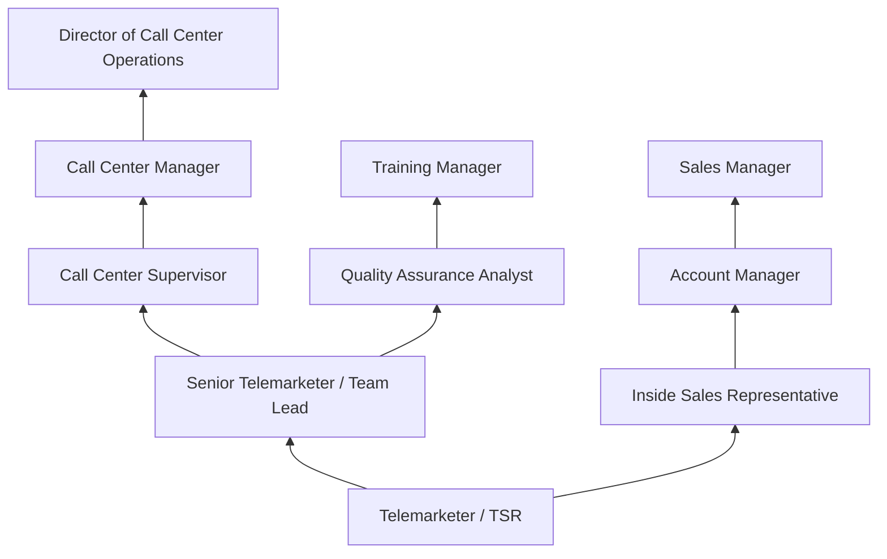
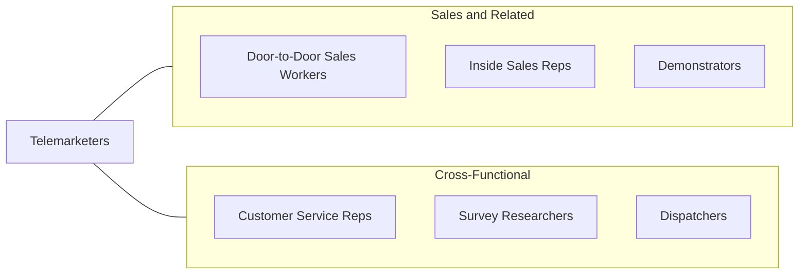

# Telemarketers

> Solicit donations or orders for goods or services over the telephone.

## Overview

Telemarketers are sales professionals who contact individuals and businesses by telephone to solicit orders for products and services, request donations for charitable organizations, conduct surveys, or generate leads for sales teams. They work from call centers, offices, or home-based settings, using telephone systems, predictive dialers, and scripted presentations to efficiently reach large numbers of potential customers or donors. The role is one of the most fundamental positions in direct sales and fundraising.

Telemarketing encompasses both outbound calling (proactively reaching out to prospects) and inbound operations (handling responses to advertisements, direct mail, or online campaigns). Outbound telemarketers follow call scripts, overcome objections, present product benefits, and close sales or schedule appointments. Inbound telemarketers respond to customer inquiries generated by marketing campaigns, process orders, and upsell additional products. The role requires resilience, as rejection rates are high and conversations must remain professional and persuasive regardless of the prospect's response.

The telemarketing industry is heavily regulated, with the Telephone Consumer Protection Act (TCPA), the National Do Not Call Registry, and FTC Telemarketing Sales Rules governing calling practices, disclosure requirements, and consumer protections. Compliance with these regulations is essential, and violations can result in substantial penalties. While automated calling and digital marketing have reduced some traditional telemarketing demand, the occupation remains relevant for complex products, charitable solicitation, appointment setting, and B2B lead generation.

## Classification Hierarchy

## Key Statistics

| Metric | Value |
|--------|-------|
| SOC Code | 41-9041.00 |
| Job Zone | 1 (Little or No Preparation) |
| Category | [Sales and Related](/occupations/Sales/index) |
| Median Annual Salary | $31,400 |
| Employment | ~96,000 |
| Projected Growth | -15% (declining) |
| Core Tasks | 53 |
| Source | O*NET |

## Core Tasks

### contact.BusinessesIndividuals

Telemarketers make outbound calls to prospects and customers.

**Actions:**
- `contact.BusinessesIndividuals.by.Telephone.to.solicit.SalesForGoods` - Call prospects to sell products
- `contact.BusinessesIndividuals.by.Telephone.to.request.Donations` - Solicit charitable contributions
- `contact.BusinessesIndividuals.by.Telephone.to.schedule.Appointments` - Set meetings for sales teams

### obtain.CustomerInformation

Telemarketers collect and record customer data for transactions.

**Actions:**
- `obtain.CustomerInformation` - Gather personal and contact details
- `obtain.Name` - Record customer identification
- `obtain.Address` - Capture shipping and billing addresses
- `obtain.PaymentMethod` - Process credit card or payment information

### explain.Products

Telemarketers present product and service information to prospects.

**Actions:**
- `explain.Products.to.Customers` - Describe product features and benefits
- `explain.Services.to.Customers` - Present service offerings and value
- `explain.Prices.to.Customers` - Communicate pricing and promotional offers
- `explain.AnswerQuestions.from.Customers` - Respond to prospect inquiries

## Skills & Competencies

### Technical Skills
- **Telephone Sales Techniques** - Advanced
- **CRM and Dialer Systems** - Advanced
- **Script Delivery and Improvisation** - Advanced
- **Data Entry** - Intermediate
- **TCPA and Regulatory Compliance** - Intermediate
- **Product/Service Knowledge** - Intermediate
- **Order Processing** - Intermediate

### Soft Skills
- **Verbal Communication** - Critical
- **Persistence and Resilience** - Critical
- **Persuasion** - Essential
- **Active Listening** - Essential
- **Patience** - Essential
- **Positive Attitude** - Essential
- **Professionalism** - Essential
- **Adaptability** - Important

## Education & Certifications

| Requirement | Details |
|-------------|---------|
| Typical Education | High school diploma or less |
| On-the-Job Training | Short-term; script training and product orientation |
| TCPA Compliance Training | Required by most employers |
| Do Not Call Registry Training | Federal and state compliance requirements |
| Sales Script Training | Company-provided call handling certification |
| Quality Assurance Training | Call quality standards and monitoring |
| Industry-Specific Training | Product knowledge for specialized campaigns |

## Career Progression

## Industry Variations

| Setting | Focus | Unique Aspects |
|---------|-------|----------------|
| B2C Products | Consumer goods, subscriptions | High volume; scripted; short call duration; impulse purchases |
| Charitable Fundraising | Donations, pledges | Emotional appeals; donor databases; seasonal campaigns |
| B2B Lead Generation | Appointment setting, qualification | Consultative; longer conversations; CRM integration |
| Political Campaigns | Voter outreach, fundraising | Seasonal surges; compliance requirements; volunteer coordination |

## Technology & Tools

- **Dialers** - Predictive dialers, power dialers, auto-dialers
- **CRM** - Salesforce, Five9, NICE inContact
- **Call Center Software** - RingCentral, Genesys, Talkdesk
- **Scripting Tools** - Dynamic call scripting platforms
- **Quality Monitoring** - Call recording, speech analytics
- **Compliance** - DNC scrubbing tools, TCPA compliance platforms
- **Communication** - Headsets, VoIP systems

## Related Occupations

## Departments

This occupation typically works in:
- [Sales Department](/departments/Sales) - Outbound sales and lead generation
- Customer Service - Inbound order processing
- [Marketing Department](/departments/Marketing) - Campaign execution
- Fundraising - Charitable solicitation

---

*Source: O*NET 41-9041.00 - ONETOccupation*
