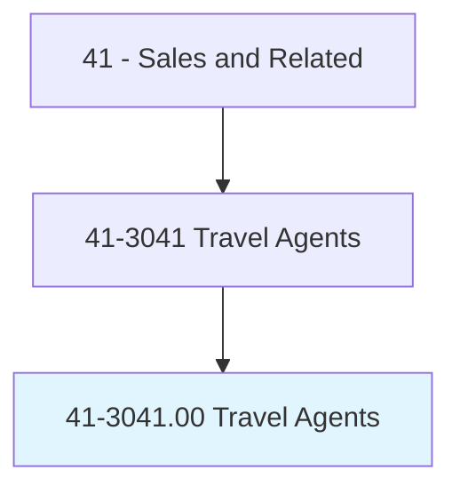
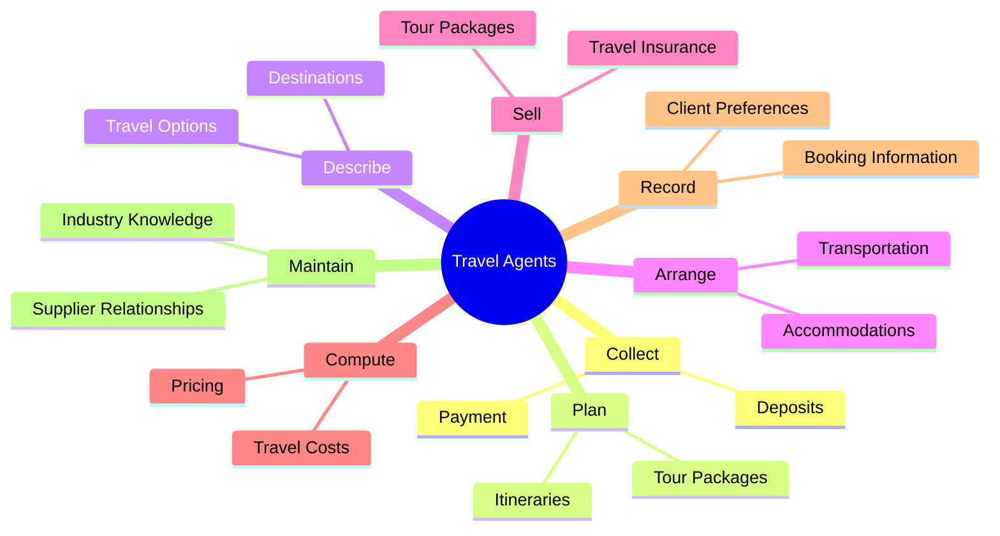
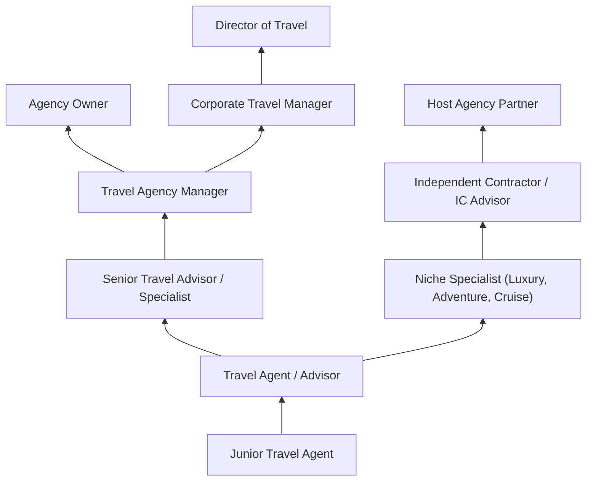
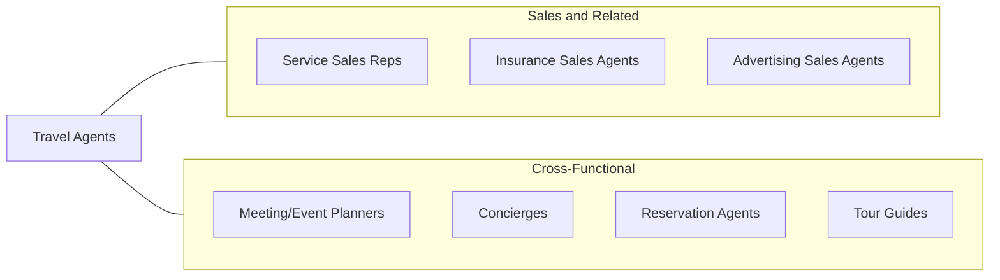

# Travel Agents

> Plan and sell transportation and accommodations for customers. Determine destination, modes of transportation, travel dates, costs, and accommodations required. May also describe, plan, and arrange itineraries and sell tour packages. May assist in resolving clients' travel problems.

## Overview

Travel Agents are specialized sales and service professionals who plan, organize, and sell travel arrangements for individuals, families, groups, and businesses. They research destinations, compare transportation options, book flights, hotels, car rentals, cruises, and tour packages, and create detailed itineraries tailored to their clients' preferences, budgets, and schedules. Beyond booking logistics, travel agents provide expert destination knowledge, insider recommendations, and problem-solving support that transforms routine trips into exceptional experiences.

The travel agency landscape has evolved significantly with the rise of online booking platforms. While many leisure travelers now book simple trips independently, travel agents have found growing demand for complex itineraries, luxury travel, group tours, destination weddings, honeymoons, cruise vacations, and corporate travel management. These scenarios benefit from the agent's expertise, supplier relationships, and ability to navigate complications. Many agents specialize in specific niches -- adventure travel, luxury resorts, Disney vacations, European tours, or river cruises -- developing deep expertise that distinguishes their services.

Travel agents earn income through commissions from suppliers (airlines, hotels, cruise lines, tour operators), service fees charged to clients, or a combination of both. The profession increasingly attracts individuals who are passionate about travel and seek flexible work arrangements, with many agents operating as independent contractors affiliated with host agencies. Professional development through industry organizations like ASTA (American Society of Travel Advisors) and supplier certifications enhances credibility and access to preferred pricing.

## Classification Hierarchy

## Key Statistics

| Metric | Value |
|--------|-------|
| SOC Code | 41-3041.00 |
| Job Zone | 3 (Medium Preparation) |
| Category | [Sales and Related](/occupations/Sales/index) |
| Median Annual Salary | $46,400 |
| Employment | ~65,000 |
| Projected Growth | 3% (slower than average) |
| Core Tasks | 38 |
| Source | O*NET |

## Core Tasks

### collect.Payment

Travel Agents process payments and manage financial transactions.

**Actions:**
- `collect.Payment.for.Transportation.from.Customer` - Process airfare and transportation payments
- `collect.Payment.for.Accommodations.from.Customer` - Collect hotel and lodging deposits

### plan.Itineraries

Travel Agents design customized travel plans and tour packages.

**Actions:**
- `plan.ItineraryTourPackagesTravelIncentivesOffered.by.VariousTravelCarriers` - Create detailed trip itineraries
- `plan.PromotionalTravelIncentivesOffered.by.VariousTravelCarriers` - Leverage supplier promotions

### describe.Destinations

Travel Agents educate clients about destination options and travel products.

**Actions:**
- `describe.ItineraryTourPackagesTravelIncentivesOffered.by.VariousTravelCarriers` - Present travel options and packages
- `describe.PromotionalTravelIncentivesOffered.by.VariousTravelCarriers` - Highlight special offers and deals

## Skills & Competencies

### Technical Skills
- **Global Distribution Systems (GDS)** - Advanced
- **Destination Knowledge** - Expert
- **Travel Booking Platforms** - Advanced
- **Itinerary Planning and Design** - Advanced
- **Travel Insurance** - Intermediate
- **International Travel Requirements (Visas, Passports)** - Advanced
- **Supplier Negotiation** - Intermediate
- **CRM and Client Management** - Intermediate

### Soft Skills
- **Customer Service** - Critical
- **Attention to Detail** - Critical
- **Communication** - Critical
- **Organization** - Essential
- **Problem Solving** - Essential
- **Cultural Awareness** - Essential
- **Patience** - Essential
- **Creativity** - Important

## Education & Certifications

| Requirement | Details |
|-------------|---------|
| Typical Education | High school diploma; travel and tourism certificate preferred |
| Travel Agent Certification | The Travel Institute Certified Travel Associate (CTA) |
| Certified Travel Counselor (CTC) | Advanced industry certification |
| Destination Specialist (DS) | Specialization in specific regions |
| Cruise Lines International (CLIA) Certification | Cruise selling specialist credential |
| Disney College of Knowledge | Authorized Disney Vacation Planner |
| Supplier Certifications | Sandals, Marriott, Hilton, major cruise lines |
| Continuing Education | FAM trips, trade shows, supplier training |

## Career Progression

## Industry Variations

| Setting | Focus | Unique Aspects |
|---------|-------|----------------|
| Leisure Travel Agency | Vacations, honeymoons, tours | Consultative; commission-based; relationship-driven |
| Corporate Travel Management | Business travel, meetings | Policy compliance; cost control; TMC partnerships |
| Online Travel Agency (OTA) | Technology-enabled booking | Volume-based; algorithm-driven; customer service focus |
| Specialty / Niche Travel | Adventure, luxury, accessible travel | Deep expertise; premium pricing; curated experiences |

## Technology & Tools

- **GDS Systems** - Sabre, Amadeus, Travelport
- **Booking Platforms** - Supplier direct booking portals
- **CRM** - ClientBase, Travel Joy, Traveler's Choice
- **Itinerary Tools** - Travefy, Axus Travel, TripIt Pro
- **Communication** - Email, phone, video consultations
- **Marketing** - Social media, email newsletters, websites
- **Accounting** - Commission tracking, invoicing tools

## Related Occupations

## Departments

This occupation typically works in:
- [Sales Department](/departments/Sales) - Travel product sales
- Customer Service - Client support and problem resolution
- Corporate Travel - Business travel management
- [Marketing Department](/departments/Marketing) - Destination promotion and lead generation

---

*Source: O*NET 41-3041.00 - ONETOccupation*
