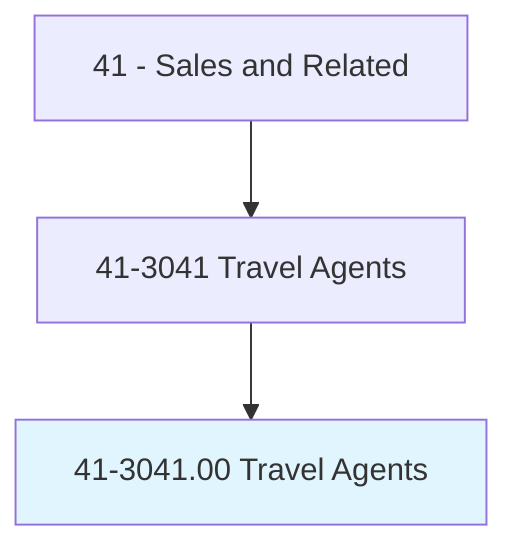
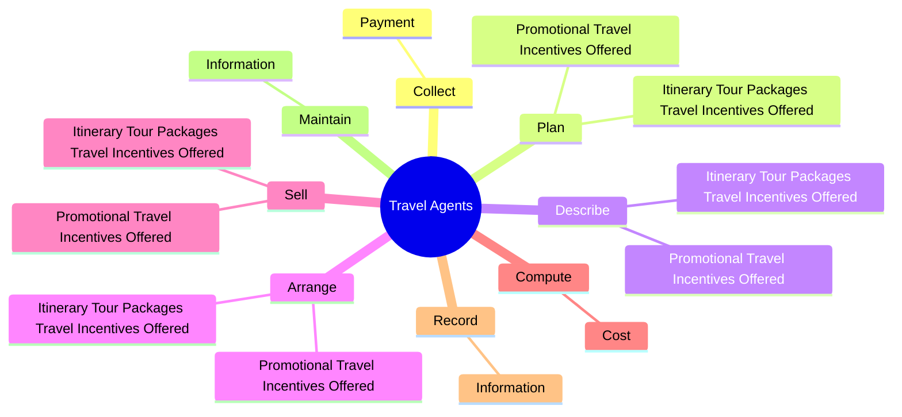

# Travel Agents

> Plan and sell transportation and accommodations for customers. Determine destination, modes of transportation, travel dates, costs, and accommodations required. May also describe, plan, and arrange itineraries and sell tour packages. May assist in resolving clients' travel problems.

## Overview

Travel Agents is an occupation within the Sales and Related category. Plan and sell transportation and accommodations for customers. Determine destination, modes of transportation, travel dates, costs, and accommodations required.

## Classification Hierarchy

## Key Statistics

| Metric | Value |
|--------|-------|
| SOC Code | 41-3041.00 |
| Category | [Sales and Related](/occupations/Sales/index) |
| Task Count | 38 |
| Source | O*NET |

## Core Tasks

### collect.Payment

Travel Agents collect payment as part of their core responsibilities.

**Actions:**
- `collect.Payment.for.Transportation.from.Customer`
- `collect.Payment.for.Accommodations.from.Customer`

### plan.ItineraryTourPackagesTravelIncentivesOffered

Travel Agents plan itinerary tour packages travel incentives offered as part of their core responsibilities.

**Actions:**
- `plan.ItineraryTourPackagesTravelIncentivesOffered.by.VariousTravelCarriers`
- `plan.PromotionalTravelIncentivesOffered.by.VariousTravelCarriers`

### describe.ItineraryTourPackagesTravelIncentivesOffered

Travel Agents describe itinerary tour packages travel incentives offered as part of their core responsibilities.

**Actions:**
- `describe.ItineraryTourPackagesTravelIncentivesOffered.by.VariousTravelCarriers`
- `describe.PromotionalTravelIncentivesOffered.by.VariousTravelCarriers`

## Skills & Competencies

### Technical Skills
- **Sales Techniques** - Advanced
- **Customer Relations** - Advanced
- **Product Knowledge** - Advanced

### Soft Skills
- **Communication** - Essential
- **Problem Solving** - Essential
- **Critical Thinking** - Important
- **Teamwork** - Important
- **Adaptability** - Important

## Related Occupations

## Industries

This occupation is found across multiple industries. See [Industries](/industries) for sector-specific employment data.

## Career Progression

---

*Source: O*NET 41-3041.00 - ONETOccupation*
