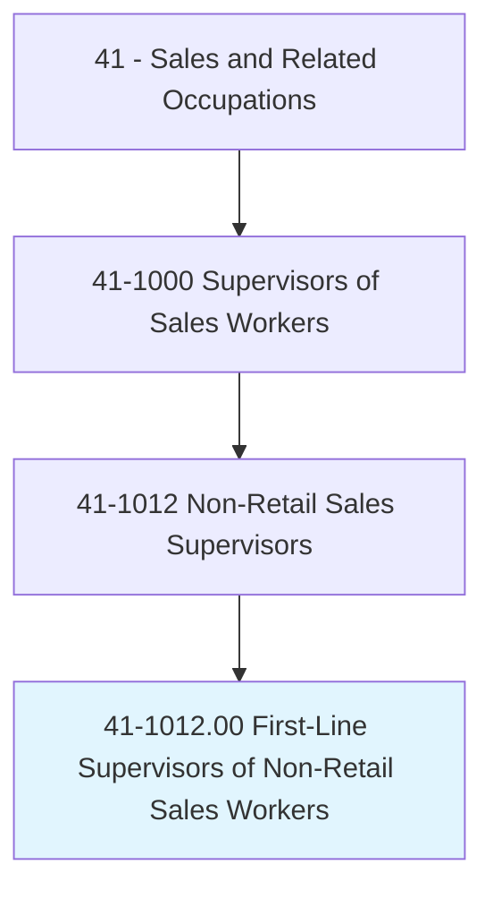
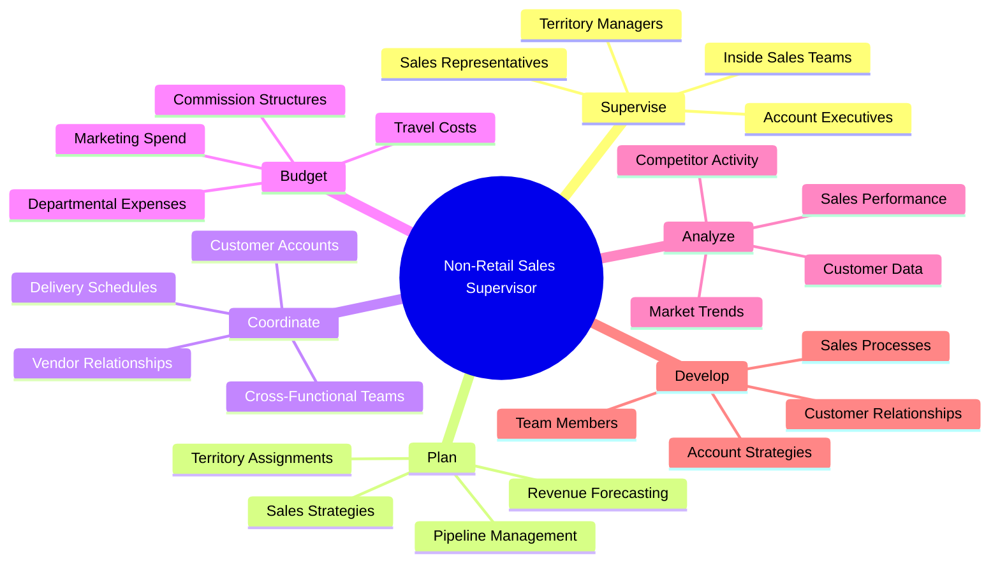
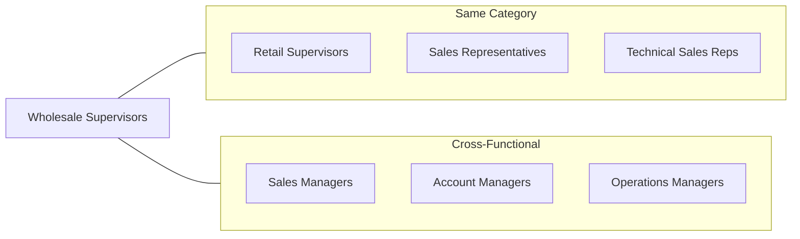
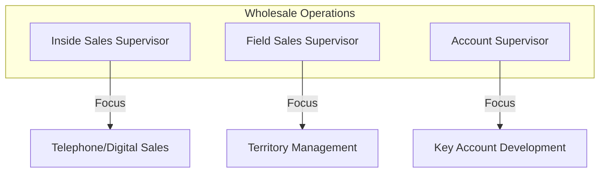
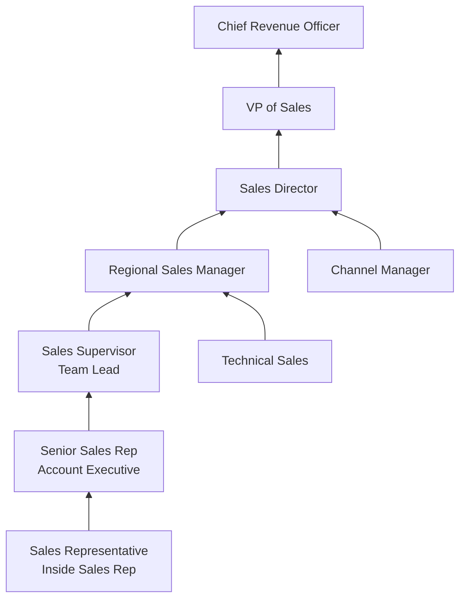
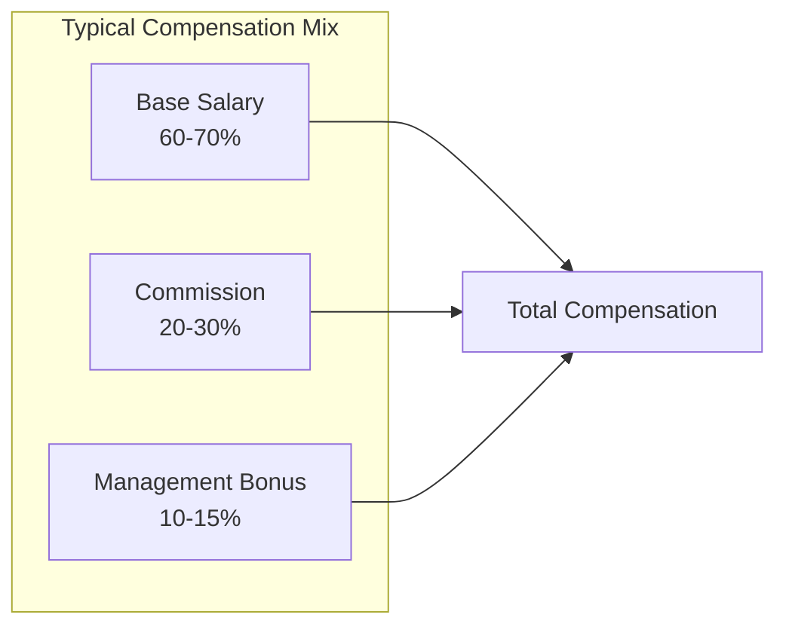

# First-Line Supervisors of Non-Retail Sales Workers

> Directly supervise and coordinate activities of sales workers other than retail sales workers. May perform duties such as budgeting, accounting, and personnel work, in addition to supervisory duties.

## Overview

First-Line Supervisors of Non-Retail Sales Workers oversee sales teams in wholesale, manufacturing, technical, and service industries. Unlike their retail counterparts, these supervisors manage professionals engaged in business-to-business (B2B) sales, often involving longer sales cycles, larger transaction values, and more complex customer relationships. They are responsible for driving revenue through territory management, pipeline oversight, and the development of sales strategies while ensuring their teams meet quotas and maintain profitable customer accounts.

## Classification Hierarchy

## Key Statistics

| Metric | Value |
|--------|-------|
| SOC Code | 41-1012.00 |
| Job Zone | 3 (Medium Preparation) |
| Category | [Sales and Related](/occupations/Sales/index) |
| Core Tasks | 20+ |
| Source | O*NET |

## Core Tasks

### supervise.SalesWorkers

Non-Retail Sales Supervisors directly manage sales professionals engaged in wholesale, manufacturing, and service sales.

**Actions:**
- `supervise.SalesWorkers.in.Territory` - Oversee regional sales team activities
- `coordinate.Activities.of.SalesRepresentatives` - Align team efforts with sales objectives
- `direct.SalesTeam.to.achieve.Quotas` - Guide team toward revenue targets
- `monitor.Performance.of.AccountExecutives` - Track individual contributor results

### plan.SalesStrategies

Developing and implementing sales plans to achieve organizational revenue goals.

**Actions:**
- `plan.SalesStrategies.for.Territory` - Create regional sales approaches
- `develop.AccountPlans.for.KeyCustomers` - Build strategic account frameworks
- `forecast.Revenue.for.Quarter` - Project sales performance
- `set.Quotas.for.SalesTeam` - Establish performance targets

### coordinate.CustomerAccounts

Managing customer relationships and ensuring account satisfaction across the sales team.

**Actions:**
- `coordinate.Accounts.with.SalesTeam` - Distribute account responsibilities
- `manage.Relationships.with.KeyAccounts` - Oversee strategic customer partnerships
- `resolve.Issues.for.Customers` - Address escalated account concerns
- `negotiate.Contracts.with.Clients` - Finalize business agreements

### analyze.SalesPerformance

Evaluating sales metrics and market data to inform strategic decisions.

**Actions:**
- `analyze.SalesData.to.identify.Trends` - Review performance patterns
- `evaluate.MarketConditions.for.Planning` - Assess competitive landscape
- `review.PipelineReports.to.forecast.Revenue` - Monitor sales funnel health
- `track.KPIs.for.Team` - Measure key performance indicators

### budget.DepartmentalExpenses

Managing financial resources allocated to sales operations.

**Actions:**
- `budget.Expenses.for.Department` - Allocate operational funds
- `manage.CommissionStructures.for.Team` - Administer incentive programs
- `control.TravelExpenses.for.SalesForce` - Oversee travel budgets
- `approve.Expenditures.for.SalesActivities` - Authorize spending

## Skills & Competencies

### Technical Skills
- **CRM Systems (Salesforce, HubSpot)** - Expert
- **Sales Analytics Tools** - Advanced
- **ERP Systems** - Proficient
- **Financial Reporting** - Proficient
- **Contract Management** - Intermediate

### Soft Skills
- **Leadership** - Critical
- **Strategic Thinking** - Critical
- **Negotiation** - Critical
- **Communication** - Essential
- **Relationship Building** - Essential
- **Problem Solving** - Essential

## Related Occupations

## Industry Variations

### Wholesale Distribution

Key differences:
- High-volume transaction management
- Inventory and logistics coordination
- Price negotiation authority
- Multi-channel sales oversight

### Manufacturing Sales

Key differences:
- Technical product knowledge requirements
- Long sales cycles (6-18 months)
- Engineering team collaboration
- Custom solution development

### Financial Services

Key differences:
- Regulatory compliance oversight
- Complex product portfolios
- Relationship-driven sales
- Performance-based compensation emphasis

### Technology/SaaS Sales

Key differences:
- Subscription revenue focus
- Customer success integration
- Rapid market changes
- Demo and proof-of-concept management

### Industrial Equipment

Key differences:
- Capital expenditure sales cycles
- After-market services oversight
- Technical specifications management
- Installation coordination

## Industries

- [Wholesale Trade](/industries/Wholesale/index) - Primary sector
- [Manufacturing](/industries/Manufacturing/index) - Industrial and consumer goods
- [Professional Services](/industries/Scientific) - B2B services
- [Finance and Insurance](/industries/Finance) - Financial products
- [Information Technology](/industries/Technology) - Software and hardware

## Career Progression

### Typical Timeline

| Stage | Years Experience | Typical Title |
|-------|-----------------|---------------|
| Entry | 0-2 | Sales Representative, Inside Sales |
| Development | 2-4 | Senior Rep, Account Executive |
| Supervisor | 4-7 | Sales Supervisor, Team Lead |
| Management | 7-12 | Regional Manager, Sales Director |
| Executive | 12+ | VP Sales, CRO |

## Education & Training

| Requirement | Details |
|-------------|---------|
| Typical Education | Bachelor's degree in Business, Marketing, or related field |
| Work Experience | 3-5 years in B2B sales |
| On-the-Job Training | 6-12 months management development |
| Certifications | Certified Sales Professional (CSP), Sales Management certification |

### Recommended Development

- Strategic Sales Management courses
- CRM Administrator certification
- Negotiation and Influence training
- Financial Acumen for Sales Leaders
- Leadership Development programs

## Departments

This occupation typically works in:
- [Sales](/departments/Sales/index)
- Business Development
- Account Management
- Revenue Operations

## Technology & Tools

### CRM Platforms
- Salesforce Sales Cloud
- HubSpot Sales Hub
- Microsoft Dynamics 365
- Pipedrive

### Sales Intelligence
- LinkedIn Sales Navigator
- ZoomInfo
- Gong.io
- Clari

### Communication Tools
- Zoom
- Microsoft Teams
- Slack
- Outreach.io

### Analytics & Reporting
- Tableau
- Power BI
- Domo
- InsightSquared

## Performance Metrics

| Metric | Description |
|--------|-------------|
| Quota Attainment | Percentage of team meeting sales targets |
| Pipeline Coverage | Ratio of pipeline to quota |
| Win Rate | Percentage of opportunities closed |
| Average Deal Size | Mean revenue per closed deal |
| Sales Cycle Length | Average time from lead to close |
| Customer Acquisition Cost | Cost to acquire new customers |
| Customer Retention Rate | Percentage of accounts retained |
| Revenue per Rep | Average revenue generated per salesperson |

## Compensation Structure

---

*Source: O*NET 41-1012.00 - ONETOccupation*
