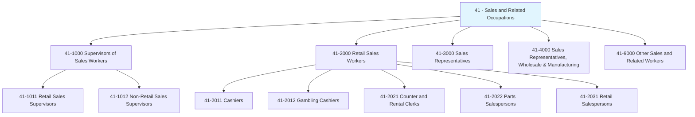
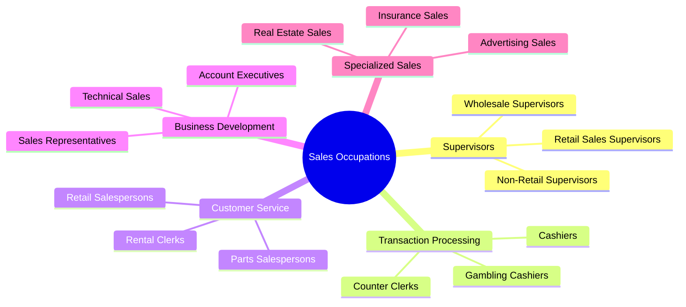
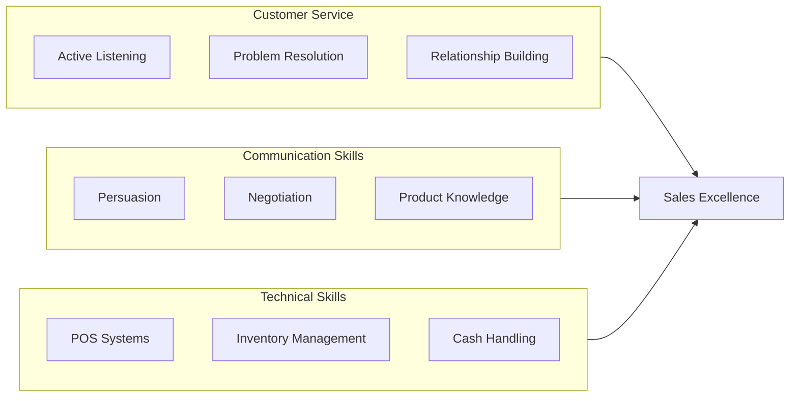
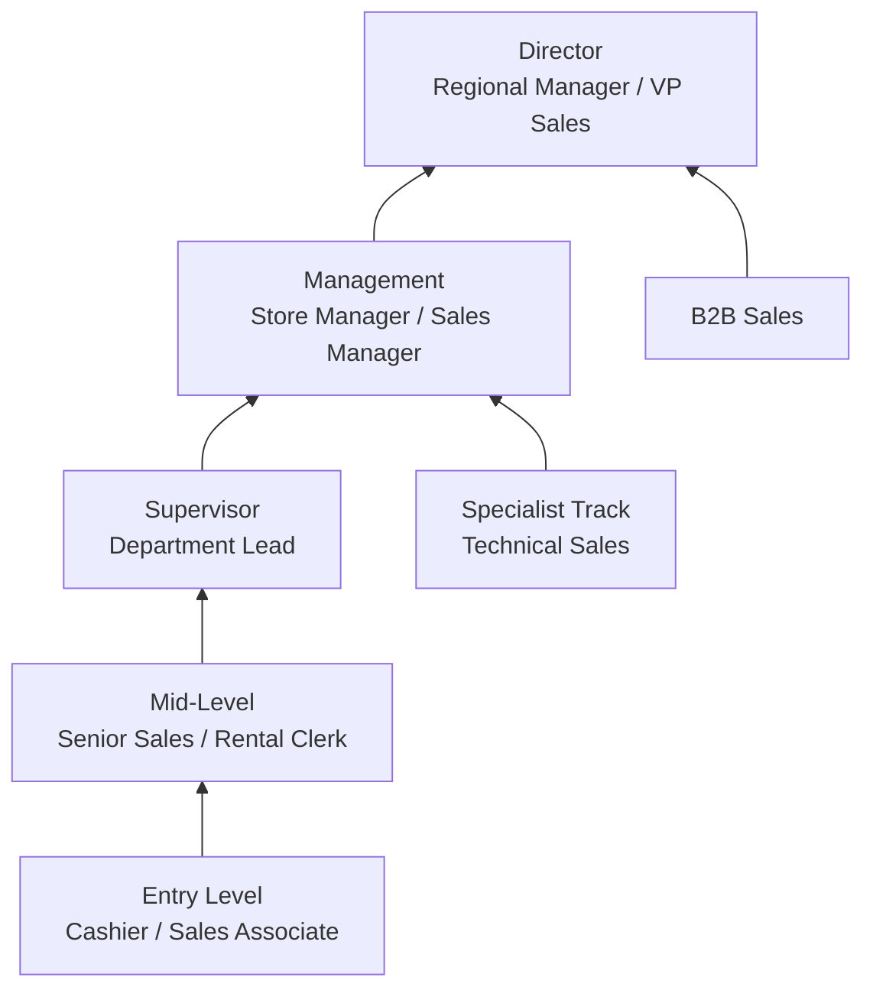

# Sales and Related Occupations

> Category 41 - Sales and Related occupations sell products and services in retail, wholesale, and other sales environments, including supervisory roles and specialized positions like cashiers and rental clerks.

## Overview

Sales and Related Occupations encompass a broad spectrum of roles dedicated to selling products and services, processing transactions, and managing sales teams. This category ranges from entry-level positions like cashiers who handle point-of-sale transactions to first-line supervisors who manage retail and wholesale sales teams. These professionals are essential to the revenue generation of nearly every industry, serving as the primary interface between businesses and their customers.

## Classification Hierarchy

## Key Statistics

| Metric | Value |
|--------|-------|
| SOC Category Code | 41 |
| Major Groups | 5 |
| Detailed Occupations | 30+ |
| Source | O*NET / BLS |

## Occupations in this Category

### Supervisors of Sales Workers (41-1000)

| Occupation | Code | Description |
|------------|------|-------------|
| [First-Line Supervisors of Retail Sales Workers](./RetailSupervisors.mdx) | 41-1011.00 | Supervise and coordinate activities of retail sales workers |
| [First-Line Supervisors of Non-Retail Sales Workers](./WholesaleSupervisors.mdx) | 41-1012.00 | Supervise sales workers in wholesale, manufacturing, and services |

### Retail Sales Workers (41-2000)

| Occupation | Code | Description |
|------------|------|-------------|
| [Cashiers](./Cashiers.mdx) | 41-2011.00 | Receive and disburse money in retail establishments |
| [Gambling Change Persons and Booth Cashiers](./GamblingCashiers.mdx) | 41-2012.00 | Exchange coins, tokens, and chips in gambling establishments |
| [Counter and Rental Clerks](./RentalClerks.mdx) | 41-2021.00 | Receive orders for repairs, rentals, and services |

## Category Overview Diagram

## Skills Common to Sales Occupations

### Core Competencies

## Career Pathways

## Industries Employing Sales Occupations

- [Retail Trade](/industries/Retail/index) - Highest concentration
- [Wholesale Trade](/industries/Wholesale/index) - B2B sales focus
- Accommodation and Food Services - Service sales
- [Real Estate](/industries/RealEstate/index) - Specialized sales
- [Finance and Insurance](/industries/Finance) - Product sales
- [Arts, Entertainment, and Recreation](/industries/Entertainment) - Casino and venue sales

## Education & Training Trends

| Level | Percentage of Sales Workers |
|-------|---------------------------|
| High School Diploma | 50-60% |
| Some College | 20-25% |
| Associate's Degree | 10-15% |
| Bachelor's Degree | 10-15% |

## GraphDL Task Categories

Sales occupations commonly perform tasks across these semantic categories:

| Verb Category | Example Tasks |
|---------------|---------------|
| **receive** | `receive.Payments.from.Customers`, `receive.Orders.for.Products` |
| **process** | `process.Transactions.using.POSSystem`, `process.Returns.for.Customers` |
| **supervise** | `supervise.SalesWorkers.in.Department`, `supervise.Operations.of.Store` |
| **coordinate** | `coordinate.Activities.of.Staff`, `coordinate.Inventory.with.Warehouse` |
| **assist** | `assist.Customers.with.Purchases`, `assist.Patrons.with.Services` |

## Related Categories

- [Office and Administrative Support](/occupations/Administrative/index) - Category 43
- [Management](/occupations/Management/index) - Category 11
- [Food Preparation and Serving](/occupations/FoodService/index) - Category 35
- [Personal Care and Service](/occupations/PersonalService/index) - Category 39

---

*Source: O*NET / Bureau of Labor Statistics - SOC Category 41*
