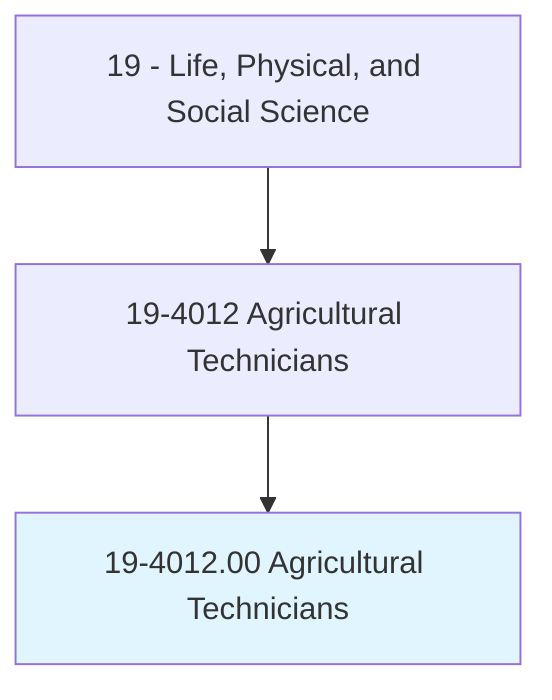
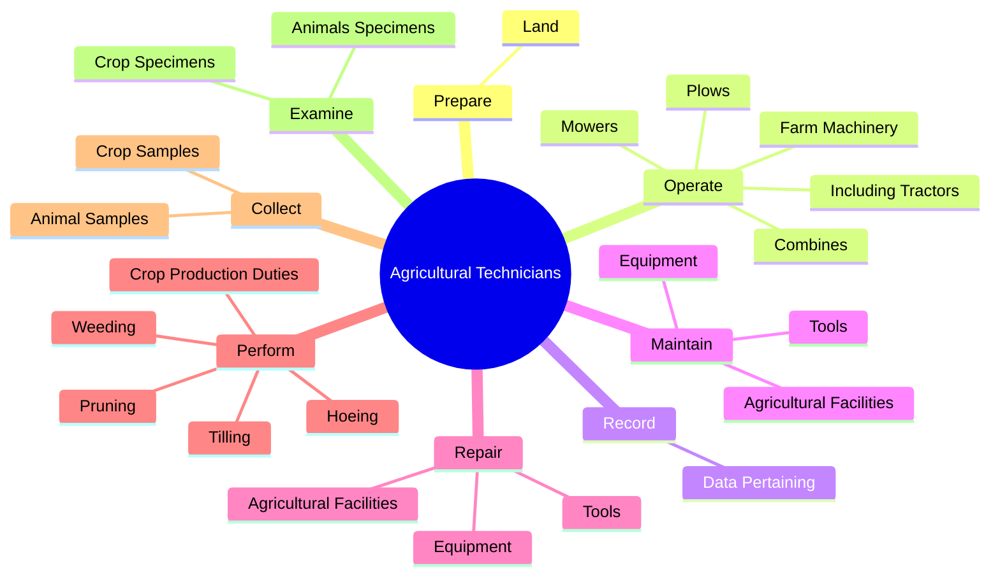
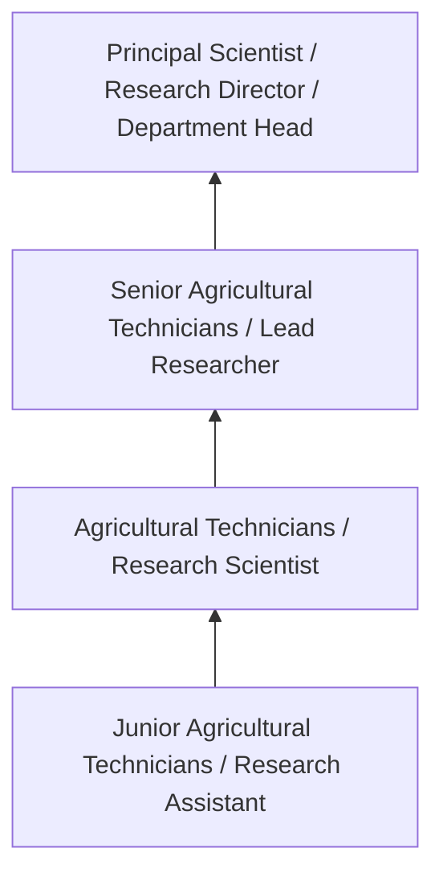

# Agricultural Technicians

> Work with agricultural scientists in plant, fiber, and animal research, or assist with animal breeding and nutrition. Set up or maintain laboratory equipment and collect samples from crops or animals. Prepare specimens or record data to assist scientists in biology or related life science experiments. Conduct tests and experiments to improve yield and quality of crops or to increase the resistance of plants and animals to disease or insects.

## Overview

Agricultural Technicians professionals work with agricultural scientists in plant, fiber, and animal research, or assist with animal breeding and nutrition. This occupation falls within the Life, Physical, and Social Science category and requires a combination of specialized knowledge, technical skills, and practical experience.

These professionals work across diverse settings and organizational contexts, applying their expertise to meet the demands of their field. They must stay current with industry standards, emerging practices, and regulatory requirements that affect their work. The role demands both independent judgment and collaborative skills, as practitioners regularly interact with colleagues, stakeholders, and the public.

As the field continues to evolve, Agricultural Technicians professionals increasingly leverage technology and data-driven approaches to enhance their effectiveness. Career opportunities span the public and private sectors, with demand influenced by economic conditions, demographic shifts, and technological advancement.

## Classification Hierarchy



## Key Statistics

| Metric | Value |
|--------|-------|
| SOC Code | 19-4012.00 |
| Job Zone | N/A |
| Category | [Life, Physical, and Social Science](/occupations/Science/index) |
| Core Tasks | 128+ |
| Salary Range | $50,000 - $130,000 |
| Median Salary | $78,000 |
| Growth Outlook | 7% (Faster than average) |
| Source | O*NET |

## Core Tasks



### perform.CropProductionDuties

Agricultural Technicians perform crop production duties as part of their core responsibilities.

**Actions:**
- `perform.CropProductionDuties` - Perform crop production duties, such as tilling, hoeing, pruning, weeding, or...
- `perform.Tilling` - Perform crop production duties, such as tilling, hoeing, pruning, weeding, or...
- `perform.Hoeing` - Perform crop production duties, such as tilling, hoeing, pruning, weeding, or...
- `perform.Pruning` - Perform crop production duties, such as tilling, hoeing, pruning, weeding, or...
- `perform.Weeding` - Perform crop production duties, such as tilling, hoeing, pruning, weeding, or...

### prepare.Land

Agricultural Technicians prepare land as part of their core responsibilities.

**Actions:**
- `prepare.Land.for.CultivatedCrops` - Prepare land for cultivated crops, orchards, or vineyards by plowing, discing...
- `prepare.Land.for.Orchards` - Prepare land for cultivated crops, orchards, or vineyards by plowing, discing...
- `prepare.Land.for.Vineyards.by.Plowing` - Prepare land for cultivated crops, orchards, or vineyards by plowing, discing...
- `prepare.Land.for.Discing` - Prepare land for cultivated crops, orchards, or vineyards by plowing, discing...
- `prepare.Land.for.Leveling` - Prepare land for cultivated crops, orchards, or vineyards by plowing, discing...

### supervise.AgriculturalTechniciansLaborers

Agricultural Technicians supervise agricultural technicians laborers as part of their core responsibilities.

**Actions:**
- `supervise.AgriculturalTechniciansLaborers` - Supervise or train agricultural technicians or farm laborers.
- `supervise.FarmLaborers` - Supervise or train agricultural technicians or farm laborers.
- `supervise.PestControlOperations` - Supervise pest or weed control operations, including locating and identifying...
- `supervise.WeedControlOperations` - Supervise pest or weed control operations, including locating and identifying...
- `supervise.IncludingLocating` - Supervise pest or weed control operations, including locating and identifying...

### operate.FarmMachinery

Agricultural Technicians operate farm machinery as part of their core responsibilities.

**Actions:**
- `operate.FarmMachinery` - Operate farm machinery, including tractors, plows, mowers, combines, balers, ...
- `operate.IncludingTractors` - Operate farm machinery, including tractors, plows, mowers, combines, balers, ...
- `operate.Plows` - Operate farm machinery, including tractors, plows, mowers, combines, balers, ...
- `operate.Mowers` - Operate farm machinery, including tractors, plows, mowers, combines, balers, ...
- `operate.Combines` - Operate farm machinery, including tractors, plows, mowers, combines, balers, ...


## Skills & Competencies

### Technical Skills
- **Research Methodology** - Expert
- **Data Analysis** - Advanced
- **Laboratory Techniques** - Advanced
- **Scientific Writing** - Advanced
- **Statistical Software** - Advanced
- **Quality Control** - Proficient

### Soft Skills
- **Analytical Thinking** - Critical
- **Attention to Detail** - Critical
- **Problem Solving** - Essential
- **Collaboration** - Essential
- **Written Communication** - Essential

## Education & Certifications

| Requirement | Details |
|-------------|---------|
| Typical Education | Bachelor's or Master's degree in relevant scientific field |
| Work Experience | 1-3 years research or laboratory experience |
| On-the-Job Training | Moderate - specialized laboratory techniques |
| Certifications | Field-specific certifications may be required |

## Career Progression



## Industry Variations

### Academic Research
Focus on fundamental research and publication. Agricultural Technicians professionals in academia often combine research with teaching responsibilities and mentoring graduate students.

### Industry Research and Development
Applied research for product development and commercial applications. Emphasis on innovation timelines and market-driven objectives.

### Government and Regulatory
Mission-oriented research supporting public policy and regulatory decisions. Focus on public health, environmental protection, or national security.

### Consulting and Contract Research
Project-based work for diverse clients. Requires strong communication skills and ability to translate findings for non-technical audiences.

## Technology & Tools

- **Laboratory Information Management Systems (LIMS)**
- **Statistical software (R, SAS, SPSS)**
- **Spectroscopy and chromatography equipment**
- **Microscopy and imaging systems**
- **Data analysis and visualization tools**

## Related Occupations


## Industries

- [Research and Development](/industries/ResearchDevelopment) - High Employment
- [Pharmaceutical Manufacturing](/industries/Pharma) - High Employment
- [Government Agencies](/industries/Government) - Moderate Employment
- [Higher Education](/industries/Education) - Moderate Employment

## Departments

This occupation typically works in:
- [Research and Development](/departments/Research/index)
- [Quality Assurance](/departments/QualityAssurance)
- [Laboratory Operations](/departments/Laboratory)

## GraphDL Semantic Structure

```
Agricultural Technicians perform:
- prepare.Land.for.CultivatedCrops
- prepare.Land.for.Orchards
- prepare.Land.for.Vineyards.by.Plowing
- prepare.Land.for.Discing
- prepare.Land.for.Leveling
- prepare.Land.for.Contouring
```

---

*Source: O*NET 19-4012.00 - ONETOccupation*
