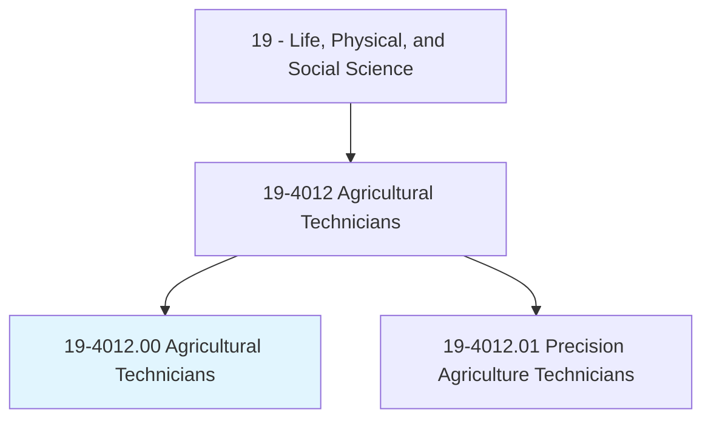
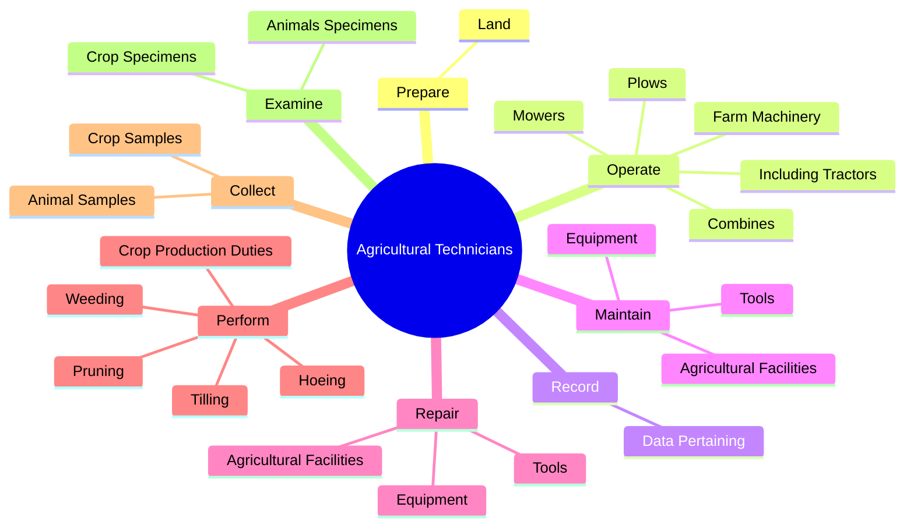

# Agricultural Technicians

> Work with agricultural scientists in plant, fiber, and animal research, or assist with animal breeding and nutrition. Set up or maintain laboratory equipment and collect samples from crops or animals. Prepare specimens or record data to assist scientists in biology or related life science experiments. Conduct tests and experiments to improve yield and quality of crops or to increase the resistance of plants and animals to disease or insects.

## Overview

Agricultural Technicians is an occupation within the Life, Physical, and Social Science category. Work with agricultural scientists in plant, fiber, and animal research, or assist with animal breeding and nutrition. Set up or maintain laboratory equipment and collect samples from crops or animals.

## Classification Hierarchy

## Key Statistics

| Metric | Value |
|--------|-------|
| SOC Code | 19-4012.00 |
| Category | [Life, Physical, and Social Science](/occupations/Science) |
| Task Count | 128 |
| Source | O*NET |

## Core Tasks

### prepare.Land

Agricultural Technicians prepare land as part of their core responsibilities.

**Actions:**
- `prepare.Land.for.CultivatedCrops`
- `prepare.Land.for.Orchards`
- `prepare.Land.for.Vineyards.by.Plowing`
- `prepare.Land.for.Discing`

### operate.FarmMachinery

Agricultural Technicians operate farm machinery as part of their core responsibilities.

**Actions:**
- `operate.FarmMachinery`
- `operate.IncludingTractors`
- `operate.Plows`
- `operate.Mowers`

### record.DataPertaining

Agricultural Technicians record data pertaining as part of their core responsibilities.

**Actions:**
- `record.DataPertaining.to.Experimentation`
- `record.DataPertaining.to.research`
- `record.DataPertaining.to.AnimalCare`

## Skills & Competencies

### Technical Skills
- **Research Methods** - Advanced
- **Data Analysis** - Advanced
- **Laboratory Techniques** - Advanced

### Soft Skills
- **Communication** - Essential
- **Problem Solving** - Essential
- **Critical Thinking** - Important
- **Teamwork** - Important
- **Adaptability** - Important

## Related Occupations

## Industries

This occupation is found across multiple industries. See [Industries](/industries) for sector-specific employment data.

## Career Progression

---

*Source: O*NET 19-4012.00 - ONETOccupation*
