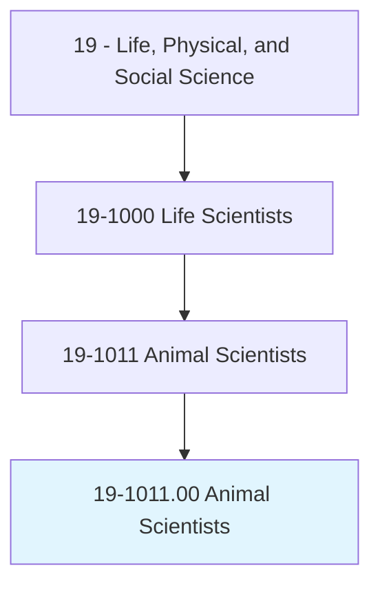
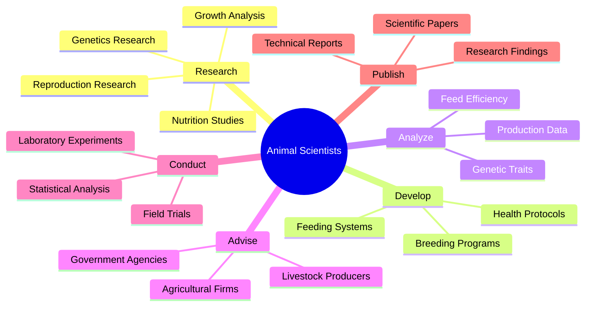
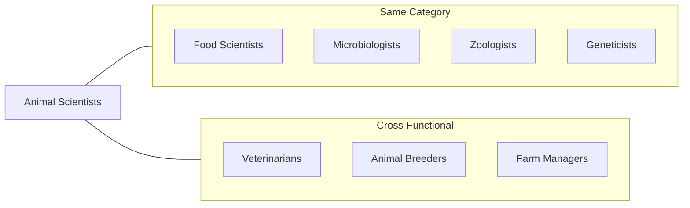
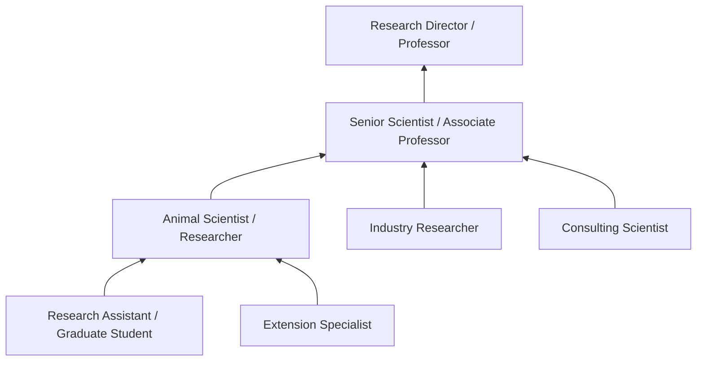

# Animal Scientists

> Conduct research in the genetics, nutrition, reproduction, growth, and development of domestic farm animals.

## Overview

Animal Scientists are specialized researchers who advance our understanding of livestock and farm animals through systematic scientific investigation. They study genetics to improve breeding programs, develop optimal nutritional regimens, enhance reproductive efficiency, and investigate factors affecting animal growth and development. Their work directly impacts agricultural productivity, food security, and animal welfare across the livestock industry. Animal Scientists work in academic institutions, government research facilities, agricultural companies, and consulting roles.

## Classification Hierarchy



## Key Statistics

| Metric | Value |
|--------|-------|
| SOC Code | 19-1011.00 |
| Job Zone | 5 (Extensive Preparation) |
| Category | [Life, Physical, and Social Science](/occupations/Science) |
| Core Tasks | 12+ |
| Source | O*NET |

## Core Tasks



### conduct.Research.on.Genetics

Animal Scientists conduct comprehensive genetic research to improve livestock traits and breeding outcomes.

**Actions:**
- `conduct.Research.on.Genetics.to.improve.BreedingPrograms` - Study hereditary patterns to optimize selective breeding
- `conduct.Research.on.Genetics.to.enhance.DesirableTraits` - Identify and propagate beneficial genetic characteristics
- `conduct.Research.on.GeneticEngineering.to.develop.ImprovedBreeds` - Apply biotechnology for breed improvement
- `analyze.GeneticData.to.predict.Offspring.Characteristics` - Use genetic markers to forecast animal traits

### develop.NutritionPrograms

Animal Scientists create feeding programs that optimize animal health and productivity.

**Actions:**
- `develop.NutritionPrograms.for.Livestock.to.maximize.Growth` - Design diets for optimal weight gain
- `develop.FeedFormulations.to.improve.FeedEfficiency` - Create cost-effective nutritional regimens
- `analyze.NutritionalRequirements.for.DifferentLifeStages` - Tailor nutrition to animal development phases
- `evaluate.FeedIngredients.to.assess.NutritionalValue` - Test feed components for nutritional quality

### study.ReproductionProcesses

Animal Scientists investigate reproductive biology to enhance breeding efficiency.

**Actions:**
- `study.ReproductionProcesses.to.improve.FertilityRates` - Research factors affecting conception success
- `develop.ArtificialInseminationProtocols.to.enhance.BreedingEfficiency` - Optimize reproductive technologies
- `analyze.ReproductiveData.to.predict.BreedingOutcomes` - Use statistical methods to forecast reproduction success
- `evaluate.ReproductiveHealth.to.identify.InfertilityIssues` - Diagnose and address reproductive problems

### advise.LivestockProducers

Animal Scientists provide expert guidance to farmers and agricultural operations.

**Actions:**
- `advise.LivestockProducers.on.BestPractices.for.AnimalHusbandry` - Share research-based recommendations
- `consult.AgriculturalCompanies.on.ProductDevelopment` - Guide development of animal products
- `educate.Farmers.on.NewTechnologies.for.AnimalProduction` - Transfer scientific knowledge to practitioners
- `recommend.ManagementStrategies.to.improve.Productivity` - Provide data-driven operational advice

### analyze.ProductionData

Animal Scientists evaluate performance metrics to identify improvement opportunities.

**Actions:**
- `analyze.ProductionData.to.evaluate.HerdPerformance` - Assess overall livestock productivity
- `calculate.FeedConversionRatios.to.measure.Efficiency` - Quantify feed-to-gain relationships
- `interpret.GrowthData.to.optimize.ManagementPractices` - Use growth metrics to inform decisions
- `compare.ProductionSystems.to.identify.BestPractices` - Benchmark performance across operations

### publish.ResearchFindings

Animal Scientists disseminate knowledge through scientific communication.

**Actions:**
- `publish.ResearchFindings.in.ScientificJournals` - Share discoveries with the scientific community
- `prepare.TechnicalReports.for.IndustryStakeholders` - Communicate findings to practitioners
- `present.Research.at.Conferences.to.advance.Knowledge` - Contribute to professional discourse
- `write.GrantProposals.to.secure.ResearchFunding` - Obtain resources for continued investigation

## Skills & Competencies

### Technical Skills
- **Animal Genetics** - Expert
- **Nutrition Science** - Expert
- **Reproductive Physiology** - Advanced
- **Statistical Analysis** - Advanced
- **Laboratory Techniques** - Advanced
- **Research Methodology** - Expert
- **Animal Husbandry** - Advanced

### Soft Skills
- **Analytical Thinking** - Critical
- **Scientific Writing** - Critical
- **Problem Solving** - Essential
- **Communication** - Essential
- **Collaboration** - Essential

## Related Occupations



## Industries

- [Agriculture and Farming](/industries/Agriculture) - High Employment
- [Animal Production](/industries/AnimalProduction) - High Employment
- [Universities and Research Institutions](/industries/Education) - Moderate Employment
- [Government Agricultural Agencies](/industries/Government) - Moderate Employment
- [Pharmaceutical and Biotechnology](/industries/Pharma) - Growing Employment
- [Feed and Nutrition Companies](/industries/FeedIndustry) - Moderate Employment

## Career Progression



## Industry Variations

### Academic Research
Focus on fundamental research, teaching, and graduate student mentorship. Emphasis on publication and grant acquisition.

### Government Agencies
Applied research for agricultural policy development. Focus on food security and sustainable agriculture.

### Private Industry
Product development for feed companies, pharmaceutical firms, and breeding operations. Emphasis on commercial applications.

### Extension Services
Knowledge transfer to farmers and producers. Focus on practical application of research findings.

## Education & Training

| Requirement | Details |
|-------------|---------|
| Typical Education | Doctoral degree in Animal Science, Animal Nutrition, or Genetics |
| Work Experience | 2-5 years postdoctoral or industry research experience |
| On-the-Job Training | Moderate - specialized techniques and methodologies |
| Common Certifications | PAS (Professional Animal Scientist), ARPAS certification |

## Departments

This occupation typically works in:
- [Research and Development](/departments/ResearchDevelopment)
- [Animal Science Department](/departments/AnimalScience)
- [Agricultural Extension](/departments/Extension)
- [Quality Assurance](/departments/QualityAssurance)

## GraphDL Semantic Structure

```
Animal Scientists perform:
- conduct.Research.on.Genetics
- develop.NutritionPrograms.for.Livestock
- study.ReproductionProcesses.to.improve.Fertility
- advise.Producers.on.AnimalHusbandry
- analyze.Data.to.evaluate.Performance
- publish.Findings.in.ScientificJournals
```

---

*Source: O*NET 19-1011.00 - ONETOccupation*
