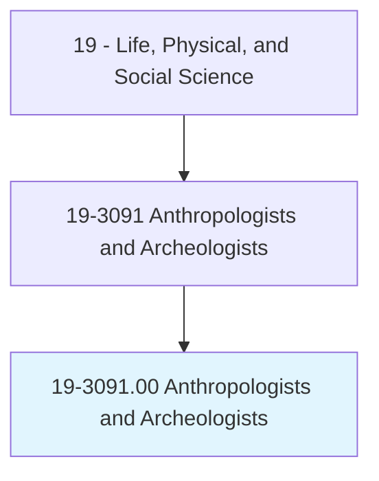
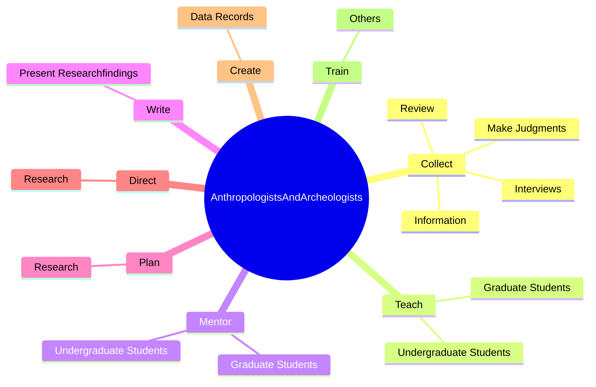
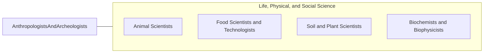

# Anthropologists and Archeologists

> Study the origin, development, and behavior of human beings. May study the way of life, language, or physical characteristics of people in various parts of the world. May engage in systematic recovery and examination of material evidence, such as tools or pottery remaining from past human cultures, in order to determine the history, customs, and living habits of earlier civilizations.

## Overview

Anthropologists and Archeologists is an occupation within the Life, Physical, and Social Science category. Study the origin, development, and behavior of human beings. May study the way of life, language, or physical characteristics of people in various parts of the world.

## Classification Hierarchy

## Key Statistics

| Metric | Value |
|--------|-------|
| SOC Code | 19-3091.00 |
| Category | [Life, Physical, and Social Science](/occupations/Science) |
| Task Count | 176 |
| Source | O*NET |

## Core Tasks

### collect.Information

Anthropologists and Archeologists collect information as part of their core responsibilities.

**Actions:**
- `collect.Information.of.Documents`
- `collect.MakeJudgments.through.Observation.of.Documents`
- `collect.Interviews.of.Documents`
- `collect.Review.of.Documents`

### teach.UndergraduateStudents

Anthropologists and Archeologists teach undergraduate students as part of their core responsibilities.

**Actions:**
- `teach.UndergraduateStudents.in.Anthropology`
- `teach.UndergraduateStudents.in.Archeology`
- `teach.GraduateStudents.in.Anthropology`
- `teach.GraduateStudents.in.Archeology`

### mentor.UndergraduateStudents

Anthropologists and Archeologists mentor undergraduate students as part of their core responsibilities.

**Actions:**
- `mentor.UndergraduateStudents.in.Anthropology`
- `mentor.UndergraduateStudents.in.Archeology`
- `mentor.GraduateStudents.in.Anthropology`
- `mentor.GraduateStudents.in.Archeology`

## Skills & Competencies

### Technical Skills
- **Research Methods** - Advanced
- **Data Analysis** - Advanced
- **Laboratory Techniques** - Advanced

### Soft Skills
- **Communication** - Essential
- **Problem Solving** - Essential
- **Critical Thinking** - Important
- **Teamwork** - Important
- **Adaptability** - Important

## Related Occupations

## Industries

This occupation is found across multiple industries. See [Industries](/industries) for sector-specific employment data.

## Career Progression

---

*Source: O*NET 19-3091.00 - ONETOccupation*
