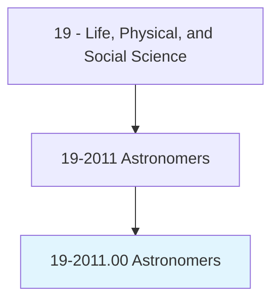
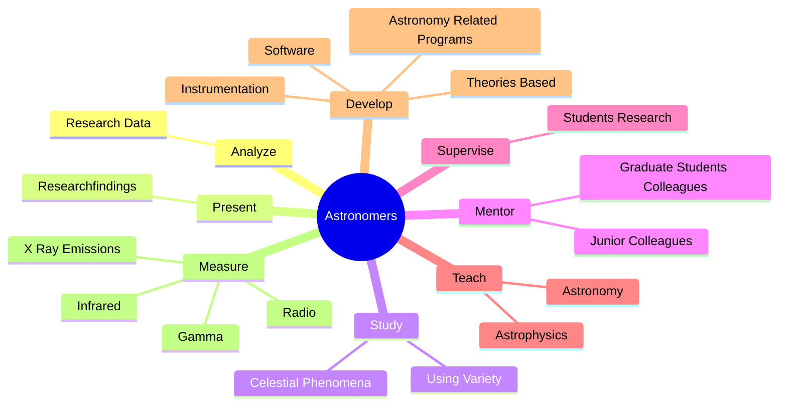
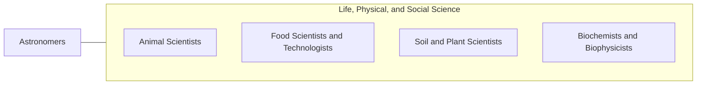

# Astronomers

> Observe, research, and interpret astronomical phenomena to increase basic knowledge or apply such information to practical problems.

## Overview

Astronomers is classified under Life, Physical, and Social Science (SOC 19). Observe, research, and interpret astronomical phenomena to increase basic knowledge or apply such information to practical problems.

## Classification Hierarchy

## Key Statistics

| Metric | Value |
|--------|-------|
| SOC Code | 19-2011.00 |
| Category | [Life, Physical, and Social Science](/occupations/Science) |
| Task Count | 37 |
| Source | O*NET |

## Core Tasks

### analyze.ResearchData

Astronomers analyze research data as part of their core responsibilities.

**Actions:**
- `analyze.ResearchData.to.determine.Significance`
- `analyze.ResearchData.to.UsingComputers`

### present.Researchfindings

Astronomers present researchfindings as part of their core responsibilities.

**Actions:**
- `present.Researchfindings.at.ScientificConferencesPapersWritten.for.ScientificJournals`
- `present.Researchfindings.at.InPapersWrittenForScientificJournals`

### study.CelestialPhenomena

Astronomers study celestial phenomena as part of their core responsibilities.

**Actions:**
- `study.CelestialPhenomena.of.GroundBasedTelescopesScientificInstruments`
- `study.CelestialPhenomena.of.SpaceBorneTelescopesScientificInstruments`
- `study.UsingVariety.of.GroundBasedTelescopesScientificInstruments`
- `study.UsingVariety.of.SpaceBorneTelescopesScientificInstruments`

## Skills & Competencies

### Technical Skills
- **Research Methods** - Advanced
- **Data Analysis** - Advanced
- **Laboratory Techniques** - Advanced

### Soft Skills
- **Communication** - Essential
- **Problem Solving** - Essential
- **Critical Thinking** - Important
- **Teamwork** - Important
- **Adaptability** - Important

## Related Occupations

## Industries

This occupation is found across multiple industries. See [Industries](/industries) for sector-specific employment data.

## Career Progression

---

*Source: O*NET 19-2011.00 - ONETOccupation*
