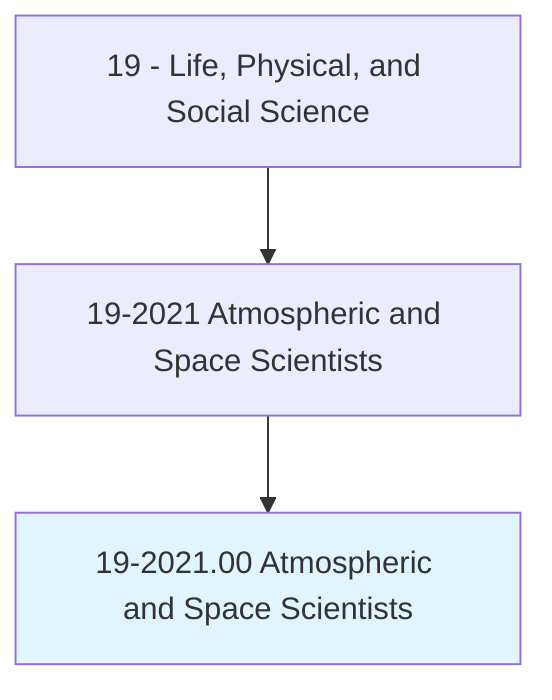
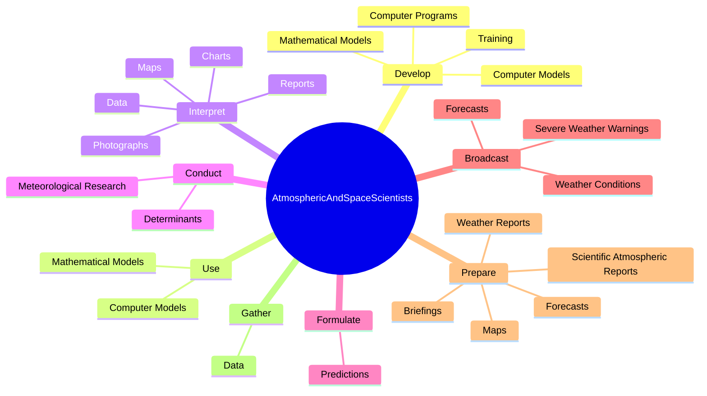
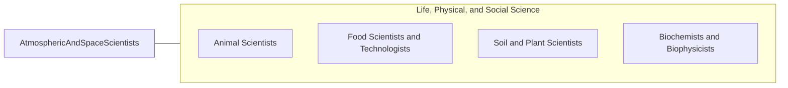

# Atmospheric and Space Scientists

> Investigate atmospheric phenomena and interpret meteorological data, gathered by surface and air stations, satellites, and radar to prepare reports and forecasts for public and other uses. Includes weather analysts and forecasters whose functions require the detailed knowledge of meteorology.

## Overview

Atmospheric and Space Scientists is an occupation within the Life, Physical, and Social Science category. Investigate atmospheric phenomena and interpret meteorological data, gathered by surface and air stations, satellites, and radar to prepare reports and forecasts for public and other uses. 

## Classification Hierarchy

## Key Statistics

| Metric | Value |
|--------|-------|
| SOC Code | 19-2021.00 |
| Category | [Life, Physical, and Social Science](/occupations/Science/index) |
| Task Count | 167 |
| Source | O*NET |

## Core Tasks

### develop.MathematicalModels

Atmospheric and Space Scientists develop mathematical models as part of their core responsibilities.

**Actions:**
- `develop.MathematicalModels.for.WeatherForecasting`
- `develop.ComputerModels.for.WeatherForecasting`
- `develop.ComputerPrograms.to.collect.MeteorologicalDataPresentMeteorologicalInformation`
- `develop.ComputerPrograms.to.ToPresentMeteorologicalInformation`

### use.MathematicalModels

Atmospheric and Space Scientists use mathematical models as part of their core responsibilities.

**Actions:**
- `use.MathematicalModels.for.WeatherForecasting`
- `use.ComputerModels.for.WeatherForecasting`

### interpret.Data

Atmospheric and Space Scientists interpret data as part of their core responsibilities.

**Actions:**
- `interpret.Data.to.predict.LongWeatherConditions`
- `interpret.Data.to.ShortRangeWeatherConditions`
- `interpret.Data.to.UsingComputerModels`
- `interpret.Data.to.KnowledgeOfClimateTheory`

## Skills & Competencies

### Technical Skills
- **Research Methods** - Advanced
- **Data Analysis** - Advanced
- **Laboratory Techniques** - Advanced

### Soft Skills
- **Communication** - Essential
- **Problem Solving** - Essential
- **Critical Thinking** - Important
- **Teamwork** - Important
- **Adaptability** - Important

## Related Occupations

## Industries

This occupation is found across multiple industries. See [Industries](/industries) for sector-specific employment data.

## Career Progression

---

*Source: O*NET 19-2021.00 - ONETOccupation*
