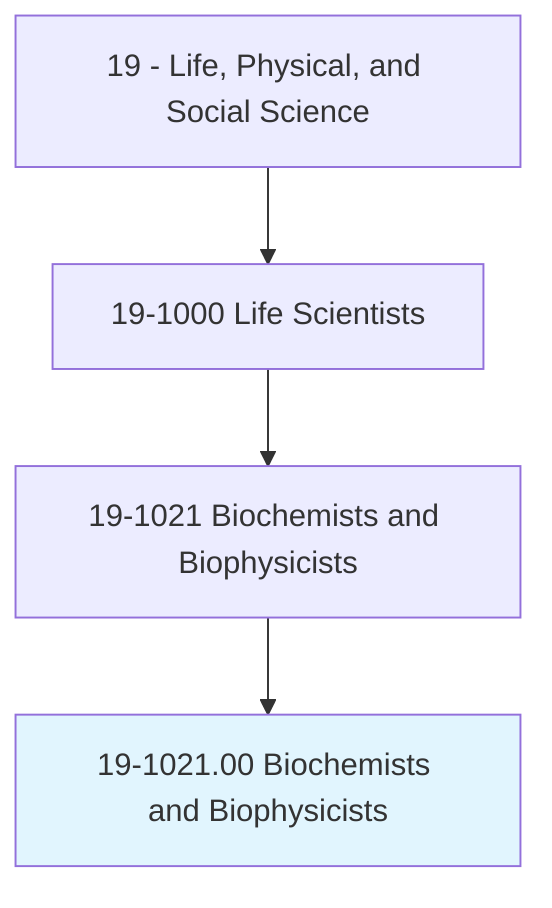
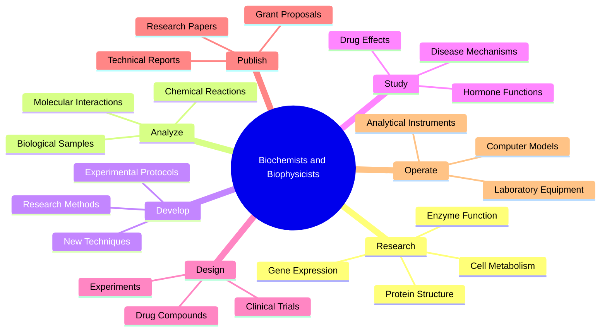
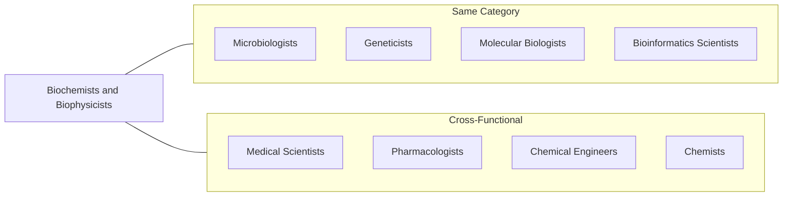
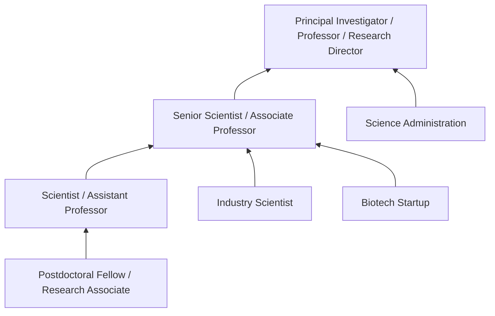

# Biochemists and Biophysicists

> Study the chemical composition or physical principles of living cells and organisms, their electrical and mechanical energy, and related phenomena. May conduct research to further understanding of the complex chemical combinations and reactions involved in metabolism, reproduction, growth, and heredity. May determine the effects of foods, drugs, serums, hormones, and other substances on tissues and vital processes of living organisms.

## Overview

Biochemists and Biophysicists investigate the fundamental chemistry and physics of life at the molecular level. They study how biological molecules interact, how cells generate and use energy, and how genetic information is expressed and regulated. Their research underpins advances in medicine, agriculture, and biotechnology, from developing new drugs to understanding disease mechanisms. They work in pharmaceutical companies, research institutions, biotechnology firms, and academic settings, often at the cutting edge of scientific discovery.

## Classification Hierarchy



## Key Statistics

| Metric | Value |
|--------|-------|
| SOC Code | 19-1021.00 |
| Job Zone | 5 (Extensive Preparation) |
| Category | [Life, Physical, and Social Science](/occupations/Science) |
| Core Tasks | 14+ |
| Source | O*NET |

## Core Tasks



### study.ChemicalComposition

Biochemists study the chemical makeup and reactions within living organisms.

**Actions:**
- `study.ChemicalComposition.of.LivingCells.to.understand.Metabolism` - Investigate cellular chemical processes
- `analyze.ChemicalReactions.involved.in.Reproduction` - Study biochemistry of reproductive processes
- `research.ChemicalCombinations.involved.in.Growth` - Examine molecular aspects of development
- `investigate.ChemicalProcesses.involved.in.Heredity` - Study biochemical basis of inheritance
- `characterize.Proteins.to.understand.Function` - Determine protein structure and activity

### determine.Effects.of.Substances

Biochemists evaluate how various substances affect living systems.

**Actions:**
- `determine.Effects.of.Drugs.on.Tissues` - Assess pharmaceutical impacts on biological systems
- `determine.Effects.of.Hormones.on.VitalProcesses` - Study hormonal regulation mechanisms
- `analyze.Effects.of.Foods.on.Metabolism` - Investigate nutritional biochemistry
- `evaluate.Effects.of.Serums.on.OrganismFunction` - Study immunological compounds
- `test.Compounds.for.TherapeuticPotential` - Screen molecules for medical applications

### study.PhysicalPrinciples

Biophysicists apply physics principles to understand biological systems.

**Actions:**
- `study.PhysicalPrinciples.of.LivingCells` - Apply physics to cellular biology
- `analyze.ElectricalEnergy.in.Organisms` - Study bioelectrical phenomena
- `investigate.MechanicalEnergy.in.BiologicalSystems` - Research biomechanics
- `model.MolecularStructures.using.PhysicalPrinciples` - Apply computational physics
- `study.Thermodynamics.of.BiologicalProcesses` - Analyze energy flow in living systems

### develop.ResearchMethods

Biochemists and Biophysicists create and refine experimental approaches.

**Actions:**
- `develop.ResearchMethods.to.advance.ScientificUnderstanding` - Create novel experimental techniques
- `design.Experiments.to.test.Hypotheses` - Plan rigorous scientific investigations
- `optimize.Protocols.to.improve.DataQuality` - Refine experimental procedures
- `validate.NewTechniques.for.ReliableResults` - Ensure method accuracy and reproducibility
- `adapt.Methods.for.SpecificResearchQuestions` - Customize approaches for particular problems

### analyze.MolecularInteractions

Biochemists study how biological molecules interact and function together.

**Actions:**
- `analyze.MolecularInteractions.to.understand.SignalingPathways` - Study cellular communication
- `characterize.ProteinProtein.Interactions` - Map molecular binding relationships
- `study.EnzymeMechanism.to.elucidate.CatalyticFunction` - Investigate enzymatic processes
- `analyze.DNAProtein.Interactions.to.understand.GeneRegulation` - Study transcriptional control
- `investigate.MembraneDynamics.to.understand.Transport` - Research cellular transport systems

### operate.LaboratoryEquipment

Biochemists use sophisticated instruments for research.

**Actions:**
- `operate.LaboratoryEquipment.to.collect.Data` - Use specialized instruments for analysis
- `use.Spectroscopy.to.analyze.MolecularStructure` - Apply spectroscopic techniques
- `perform.Chromatography.to.separate.Compounds` - Purify and characterize molecules
- `conduct.Electrophoresis.to.analyze.Proteins` - Separate and identify macromolecules
- `utilize.MassSpectrometry.to.identify.Molecules` - Determine molecular composition

## Skills & Competencies

### Technical Skills
- **Molecular Biology** - Expert
- **Protein Chemistry** - Expert
- **Spectroscopy** - Advanced
- **Chromatography** - Advanced
- **Cell Culture** - Advanced
- **Bioinformatics** - Advanced
- **Statistical Analysis** - Advanced
- **Computational Modeling** - Advanced
- **X-ray Crystallography** - Advanced

### Soft Skills
- **Analytical Thinking** - Critical
- **Scientific Writing** - Critical
- **Problem Solving** - Essential
- **Attention to Detail** - Essential
- **Collaboration** - Essential

## Related Occupations



## Industries

- [Pharmaceutical and Medicine Manufacturing](/industries/Pharma) - High Employment
- [Research and Development](/industries/ResearchDevelopment) - High Employment
- [Biotechnology](/industries/Biotechnology) - High Employment
- [Universities and Research Institutions](/industries/Education) - Moderate Employment
- [Government Laboratories](/industries/Government) - Moderate Employment
- [Healthcare and Diagnostics](/industries/Healthcare) - Growing Employment

## Career Progression



## Industry Variations

### Academic Research
Focus on fundamental discovery research with teaching and mentorship responsibilities. Emphasis on publications and grant acquisition.

### Pharmaceutical Industry
Drug discovery and development research. Focus on therapeutic targets and compound screening. Regulatory compliance and project timelines.

### Biotechnology
Applied research for product development. May include diagnostics, therapeutics, or industrial applications. Emphasis on innovation and commercial viability.

### Government Laboratories
Mission-oriented research for public benefit. May focus on health, agriculture, or environmental applications. Stable funding with long-term research goals.

### Medical Research Institutes
Disease-focused research with clinical translation emphasis. Collaboration with clinicians and patient populations.

## Education & Training

| Requirement | Details |
|-------------|---------|
| Typical Education | Doctoral degree in Biochemistry, Biophysics, Molecular Biology, or related field |
| Work Experience | 2-5 years postdoctoral research experience |
| On-the-Job Training | Minimal - highly specialized technical expertise required |
| Common Certifications | None required; professional society memberships (ASBMB, Biophysical Society) |

## Departments

This occupation typically works in:
- [Research and Development](/departments/ResearchDevelopment)
- [Biochemistry Department](/departments/Biochemistry)
- [Drug Discovery](/departments/DrugDiscovery)
- [Structural Biology](/departments/StructuralBiology)
- [Molecular Biology](/departments/MolecularBiology)

## GraphDL Semantic Structure

```
Biochemists and Biophysicists perform:
- study.ChemicalComposition.of.LivingCells
- determine.Effects.of.Drugs.on.Tissues
- analyze.MolecularInteractions.to.understand.Function
- develop.ResearchMethods.to.advance.Knowledge
- operate.LaboratoryEquipment.to.collect.Data
- publish.ResearchFindings.in.ScientificJournals
```

---

*Source: O*NET 19-1021.00 - ONETOccupation*
