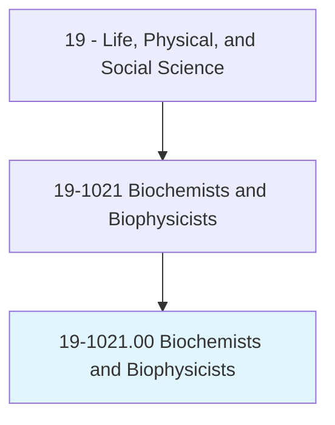
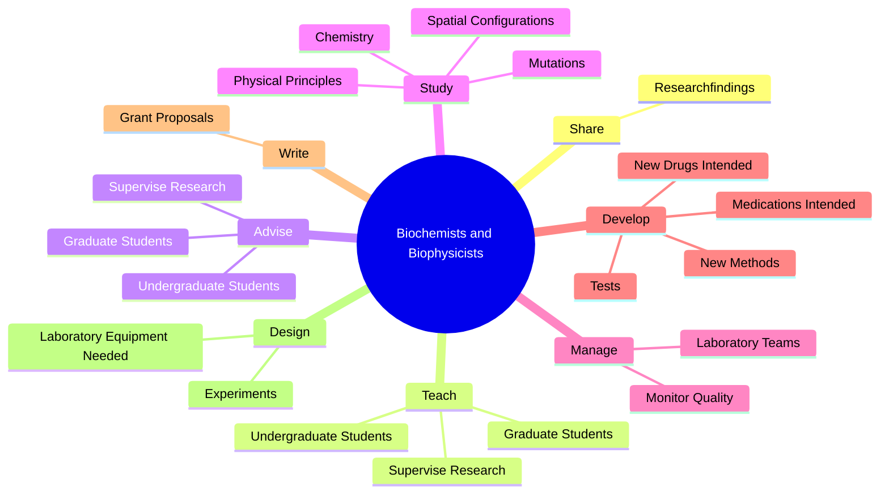
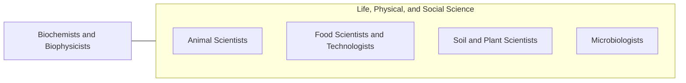

# Biochemists and Biophysicists

> Study the chemical composition or physical principles of living cells and organisms, their electrical and mechanical energy, and related phenomena. May conduct research to further understanding of the complex chemical combinations and reactions involved in metabolism, reproduction, growth, and heredity. May determine the effects of foods, drugs, serums, hormones, and other substances on tissues and vital processes of living organisms.

## Overview

Biochemists and Biophysicists is an occupation within the Life, Physical, and Social Science category. Study the chemical composition or physical principles of living cells and organisms, their electrical and mechanical energy, and related phenomena. May conduct research to further understanding of the complex chemical combinations and reactions involved in metabolism, reproduction, growth, and heredity.

## Classification Hierarchy

## Key Statistics

| Metric | Value |
|--------|-------|
| SOC Code | 19-1021.00 |
| Category | [Life, Physical, and Social Science](/occupations/Science) |
| Task Count | 101 |
| Source | O*NET |

## Core Tasks

### share.Researchfindings

Biochemists and Biophysicists share researchfindings as part of their core responsibilities.

**Actions:**
- `share.Researchfindings.by.WritingScientificArticlesMakingPresentations.at.ScientificConferences`
- `share.Researchfindings.by.ByMakingPresentationsAtScientificConferences`

### teach.UndergraduateStudents

Biochemists and Biophysicists teach undergraduate students as part of their core responsibilities.

**Actions:**
- `teach.UndergraduateStudents`
- `teach.SuperviseResearch`
- `teach.GraduateStudents`

### advise.UndergraduateStudents

Biochemists and Biophysicists advise undergraduate students as part of their core responsibilities.

**Actions:**
- `advise.UndergraduateStudents`
- `advise.SuperviseResearch`
- `advise.GraduateStudents`

## Skills & Competencies

### Technical Skills
- **Research Methods** - Advanced
- **Data Analysis** - Advanced
- **Laboratory Techniques** - Advanced

### Soft Skills
- **Communication** - Essential
- **Problem Solving** - Essential
- **Critical Thinking** - Important
- **Teamwork** - Important
- **Adaptability** - Important

## Related Occupations

## Industries

This occupation is found across multiple industries. See [Industries](/industries) for sector-specific employment data.

## Career Progression

---

*Source: O*NET 19-1021.00 - ONETOccupation*
