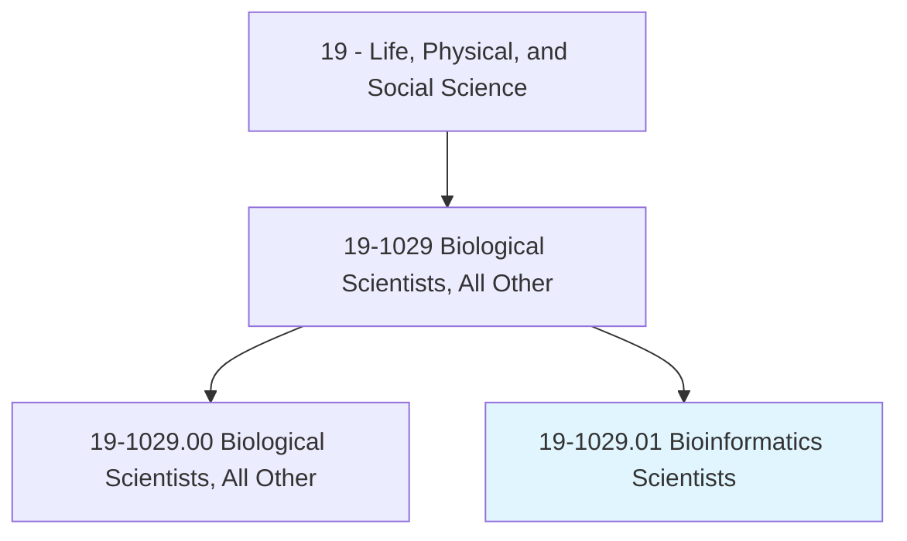
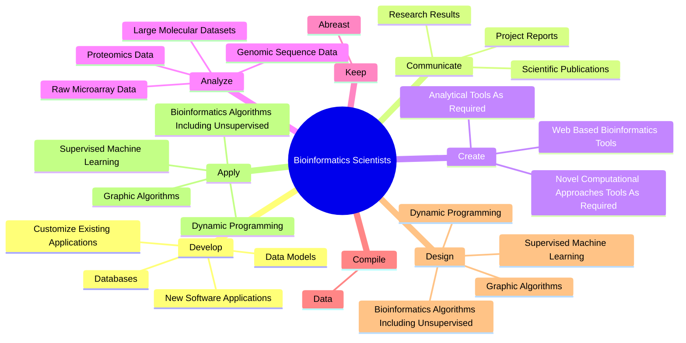
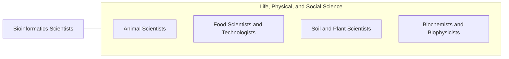

# Bioinformatics Scientists

> Conduct research using bioinformatics theory and methods in areas such as pharmaceuticals, medical technology, biotechnology, computational biology, proteomics, computer information science, biology and medical informatics. May design databases and develop algorithms for processing and analyzing genomic information, or other biological information.

## Overview

Bioinformatics Scientists is a specialized variant within the Life, Physical, and Social Science category. Conduct research using bioinformatics theory and methods in areas such as pharmaceuticals, medical technology, biotechnology, computational biology, proteomics, computer information science, biology and medical informatics. 

## Classification Hierarchy

## Key Statistics

| Metric | Value |
|--------|-------|
| SOC Code | 19-1029.01 |
| Category | [Life, Physical, and Social Science](/occupations/Science/index) |
| Task Count | 70 |
| Source | O*NET |

## Core Tasks

### develop.NewSoftwareApplications

Bioinformatics Scientists develop new software applications as part of their core responsibilities.

**Actions:**
- `develop.NewSoftwareApplications.to.meet.SpecificScientificProjectNeeds`
- `develop.CustomizeExistingApplications.to.meet.SpecificScientificProjectNeeds`
- `develop.DataModels`
- `develop.Databases`

### communicate.ResearchResults

Bioinformatics Scientists communicate research results as part of their core responsibilities.

**Actions:**
- `communicate.ResearchResults.through.ConferencePresentations`
- `communicate.ScientificPublications`
- `communicate.ProjectReports`

### create.NovelComputationalApproachesToolsAsRequired

Bioinformatics Scientists create novel computational approaches tools as required as part of their core responsibilities.

**Actions:**
- `create.NovelComputationalApproachesToolsAsRequired.by.ResearchGoals`
- `create.AnalyticalToolsAsRequired.by.ResearchGoals`
- `create.WebBasedBioinformaticsTools`

## Skills & Competencies

### Technical Skills
- **Research Methods** - Advanced
- **Data Analysis** - Advanced
- **Laboratory Techniques** - Advanced

### Soft Skills
- **Communication** - Essential
- **Problem Solving** - Essential
- **Critical Thinking** - Important
- **Teamwork** - Important
- **Adaptability** - Important

## Related Occupations

## Industries

This occupation is found across multiple industries. See [Industries](/industries) for sector-specific employment data.

## Career Progression

---

*Source: O*NET 19-1029.01 - ONETOccupation*
