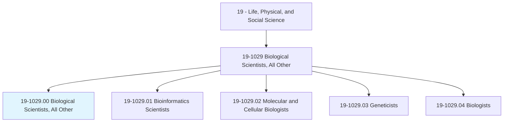
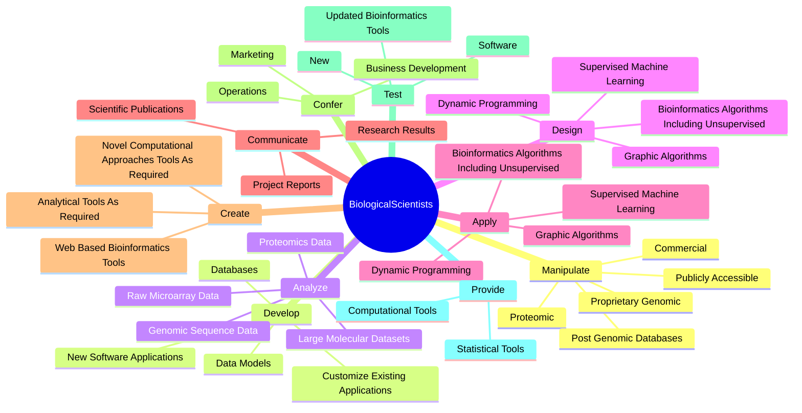
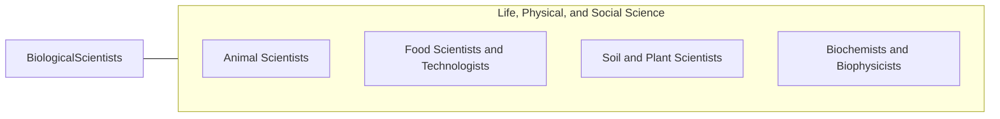

# Biological Scientists, All Other

> All biological scientists not listed separately.

## Overview

Biological Scientists, All Other is classified under Life, Physical, and Social Science (SOC 19). All biological scientists not listed separately.

## Classification Hierarchy

## Key Statistics

| Metric | Value |
|--------|-------|
| SOC Code | 19-1029.00 |
| Category | [Life, Physical, and Social Science](/occupations/Science) |
| Task Count | 70 |
| Source | O*NET |

## Core Tasks

### manipulate.PubliclyAccessible

Biological Scientists, All Other manipulate publicly accessible as part of their core responsibilities.

**Actions:**
- `manipulate.PubliclyAccessible`
- `manipulate.Commercial`
- `manipulate.ProprietaryGenomic`
- `manipulate.Proteomic`

### develop.NewSoftwareApplications

Biological Scientists, All Other develop new software applications as part of their core responsibilities.

**Actions:**
- `develop.NewSoftwareApplications.to.MeetSpecificScientificProjectNeeds`
- `develop.CustomizeExistingApplications.to.MeetSpecificScientificProjectNeeds`
- `develop.DataModels`
- `develop.Databases`

### analyze.LargeMolecularDatasets

Biological Scientists, All Other analyze large molecular datasets as part of their core responsibilities.

**Actions:**
- `analyze.LargeMolecularDatasets.for.ClinicalResearchPurposes`
- `analyze.LargeMolecularDatasets.for.BasicResearchPurposes`
- `analyze.RawMicroarrayData.for.ClinicalResearchPurposes`
- `analyze.RawMicroarrayData.for.BasicResearchPurposes`

## Skills & Competencies

### Technical Skills
- **Research Methods** - Advanced
- **Data Analysis** - Advanced
- **Laboratory Techniques** - Advanced

### Soft Skills
- **Communication** - Essential
- **Problem Solving** - Essential
- **Critical Thinking** - Important
- **Teamwork** - Important
- **Adaptability** - Important

## Related Occupations

## Industries

This occupation is found across multiple industries. See [Industries](/industries) for sector-specific employment data.

## Career Progression

---

*Source: O*NET 19-1029.00 - ONETOccupation*
