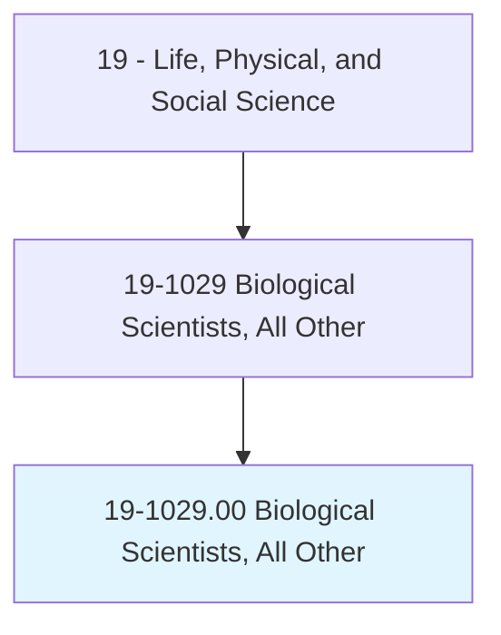
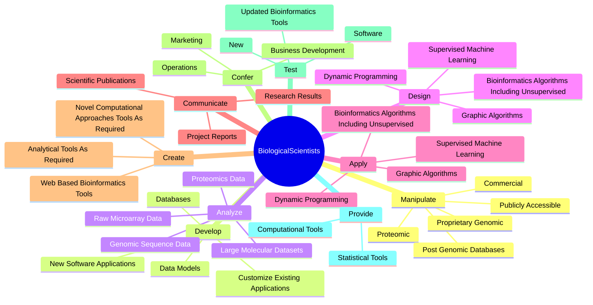
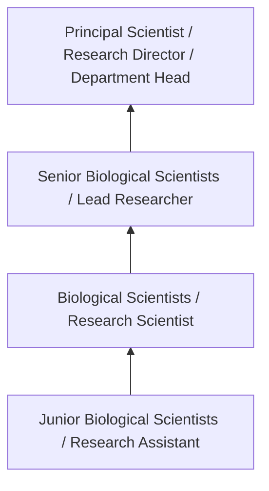

# Biological Scientists, All Other

> All biological scientists not listed separately.

## Overview

Biological Scientists professionals serve a vital function within the Life, Physical, and Social Science field. They bring specialized skills and knowledge to their roles, contributing to organizational objectives and societal needs.

These practitioners work in varied environments, adapting their expertise to meet specific requirements of their industry and employer. The role requires ongoing professional development to maintain competency and respond to changing demands.

Career paths in this field offer opportunities for advancement through experience, additional education, and specialized certifications. Employment prospects are influenced by industry trends, technological change, and workforce demographics.

## Classification Hierarchy



## Key Statistics

| Metric | Value |
|--------|-------|
| SOC Code | 19-1029.00 |
| Job Zone | N/A |
| Category | [Life, Physical, and Social Science](/occupations/Science/index) |
| Core Tasks | N/A+ |
| Salary Range | $50,000 - $130,000 |
| Median Salary | $78,000 |
| Growth Outlook | 7% (Faster than average) |
| Source | O*NET |

## Core Tasks



### manipulate.PubliclyAccessible

Biological Scientists, All Other manipulate publicly accessible as part of their core responsibilities.

**Actions:**
- `manipulate.PubliclyAccessible`
- `manipulate.Commercial`
- `manipulate.ProprietaryGenomic`
- `manipulate.Proteomic`

### develop.NewSoftwareApplications

Biological Scientists, All Other develop new software applications as part of their core responsibilities.

**Actions:**
- `develop.NewSoftwareApplications.to.MeetSpecificScientificProjectNeeds`
- `develop.CustomizeExistingApplications.to.MeetSpecificScientificProjectNeeds`
- `develop.DataModels`
- `develop.Databases`

### analyze.LargeMolecularDatasets

Biological Scientists, All Other analyze large molecular datasets as part of their core responsibilities.

**Actions:**
- `analyze.LargeMolecularDatasets.for.ClinicalResearchPurposes`
- `analyze.LargeMolecularDatasets.for.BasicResearchPurposes`
- `analyze.RawMicroarrayData.for.ClinicalResearchPurposes`
- `analyze.RawMicroarrayData.for.BasicResearchPurposes`


### Technical Skills
- **Research Methods** - Advanced
- **Data Analysis** - Advanced
- **Laboratory Techniques** - Advanced

### Soft Skills
- **Communication** - Essential
- **Problem Solving** - Essential
- **Critical Thinking** - Important
- **Teamwork** - Important
- **Adaptability** - Important


## Skills & Competencies

### Technical Skills
- **Research Methodology** - Expert
- **Data Analysis** - Advanced
- **Laboratory Techniques** - Advanced
- **Scientific Writing** - Advanced
- **Statistical Software** - Advanced
- **Quality Control** - Proficient

### Soft Skills
- **Analytical Thinking** - Critical
- **Attention to Detail** - Critical
- **Problem Solving** - Essential
- **Collaboration** - Essential
- **Written Communication** - Essential

## Education & Certifications

| Requirement | Details |
|-------------|---------|
| Typical Education | Bachelor's or Master's degree in relevant scientific field |
| Work Experience | 1-3 years research or laboratory experience |
| On-the-Job Training | Moderate - specialized laboratory techniques |
| Certifications | Field-specific certifications may be required |

## Career Progression



## Industry Variations

### Academic Research
Focus on fundamental research and publication. Biological Scientists professionals in academia often combine research with teaching responsibilities and mentoring graduate students.

### Industry Research and Development
Applied research for product development and commercial applications. Emphasis on innovation timelines and market-driven objectives.

### Government and Regulatory
Mission-oriented research supporting public policy and regulatory decisions. Focus on public health, environmental protection, or national security.

### Consulting and Contract Research
Project-based work for diverse clients. Requires strong communication skills and ability to translate findings for non-technical audiences.

## Technology & Tools

- **Laboratory Information Management Systems (LIMS)**
- **Statistical software (R, SAS, SPSS)**
- **Spectroscopy and chromatography equipment**
- **Microscopy and imaging systems**
- **Data analysis and visualization tools**

## Related Occupations


## Industries

- [Research and Development](/industries/ResearchDevelopment) - High Employment
- [Pharmaceutical Manufacturing](/industries/Pharma) - High Employment
- [Government Agencies](/industries/Government) - Moderate Employment
- [Higher Education](/industries/Education) - Moderate Employment

## Departments

This occupation typically works in:
- [Research and Development](/departments/Research/index)
- [Quality Assurance](/departments/QualityAssurance)
- [Laboratory Operations](/departments/Laboratory)

## GraphDL Semantic Structure

```
Biological Scientists, All Other perform:
- conduct.Research.in.BiologicalScientistsField
- analyze.Data.using.ScientificMethods
- prepare.Reports.on.ResearchFindings
- develop.Procedures.for.BiologicalScientistsAnalysis
- collaborate.WithTeam.on.ResearchProjects
```

---

*Source: O*NET 19-1029.00 - ONETOccupation*
