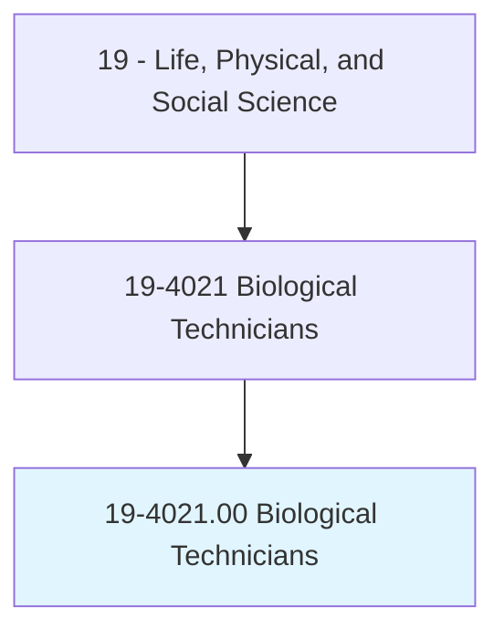
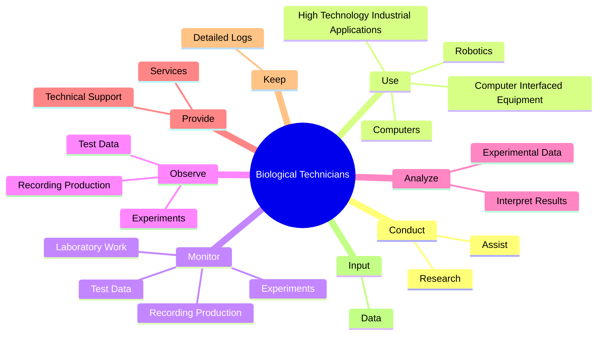

# Biological Technicians

> Assist biological and medical scientists. Set up, operate, and maintain laboratory instruments and equipment, monitor experiments, collect data and samples, make observations, and calculate and record results. May analyze organic substances, such as blood, food, and drugs.

## Overview

Biological Technicians is an occupation within the Life, Physical, and Social Science category. Assist biological and medical scientists. Set up, operate, and maintain laboratory instruments and equipment, monitor experiments, collect data and samples, make observations, and calculate and record results.

## Classification Hierarchy

## Key Statistics

| Metric | Value |
|--------|-------|
| SOC Code | 19-4021.00 |
| Category | [Life, Physical, and Social Science](/occupations/Science/index) |
| Task Count | 85 |
| Source | O*NET |

## Core Tasks

### conduct.Research

Biological Technicians conduct research as part of their core responsibilities.

**Actions:**
- `conduct.Research.in.Conduct.of.Research`
- `conduct.Research.in.IncludingCollection.of.Information`
- `conduct.Research.in.Samples`
- `conduct.Research.in.Blood`

### use.Computers

Biological Technicians use computers as part of their core responsibilities.

**Actions:**
- `use.Computers.to.perform.WorkDuties`
- `use.ComputerInterfacedEquipment.to.perform.WorkDuties`
- `use.Robotics.to.perform.WorkDuties`
- `use.HighTechnologyIndustrialApplications.to.perform.WorkDuties`

### monitor.Experiments

Biological Technicians monitor experiments as part of their core responsibilities.

**Actions:**
- `monitor.Experiments.for.Evaluation.by.ResearchPersonnel`
- `monitor.RecordingProduction.for.Evaluation.by.ResearchPersonnel`
- `monitor.TestData.for.Evaluation.by.ResearchPersonnel`
- `monitor.LaboratoryWork.to.ensure.ComplianceWithSetStandards`

## Skills & Competencies

### Technical Skills
- **Research Methods** - Advanced
- **Data Analysis** - Advanced
- **Laboratory Techniques** - Advanced

### Soft Skills
- **Communication** - Essential
- **Problem Solving** - Essential
- **Critical Thinking** - Important
- **Teamwork** - Important
- **Adaptability** - Important

## Related Occupations

## Industries

This occupation is found across multiple industries. See [Industries](/industries) for sector-specific employment data.

## Career Progression

---

*Source: O*NET 19-4021.00 - ONETOccupation*
