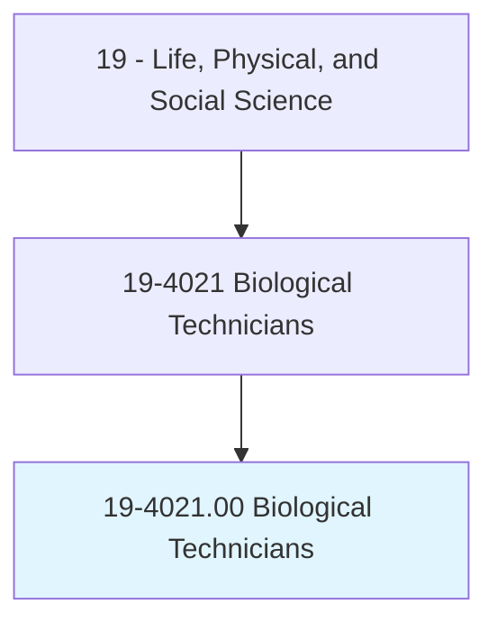
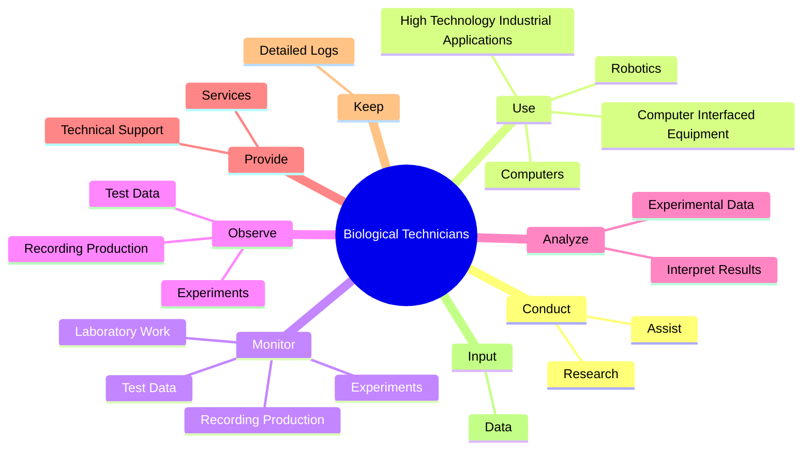
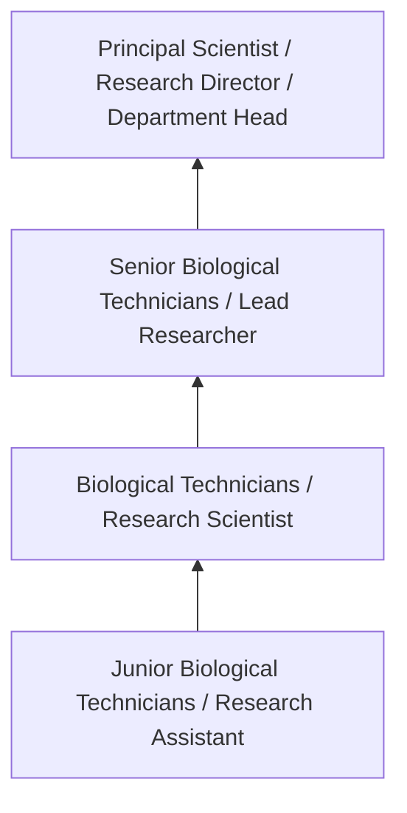

# Biological Technicians

> Assist biological and medical scientists. Set up, operate, and maintain laboratory instruments and equipment, monitor experiments, collect data and samples, make observations, and calculate and record results. May analyze organic substances, such as blood, food, and drugs.

## Overview

Biological Technicians professionals assist biological and medical scientists. This occupation falls within the Life, Physical, and Social Science category and requires a combination of specialized knowledge, technical skills, and practical experience.

These professionals work across diverse settings and organizational contexts, applying their expertise to meet the demands of their field. They must stay current with industry standards, emerging practices, and regulatory requirements that affect their work. The role demands both independent judgment and collaborative skills, as practitioners regularly interact with colleagues, stakeholders, and the public.

As the field continues to evolve, Biological Technicians professionals increasingly leverage technology and data-driven approaches to enhance their effectiveness. Career opportunities span the public and private sectors, with demand influenced by economic conditions, demographic shifts, and technological advancement.

## Classification Hierarchy



## Key Statistics

| Metric | Value |
|--------|-------|
| SOC Code | 19-4021.00 |
| Job Zone | N/A |
| Category | [Life, Physical, and Social Science](/occupations/Science/index) |
| Core Tasks | 85+ |
| Salary Range | $50,000 - $130,000 |
| Median Salary | $78,000 |
| Growth Outlook | 7% (Faster than average) |
| Source | O*NET |

## Core Tasks



### conduct.Research

Biological Technicians conduct research as part of their core responsibilities.

**Actions:**
- `conduct.Research.in.Conduct.of.Research` - Conduct research, or assist in the conduct of research, including the collect...
- `conduct.Research.in.IncludingCollection.of.Information` - Conduct research, or assist in the conduct of research, including the collect...
- `conduct.Research.in.Samples` - Conduct research, or assist in the conduct of research, including the collect...
- `conduct.Research.in.Blood` - Conduct research, or assist in the conduct of research, including the collect...
- `conduct.Research.in.Water` - Conduct research, or assist in the conduct of research, including the collect...

### provide.TechnicalSupport

Biological Technicians provide technical support as part of their core responsibilities.

**Actions:**
- `provide.TechnicalSupport.for.Scientists` - Provide technical support and services for scientists and engineers working i...
- `provide.TechnicalSupport.for.EngineersWorking.in.Fields` - Provide technical support and services for scientists and engineers working i...
- `provide.TechnicalSupport.for.Agriculture` - Provide technical support and services for scientists and engineers working i...
- `provide.TechnicalSupport.for.EnvironmentalScience` - Provide technical support and services for scientists and engineers working i...
- `provide.TechnicalSupport.for.ResourceManagement` - Provide technical support and services for scientists and engineers working i...

### set.Adjust

Biological Technicians set adjust as part of their core responsibilities.

**Actions:**
- `set.Adjust` - Set up, adjust, calibrate, clean, maintain, and troubleshoot laboratory and f...
- `set.Calibrate` - Set up, adjust, calibrate, clean, maintain, and troubleshoot laboratory and f...
- `set.Clean` - Set up, adjust, calibrate, clean, maintain, and troubleshoot laboratory and f...
- `set.Maintain` - Set up, adjust, calibrate, clean, maintain, and troubleshoot laboratory and f...
- `set.TroubleshootLaboratoryEquipment` - Set up, adjust, calibrate, clean, maintain, and troubleshoot laboratory and f...

### use.Computers

Biological Technicians use computers as part of their core responsibilities.

**Actions:**
- `use.Computers.to.perform.WorkDuties` - Use computers, computer-interfaced equipment, robotics or high-technology ind...
- `use.ComputerInterfacedEquipment.to.perform.WorkDuties` - Use computers, computer-interfaced equipment, robotics or high-technology ind...
- `use.Robotics.to.perform.WorkDuties` - Use computers, computer-interfaced equipment, robotics or high-technology ind...
- `use.HighTechnologyIndustrialApplications.to.perform.WorkDuties` - Use computers, computer-interfaced equipment, robotics or high-technology ind...


## Skills & Competencies

### Technical Skills
- **Research Methodology** - Expert
- **Data Analysis** - Advanced
- **Laboratory Techniques** - Advanced
- **Scientific Writing** - Advanced
- **Statistical Software** - Advanced
- **Quality Control** - Proficient

### Soft Skills
- **Analytical Thinking** - Critical
- **Attention to Detail** - Critical
- **Problem Solving** - Essential
- **Collaboration** - Essential
- **Written Communication** - Essential

## Education & Certifications

| Requirement | Details |
|-------------|---------|
| Typical Education | Bachelor's or Master's degree in relevant scientific field |
| Work Experience | 1-3 years research or laboratory experience |
| On-the-Job Training | Moderate - specialized laboratory techniques |
| Certifications | Field-specific certifications may be required |

## Career Progression



## Industry Variations

### Academic Research
Focus on fundamental research and publication. Biological Technicians professionals in academia often combine research with teaching responsibilities and mentoring graduate students.

### Industry Research and Development
Applied research for product development and commercial applications. Emphasis on innovation timelines and market-driven objectives.

### Government and Regulatory
Mission-oriented research supporting public policy and regulatory decisions. Focus on public health, environmental protection, or national security.

### Consulting and Contract Research
Project-based work for diverse clients. Requires strong communication skills and ability to translate findings for non-technical audiences.

## Technology & Tools

- **Laboratory Information Management Systems (LIMS)**
- **Statistical software (R, SAS, SPSS)**
- **Spectroscopy and chromatography equipment**
- **Microscopy and imaging systems**
- **Data analysis and visualization tools**

## Related Occupations


## Industries

- Research and Development - High Employment
- Pharmaceutical Manufacturing - High Employment
- [Government Agencies](/industries/PublicAdministration) - Moderate Employment
- [Higher Education](/industries/Education) - Moderate Employment

## Departments

This occupation typically works in:
- [Research and Development](/departments/Research/index)
- Quality Assurance
- Laboratory Operations

## GraphDL Semantic Structure

```graphdl
Biological Technicians perform:
- conduct.Research.in.Conduct.of.Research
- conduct.Research.in.IncludingCollection.of.Information
- conduct.Research.in.Samples
- conduct.Research.in.Blood
- conduct.Research.in.Water
- conduct.Research.in.Soil
```

---

*Source: O*NET 19-4021.00 - ONETOccupation*
