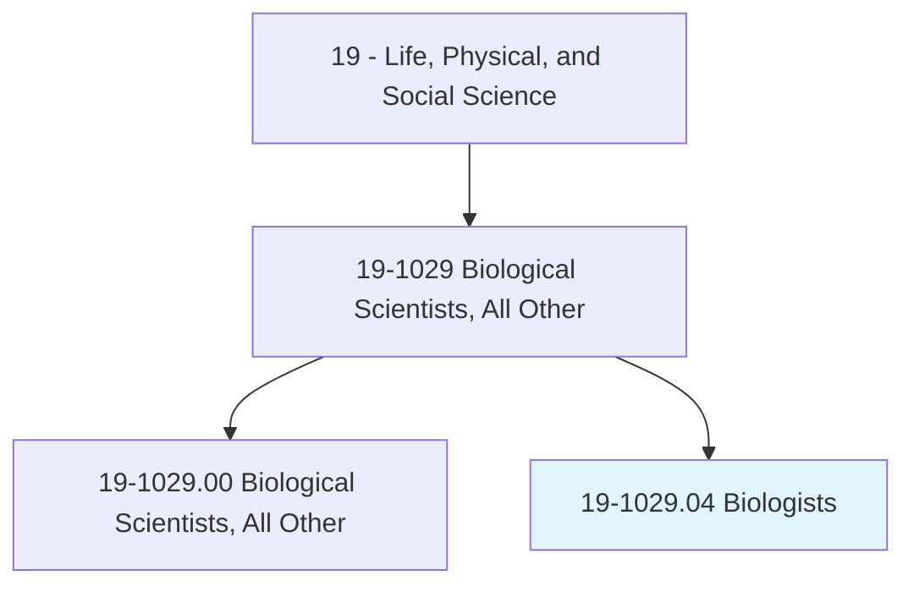
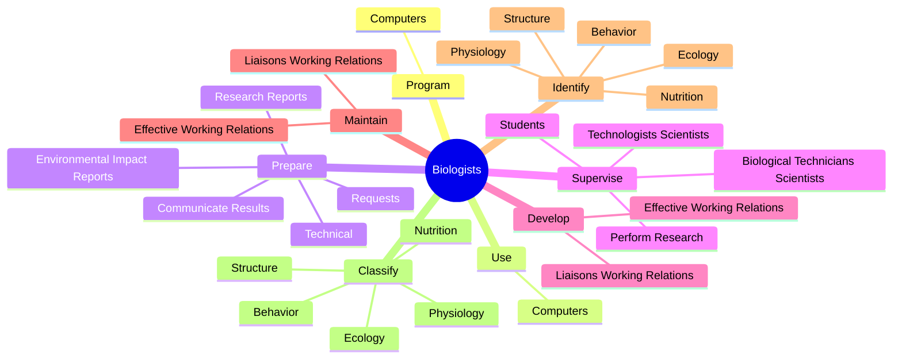
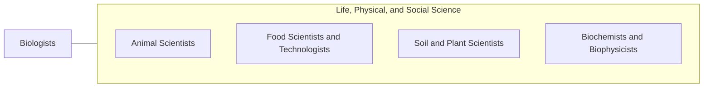

# Biologists

> Research or study basic principles of plant and animal life, such as origin, relationship, development, anatomy, and functions.

## Overview

Biologists is classified under Life, Physical, and Social Science (SOC 19). Research or study basic principles of plant and animal life, such as origin, relationship, development, anatomy, and functions.

## Classification Hierarchy

## Key Statistics

| Metric | Value |
|--------|-------|
| SOC Code | 19-1029.04 |
| Category | [Life, Physical, and Social Science](/occupations/Science) |
| Task Count | 172 |
| Source | O*NET |

## Core Tasks

### program.Computers

Biologists program computers as part of their core responsibilities.

**Actions:**
- `program.Computers.to.store`
- `program.Computers.to.process`
- `program.Computers.to.analyze.Data`

### use.Computers

Biologists use computers as part of their core responsibilities.

**Actions:**
- `use.Computers.to.store`
- `use.Computers.to.process`
- `use.Computers.to.analyze.Data`

### prepare.Technical

Biologists prepare technical as part of their core responsibilities.

**Actions:**
- `prepare.Technical.to.IndividualsInIndustry`
- `prepare.Technical.to.Government`
- `prepare.Technical.to.GeneralPublic`
- `prepare.ResearchReports.to.IndividualsInIndustry`

## Skills & Competencies

### Technical Skills
- **Research Methods** - Advanced
- **Data Analysis** - Advanced
- **Laboratory Techniques** - Advanced

### Soft Skills
- **Communication** - Essential
- **Problem Solving** - Essential
- **Critical Thinking** - Important
- **Teamwork** - Important
- **Adaptability** - Important

## Related Occupations

## Industries

This occupation is found across multiple industries. See [Industries](/industries) for sector-specific employment data.

## Career Progression

---

*Source: O*NET 19-1029.04 - ONETOccupation*
