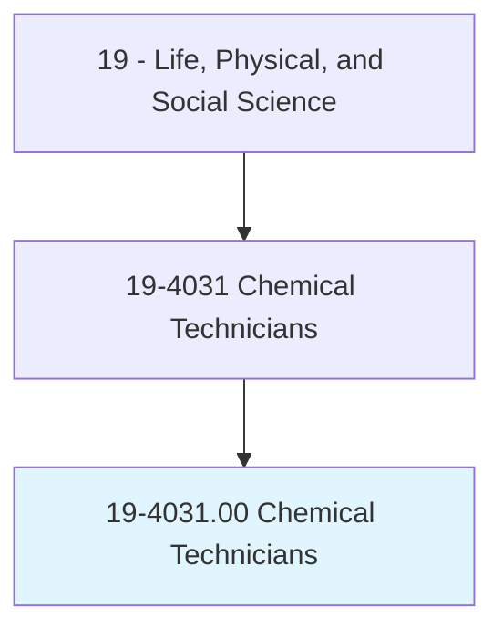
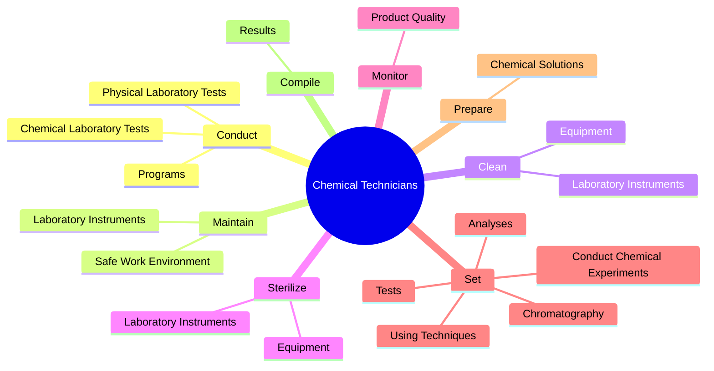
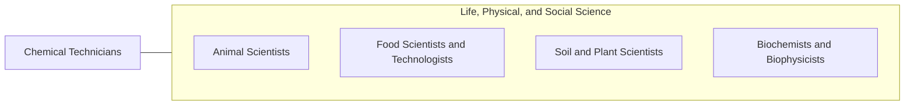

# Chemical Technicians

> Conduct chemical and physical laboratory tests to assist scientists in making qualitative and quantitative analyses of solids, liquids, and gaseous materials for research and development of new products or processes, quality control, maintenance of environmental standards, and other work involving experimental, theoretical, or practical application of chemistry and related sciences.

## Overview

Chemical Technicians is classified under Life, Physical, and Social Science (SOC 19). Conduct chemical and physical laboratory tests to assist scientists in making qualitative and quantitative analyses of solids, liquids, and gaseous materials for research and development of new products or processes, quality control, maintenance of environmental standards, and other work involving experimental, theoretical, or practical application of chemistry and related sciences.

## Classification Hierarchy

## Key Statistics

| Metric | Value |
|--------|-------|
| SOC Code | 19-4031.00 |
| Category | [Life, Physical, and Social Science](/occupations/Science/index) |
| Task Count | 68 |
| Source | O*NET |

## Core Tasks

### conduct.ChemicalLaboratoryTests

Chemical Technicians conduct chemical laboratory tests as part of their core responsibilities.

**Actions:**
- `conduct.ChemicalLaboratoryTests.to.assist.ScientistsInMakingQualitativeAnalysesOfSolids`
- `conduct.ChemicalLaboratoryTests.to.QuantitativeAnalysesOfSolids`
- `conduct.ChemicalLaboratoryTests.to.Liquids`
- `conduct.ChemicalLaboratoryTests.to.GaseousMaterials`

### maintain.LaboratoryInstruments

Chemical Technicians maintain laboratory instruments as part of their core responsibilities.

**Actions:**
- `maintain.LaboratoryInstruments`
- `maintain.SafeWorkEnvironment.by.Participating.in.SafetyPrograms`
- `maintain.SafeWorkEnvironment.by.Committees`
- `maintain.SafeWorkEnvironment.by.TeamsConductingLaboratoryPlantSafetyAudits`

### clean.LaboratoryInstruments

Chemical Technicians clean laboratory instruments as part of their core responsibilities.

**Actions:**
- `clean.LaboratoryInstruments`
- `clean.Equipment`

## Skills & Competencies

### Technical Skills
- **Research Methods** - Advanced
- **Data Analysis** - Advanced
- **Laboratory Techniques** - Advanced

### Soft Skills
- **Communication** - Essential
- **Problem Solving** - Essential
- **Critical Thinking** - Important
- **Teamwork** - Important
- **Adaptability** - Important

## Related Occupations

## Industries

This occupation is found across multiple industries. See [Industries](/industries) for sector-specific employment data.

## Career Progression

---

*Source: O*NET 19-4031.00 - ONETOccupation*
