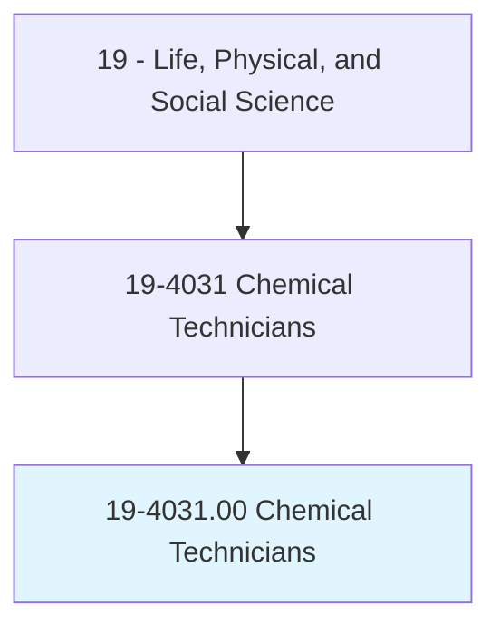
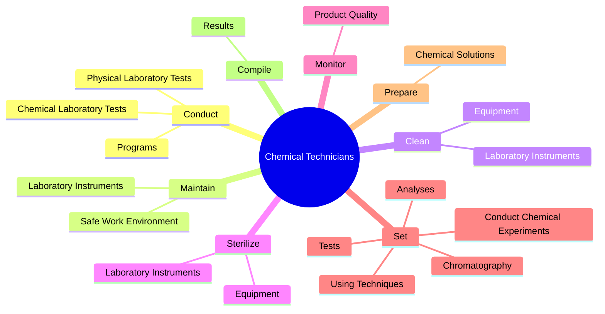
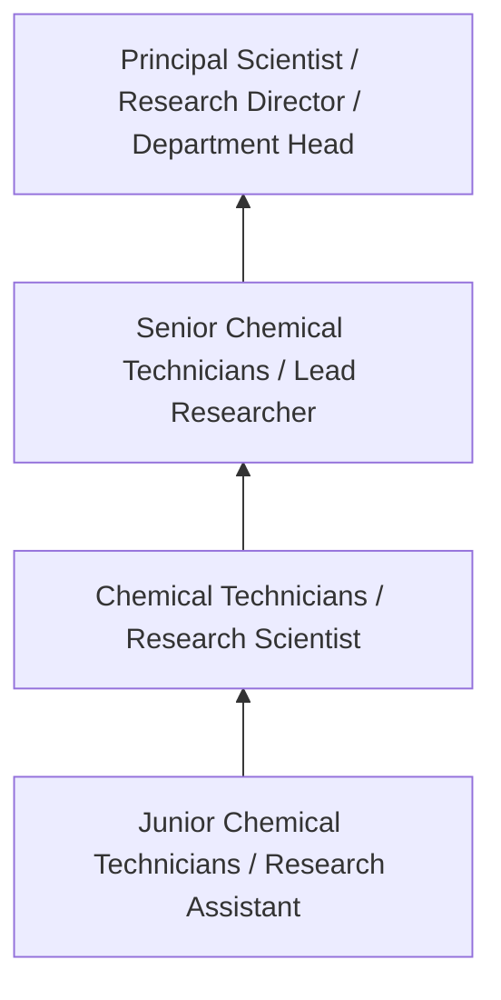
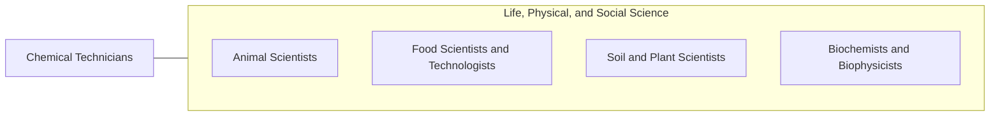

# Chemical Technicians

> Conduct chemical and physical laboratory tests to assist scientists in making qualitative and quantitative analyses of solids, liquids, and gaseous materials for research and development of new products or processes, quality control, maintenance of environmental standards, and other work involving experimental, theoretical, or practical application of chemistry and related sciences.

## Overview

Chemical Technicians professionals conduct chemical and physical laboratory tests to assist scientists in making qualitative and quantitative analyses of solids, liquids, and gaseous materials for research and development of new products or processes, quality control, maintenance of environmental standards, and other work involving experimental, theoretical, or practical application of chemistry and related sciences.. This occupation falls within the Life, Physical, and Social Science category and requires a combination of specialized knowledge, technical skills, and practical experience.

These professionals work across diverse settings and organizational contexts, applying their expertise to meet the demands of their field. They must stay current with industry standards, emerging practices, and regulatory requirements that affect their work. The role demands both independent judgment and collaborative skills, as practitioners regularly interact with colleagues, stakeholders, and the public.

As the field continues to evolve, Chemical Technicians professionals increasingly leverage technology and data-driven approaches to enhance their effectiveness. Career opportunities span the public and private sectors, with demand influenced by economic conditions, demographic shifts, and technological advancement.

## Classification Hierarchy



## Key Statistics

| Metric | Value |
|--------|-------|
| SOC Code | 19-4031.00 |
| Job Zone | N/A |
| Category | [Life, Physical, and Social Science](/occupations/Science/index) |
| Core Tasks | 68+ |
| Salary Range | $50,000 - $130,000 |
| Median Salary | $78,000 |
| Growth Outlook | 7% (Faster than average) |
| Source | O*NET |

## Core Tasks



### conduct.ChemicalLaboratoryTests

Chemical Technicians conduct chemical laboratory tests as part of their core responsibilities.

**Actions:**
- `conduct.ChemicalLaboratoryTests.to.assist.ScientistsInMakingQualitativeAnalysesOfSolids` - Conduct chemical or physical laboratory tests to assist scientists in making ...
- `conduct.ChemicalLaboratoryTests.to.QuantitativeAnalysesOfSolids` - Conduct chemical or physical laboratory tests to assist scientists in making ...
- `conduct.ChemicalLaboratoryTests.to.Liquids` - Conduct chemical or physical laboratory tests to assist scientists in making ...
- `conduct.ChemicalLaboratoryTests.to.GaseousMaterials` - Conduct chemical or physical laboratory tests to assist scientists in making ...
- `conduct.PhysicalLaboratoryTests.to.assist.ScientistsInMakingQualitativeAnalysesOfSolids` - Conduct chemical or physical laboratory tests to assist scientists in making ...

### set.ConductChemicalExperiments

Chemical Technicians set conduct chemical experiments as part of their core responsibilities.

**Actions:**
- `set.ConductChemicalExperiments` - Set up and conduct chemical experiments, tests, and analyses, using technique...
- `set.Tests` - Set up and conduct chemical experiments, tests, and analyses, using technique...
- `set.Analyses` - Set up and conduct chemical experiments, tests, and analyses, using technique...
- `set.UsingTechniques` - Set up and conduct chemical experiments, tests, and analyses, using technique...
- `set.Chromatography` - Set up and conduct chemical experiments, tests, and analyses, using technique...

### provide.SafeWorkEnvironment

Chemical Technicians provide safe work environment as part of their core responsibilities.

**Actions:**
- `provide.SafeWorkEnvironment.by.Participating.in.SafetyPrograms` - Provide and maintain a safe work environment by participating in safety progr...
- `provide.SafeWorkEnvironment.by.Committees` - Provide and maintain a safe work environment by participating in safety progr...
- `provide.SafeWorkEnvironment.by.TeamsConductingLaboratoryPlantSafetyAudits` - Provide and maintain a safe work environment by participating in safety progr...
- `provide.SafeWorkEnvironment.by.ByConductingLaboratoryPlantSafetyAudits` - Provide and maintain a safe work environment by participating in safety progr...
- `provide.TechnicalSupport.to.Chemists` - Provide technical support or assistance to chemists or engineers.

### develop.Programs

Chemical Technicians develop programs as part of their core responsibilities.

**Actions:**
- `develop.Programs.of.Sampling.to.maintain.QualityStandardsOfRawMaterials` - Develop or conduct programs of sampling and analysis to maintain quality stan...
- `develop.Programs.of.Analysis.to.maintain.QualityStandardsOfRawMaterials` - Develop or conduct programs of sampling and analysis to maintain quality stan...
- `develop.Programs.of.ChemicalIntermediates` - Develop or conduct programs of sampling and analysis to maintain quality stan...
- `develop.Programs.of.Products` - Develop or conduct programs of sampling and analysis to maintain quality stan...
- `develop.NewChemicalEngineeringProcesses` - Develop new chemical engineering processes or production techniques.


## Skills & Competencies

### Technical Skills
- **Research Methodology** - Expert
- **Data Analysis** - Advanced
- **Laboratory Techniques** - Advanced
- **Scientific Writing** - Advanced
- **Statistical Software** - Advanced
- **Quality Control** - Proficient

### Soft Skills
- **Analytical Thinking** - Critical
- **Attention to Detail** - Critical
- **Problem Solving** - Essential
- **Collaboration** - Essential
- **Written Communication** - Essential

## Education & Certifications

| Requirement | Details |
|-------------|---------|
| Typical Education | Bachelor's or Master's degree in relevant scientific field |
| Work Experience | 1-3 years research or laboratory experience |
| On-the-Job Training | Moderate - specialized laboratory techniques |
| Certifications | Field-specific certifications may be required |

## Career Progression



## Industry Variations

### Academic Research
Focus on fundamental research and publication. Chemical Technicians professionals in academia often combine research with teaching responsibilities and mentoring graduate students.

### Industry Research and Development
Applied research for product development and commercial applications. Emphasis on innovation timelines and market-driven objectives.

### Government and Regulatory
Mission-oriented research supporting public policy and regulatory decisions. Focus on public health, environmental protection, or national security.

### Consulting and Contract Research
Project-based work for diverse clients. Requires strong communication skills and ability to translate findings for non-technical audiences.

## Technology & Tools

- **Laboratory Information Management Systems (LIMS)**
- **Statistical software (R, SAS, SPSS)**
- **Spectroscopy and chromatography equipment**
- **Microscopy and imaging systems**
- **Data analysis and visualization tools**

## Related Occupations



## Industries

- [Research and Development](/industries/ResearchDevelopment) - High Employment
- [Pharmaceutical Manufacturing](/industries/Pharma) - High Employment
- [Government Agencies](/industries/Government) - Moderate Employment
- [Higher Education](/industries/Education) - Moderate Employment

## Departments

This occupation typically works in:
- [Research and Development](/departments/Research/index)
- [Quality Assurance](/departments/QualityAssurance)
- [Laboratory Operations](/departments/Laboratory)

## GraphDL Semantic Structure

```
Chemical Technicians perform:
- conduct.ChemicalLaboratoryTests.to.assist.ScientistsInMakingQualitativeAnalysesOfSolids
- conduct.ChemicalLaboratoryTests.to.QuantitativeAnalysesOfSolids
- conduct.ChemicalLaboratoryTests.to.Liquids
- conduct.ChemicalLaboratoryTests.to.GaseousMaterials
- conduct.PhysicalLaboratoryTests.to.assist.ScientistsInMakingQualitativeAnalysesOfSolids
- conduct.PhysicalLaboratoryTests.to.QuantitativeAnalysesOfSolids
```

---

*Source: O*NET 19-4031.00 - ONETOccupation*
